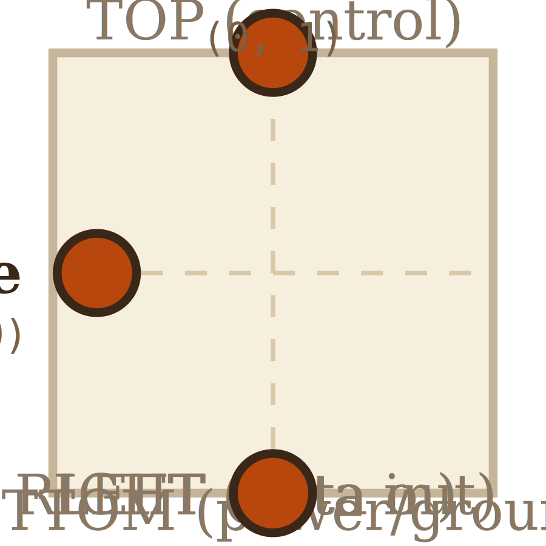

# Layer 0 — Single MOSFET

A voltage-controlled switch. The gate voltage decides whether the
source-drain channel conducts. This is the atomic unit — nothing zooms
deeper than this in the current project scope.

## Scene bounds
x ∈ [-1.0, 1.0], y ∈ [-1.0, 1.0]

(canonical per-transistor local frame; the parent NAND-gate level
positions, scales, and re-labels each instance.)

## External terminals

| key    | role           | (x, y)       | edge   |
|--------|----------------|--------------|--------|
| gate   | control input  | (-0.8,  0.0) | LEFT   |
| source | upper terminal | ( 0.0,  1.0) | TOP    |
| drain  | lower terminal | ( 0.0, -1.0) | BOTTOM |

Notes:
- Source / drain are physically symmetric for an enhancement-mode MOSFET;
  the labels track conventional CMOS orientation (PMOS source → Vdd is the
  TOP wire; NMOS source → GND is the BOTTOM wire).
- The gate enters from the LEFT because the parent NAND gate's input
  signal (A or B) always arrives from the left or right edge of the gate
  scene, runs along a horizontal stub, and dips into the polysilicon strip
  on the side of the transistor body. See `gateApproachSide` in
  `src/levels/transistorConnections.ts`.

## Embedded children
None — leaf.

## Wires
None — this layer renders the device's physical cross-section, not a
netlist. The conducting channel between source and drain when V_G > V_th
is implicit in the device physics, not a polyline.

## Alignment claims

Each instance of this MOSFET, when embedded as one of the four transistors
in the NAND-gate level (layer 1), has its three external terminals placed
at these absorbed-terminal coords in the parent gate's scene world
(source-of-truth: `src/levels/transistorConnections.ts`):

- `P_A`: gate=(-2.05, 1.5), source=(-1.6, 1.85), drain=(-1.6, 1.15)
- `P_B`: gate=( 2.05, 1.5), source=( 1.6, 1.85), drain=( 1.6, 1.15)
- `N_A`: gate=(-0.45,-0.6), source=( 0.0, -0.95), drain=( 0.0, -0.25)
- `N_B`: gate=( 0.45,-2.4), source=( 0.0, -2.75), drain=( 0.0, -2.05)

PMOS instances are oriented with source on top (toward Vdd rail at
y = +3). NMOS instances also have drain on top (toward Y junction or the
upper NMOS's source) and source on bottom (toward GND rail at y = -3.5).

