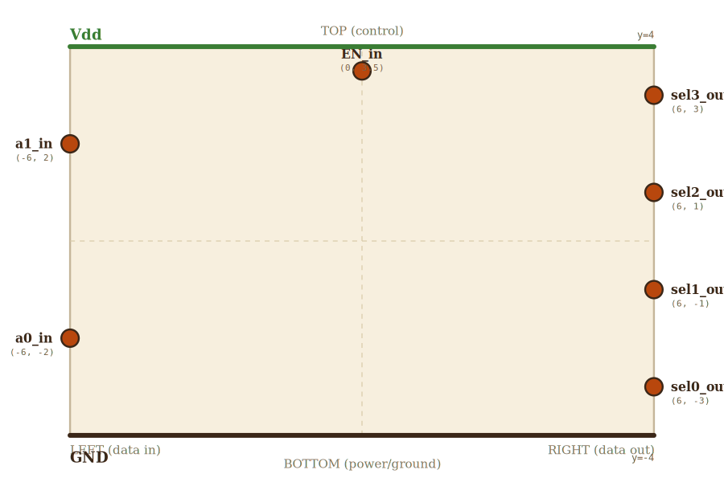

# Layer 10 — 2-to-4 decoder

Convert a 2-bit binary address `(a1, a0)` into a one-hot 4-line output.
Exactly one of `sel0..sel3` is high at any time, and only when the
enable `EN` is high. The address-to-one-hot primitive — every register
file, MUX, and instruction decoder depends on a decoder of some width.

LSB-at-bottom convention: `sel0` (selects address=0) at the bottom of
the right edge, `sel3` at the top. `a0` (LSB input) at the bottom of
the left edge, `a1` at the top.

Truth table (with EN=1):

| a1 | a0 | sel3 | sel2 | sel1 | sel0 |
|----|----|------|------|------|------|
|  0 |  0 |  0   |  0   |  0   |  1   |
|  0 |  1 |  0   |  0   |  1   |  0   |
|  1 |  0 |  0   |  1   |  0   |  0   |
|  1 |  1 |  1   |  0   |  0   |  0   |

With EN=0, all outputs are 0.

Internally: 2 inverters (produce `~a1` and `~a0`) and 4 three-input AND
gates, each combining one of the four polarity patterns of `(a1, a0)`
with `EN`:

  sel0 = ~a1 · ~a0 · EN
  sel1 = ~a1 ·  a0 · EN
  sel2 =  a1 · ~a0 · EN
  sel3 =  a1 ·  a0 · EN

The internal layout (2 inverters on the left, 4 ANDs on the right, 5
vertical bus lanes between them carrying `a1`, `~a1`, `EN`, `a0`,
`~a0`) is shown by the implementation directly. The internal wiring
detail is too dense for a useful wireframe table; the wireframe locks
the *external* contract and the implementation owns the routing.

## Scene bounds
x ∈ [-6, 6], y ∈ [-4, 4]

## External terminals

| key       | role           | (x, y)        | edge   |
|-----------|----------------|---------------|--------|
| a1_in     | addr bit 1     | (-6,  2)      | LEFT   |
| a0_in     | addr bit 0     | (-6, -2)      | LEFT   |
| EN_in     | enable         | ( 0,  3.5)    | TOP    |
| sel3_out  | one-hot (a=3)  | ( 6,  3)      | RIGHT  |
| sel2_out  | one-hot (a=2)  | ( 6,  1)      | RIGHT  |
| sel1_out  | one-hot (a=1)  | ( 6, -1)      | RIGHT  |
| sel0_out  | one-hot (a=0)  | ( 6, -3)      | RIGHT  |
| Vdd       | supply (+V)    | ( 0,  4)      | TOP    |
| GND       | supply (0V)    | ( 0, -4)      | BOTTOM |

The four `selN_out` outputs are at evenly-spaced fracs (0.125, 0.375,
0.625, 0.875) — same as every other 4-line interface in this app, so
the decoder embeds cleanly into any 4-line parent (register file,
mux, etc.).

## Internal supply distribution

Vdd at top y=4, GND at bottom y=-4. The inverter row and the AND row
each tap directly via top-drop / bottom-rise — they sit in a single
horizontal band so no L-shaped side bus is needed.

## Embedded children

The internal logic is shown by the implementation (2 inverters + 4
three-input ANDs + 5 vertical bus lanes). At this layer's zoom we do
NOT decompose into named children — the routing detail is too dense
to express cleanly in a wireframe table. Hovering on the implementation
reveals the inverters and ANDs as sub-blocks with their own (eventual)
drill-down to `/and.html` and `/not.html`.

When those pages get added, this wireframe should grow embedded-child
entries linking to them — the wireframe-gate test will surface the
mismatch.

## Wires

Only supply rails are declared at this layer. Internal signal routing
is the implementation's responsibility.

| from      | to        | via | net |
|-----------|-----------|-----|-----|
| Vdd_left  | Vdd_right | —   | Vdd |
| GND_left  | GND_right | —   | GND |

## Supply helpers

- `Vdd_left` (-6, 4), `Vdd_right` (6, 4)
- `GND_left` (-6, -4), `GND_right` (6, -4)

## Alignment claims

- All 4 `selN_out` terminals at evenly-spaced fracs of scene height
  (0.125, 0.375, 0.625, 0.875) — LSB-at-bottom matches every other
  multi-bit page in this app.
- `a1_in.y = 2` and `a0_in.y = -2` are symmetric about the horizontal
  midline — top inverter row and bottom inverter row mirror each other.

## Note: this wireframe locks the external contract only

A wireframe at this layer of complexity (with 5+ buses, 6 child gates,
12+ tap wires) is hard to write compactly without it becoming the
implementation. So this wireframe deliberately stops at the external
contract: anything that *embeds* a 2-to-4 decoder later (a 4-register
file, say) only needs to know these 9 terminals exist where claimed.
The internal layout is owned by `/decoder.html` + `src/decoder.ts`.

