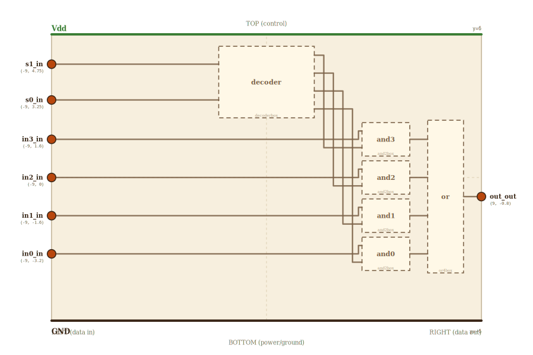

# Layer 11 — 4-to-1 MUX

Route one of four data inputs `(in0..in3)` to the single `out` line,
chosen by a 2-bit binary `select = (s1, s0)`.

Per the locked spatial invariant (CLAUDE.md): ALL inputs on LEFT,
ALL outputs on RIGHT. The MUX has 6 LEFT-edge inputs (s1, s0, in3,
in2, in1, in0 — selects on top, data below) and 1 RIGHT-edge output.

Truth table:

| s1 | s0 | out  |
|----|----|------|
|  0 |  0 | in0  |
|  0 |  1 | in1  |
|  1 |  0 | in2  |
|  1 |  1 | in3  |

A MUX **contains** a decoder. Internally: 2-to-4 decoder turns
(s1, s0) into one-hot sel0..sel3. Each `andN` gates `inN` with
`selN`. A 4-input OR collapses the four AND outputs into one.

## Scene bounds
x ∈ [-9, 9], y ∈ [-6, 6]

## External terminals

| key      | role               | (x, y)        | edge   |
|----------|--------------------|---------------|--------|
| s1_in    | select MSB         | (-9,  4.75)   | LEFT   |
| s0_in    | select LSB         | (-9,  3.25)   | LEFT   |
| in3_in   | data in (bit 3)    | (-9,  1.6)    | LEFT   |
| in2_in   | data in (bit 2)    | (-9,  0.0)    | LEFT   |
| in1_in   | data in (bit 1)    | (-9, -1.6)    | LEFT   |
| in0_in   | data in (bit 0)    | (-9, -3.2)    | LEFT   |
| out_out  | data out           | ( 9, -0.8)    | RIGHT  |
| Vdd      | supply (+V)        | ( 5,  6)      | TOP    |
| GND      | supply (0V)        | ( 0, -6)      | BOTTOM |

The s1/s0 y-positions (4.75 and 3.25) are chosen so the s wires
land EXACTLY on the embedded decoder's `a1_in` / `a0_in` LEFT-edge
terminals — both s wires are pure horizontals into the decoder.

## Internal supply distribution

Vdd at y=6 (TOP, x=5 to clear the LEFT-edge inputs and the decoder
top). GND at y=-6.

## Embedded children

| child id | child layer | center (cx, cy) | box (w × h) | inputs → absorbed                          | outputs → absorbed |
|----------|-------------|-----------------|-------------|--------------------------------------------|--------------------|
| decoder  | decoderbox  | ( 0,   4.0)     | 4.0 × 3.0   | a1_in → dec_a1_in (LEFT 0.25); a0_in → dec_a0_in (LEFT 0.75)                              | sel{3..0}_out → dec_sel{3..0}_out (RIGHT) |
| and3     | and2box     | ( 5,   1.6)     | 2.0 × 1.4   | A_in/B_in → and3_{A,B}_in                  | Y_out → and3_Y_out |
| and2     | and2box     | ( 5,   0.0)     | 2.0 × 1.4   | A_in/B_in → and2_{A,B}_in                  | Y_out → and2_Y_out |
| and1     | and2box     | ( 5,  -1.6)     | 2.0 × 1.4   | A_in/B_in → and1_{A,B}_in                  | Y_out → and1_Y_out |
| and0     | and2box     | ( 5,  -3.2)     | 2.0 × 1.4   | A_in/B_in → and0_{A,B}_in                  | Y_out → and0_Y_out |
| or       | or4box      | ( 7.5, -0.8)    | 1.5 × 6.4   | A,B,C,D_in → or_{a,b,c,d}_in               | Y_out → or_y_out  |

Decoder box: x ∈ [-2, 2], y ∈ [2.5, 5.5]. The decoder's LEFT-edge
terminals (a1, a0, EN) at fracs 0.25 / 0.75 / 0.5 of its box height
sit at MUX y ∈ {4.75, 3.25, 4.0} — the first two match s1_in.y and
s0_in.y exactly so the s wires are pure horizontals.

EN is tied internally HIGH (the MUX always wants the decoder
active).

## Absorbed terminals

Decoder `decoder` (cx=0, cy=4, w=4, h=3 → x∈[-2,2], y∈[2.5,5.5]):

- `dec_a1_in`    (-2,    4.75)  ← LEFT  frac 0.25 (matches s1_in.y)
- `dec_a0_in`    (-2,    3.25)  ← LEFT  frac 0.75 (matches s0_in.y)

(The decoder's `EN_in` terminal — layer-10 LEFT frac 0.5 — is tied
HIGH internally by the MUX and not declared as a wireable absorbed
terminal here.)
- `dec_sel3_out` ( 2,    5.125) ← RIGHT frac 0.125
- `dec_sel2_out` ( 2,    4.375) ← RIGHT frac 0.375
- `dec_sel1_out` ( 2,    3.625) ← RIGHT frac 0.625
- `dec_sel0_out` ( 2,    2.875) ← RIGHT frac 0.875

AND `and3` (cx=5, cy=1.6, w=2, h=1.4 → x∈[4,6], y∈[0.9,2.3]):

- `and3_A_in`  (4,  1.95)
- `and3_B_in`  (4,  1.25)
- `and3_Y_out` (6,  1.60)

AND `and2`, `and1`, `and0` — same shape, cy ∈ {0, -1.6, -3.2}:

- `and2_A_in` (4, 0.35),   `and2_B_in` (4, -0.35),  `and2_Y_out` (6, 0)
- `and1_A_in` (4, -1.25),  `and1_B_in` (4, -1.95),  `and1_Y_out` (6, -1.6)
- `and0_A_in` (4, -2.85),  `and0_B_in` (4, -3.55),  `and0_Y_out` (6, -3.2)

OR `or` (cx=7.5, cy=-0.8, w=1.5, h=6.4):

- `or_a_in` (6.75,  1.6),  `or_b_in` (6.75, 0),  `or_c_in` (6.75, -1.6),  `or_d_in` (6.75, -3.2)
- `or_y_out` (8.25, -0.8)

## Internal lanes

Sel lanes — 2-wu gap between decoder right (x=2) and AND.left (x=4):

| net  | lane x | from         | to        |
|------|--------|--------------|-----------|
| sel3 | 2.4    | dec_sel3_out | and3_B_in |
| sel2 | 2.7    | dec_sel2_out | and2_B_in |
| sel1 | 3.0    | dec_sel1_out | and1_B_in |
| sel0 | 3.3    | dec_sel0_out | and0_B_in |

AndOut wires are STRAIGHT HORIZONTALS — OR fracs match AND.Y_out
y-values exactly:

| net     | from        | to       | y       |
|---------|-------------|----------|---------|
| andOut3 | and3_Y_out  | or_a_in  |  1.6    |
| andOut2 | and2_Y_out  | or_b_in  |  0      |
| andOut1 | and1_Y_out  | or_c_in  | -1.6    |
| andOut0 | and0_Y_out  | or_d_in  | -3.2    |

## Supply helpers

- `Vdd_left` (-9, 6), `Vdd_right` (9, 6)
- `GND_left` (-9, -6), `GND_right` (9, -6)

## Wires

| from         | to          | via                              | net     |
|--------------|-------------|----------------------------------|---------|
| Vdd_left     | Vdd_right   | —                                | Vdd     |
| GND_left     | GND_right   | —                                | GND     |
| s1_in        | dec_a1_in   | —                                | s1      |
| s0_in        | dec_a0_in   | —                                | s0      |
| in3_in       | and3_A_in   | (3.85, 1.6), (3.85, 1.95)        | in3     |
| in2_in       | and2_A_in   | (3.85, 0), (3.85, 0.35)          | in2     |
| in1_in       | and1_A_in   | (3.85, -1.6), (3.85, -1.25)      | in1     |
| in0_in       | and0_A_in   | (3.85, -3.2), (3.85, -2.85)      | in0     |
| dec_sel3_out | and3_B_in   | (2.4, 5.125), (2.4, 1.25)        | sel3    |
| dec_sel2_out | and2_B_in   | (2.7, 4.375), (2.7, -0.35)       | sel2    |
| dec_sel1_out | and1_B_in   | (3.0, 3.625), (3.0, -1.95)       | sel1    |
| dec_sel0_out | and0_B_in   | (3.3, 2.875), (3.3, -3.55)       | sel0    |
| and3_Y_out   | or_a_in     | —                                | andOut3 |
| and2_Y_out   | or_b_in     | —                                | andOut2 |
| and1_Y_out   | or_c_in     | —                                | andOut1 |
| and0_Y_out   | or_d_in     | —                                | andOut0 |
| or_y_out     | out_out     | —                                | out     |

## Alignment claims

- ALL 6 inputs sit on the LEFT edge per the locked invariant (LEFT
  = inputs).
- `s1_in.y` = `dec_a1_in.y` = 4.75 — s1 wire is a pure horizontal.
- `s0_in.y` = `dec_a0_in.y` = 3.25 — s0 wire is a pure horizontal.
- `in_n_in.y` = `andN.cy` for all 4 data bits — in→AND.A wires are
  near-horizontals with a small 0.35-wu jog at x=3.85.
- AND-2 boxes use 10/7 aspect (matching the layer-2 NAND mini).
- All 4 OR inputs land at exactly y ∈ {1.6, 0, -1.6, -3.2} = the
  four AND.Y_out positions → andOut wires are straight horizontals.

## Embedding contract

A wider MUX (8-to-1 over 3 select bits, 16-to-1 over 4, 32-to-1
over 5) is this same shape with more LEFT-edge inputs and a wider
decoder.

## 1-to-1 preview rendering

The decoder embedded here is rendered at MUX runtime by the same
`renderDecoderScene` function that draws `/decoder.html`. The hover-
preview is the standalone decoder at 1:1 — gate shapes, wire
routing, and `data-net` values match exactly. Because BOTH the MUX's
s1/s0 pins AND the embedded decoder's a1/a0 terminals are on the
LEFT edge, the s wires from the MUX are pure horizontals that
visually CONTINUE INTO the preview's `a1_in` / `a0_in` LEFT-edge
ports. `tests/decoder-1to1.test.mjs` locks the mapping.

