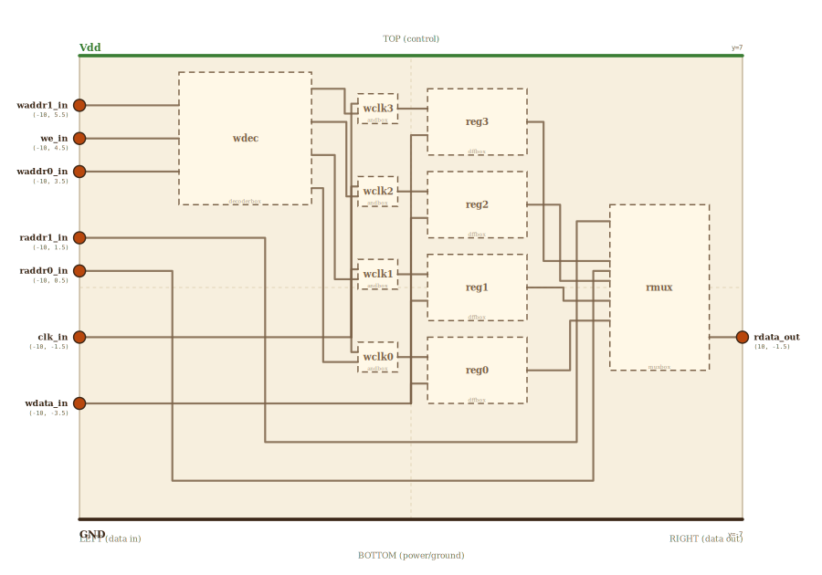

# Layer 12 — register file (4 × 1-bit, 1 write + 1 read port)

A small bank of registers that the rest of the CPU reads from and writes
to by *address*. This is where `x1`, `x2`, `x3` live in the RV32I demo
program. It is the convergence of three already-built primitives: a
**decoder** turns the write address into a one-hot write-enable, the
**DFF** cells hold the bits, and a **MUX** uses the read address to route
one cell's value out. Keeping it 1-bit-wide and 4-deep makes every child
map 1:1 to an existing page (each cell *is* a DFF; the read port *is* the
4-to-1 MUX; the write port *is* the 2-to-4 decoder) — widen the cells to
32 bits and the addresses to 5 bits and it is an RV32I register file.

Per the locked spatial invariant (CLAUDE.md): ALL inputs on the LEFT,
the single output on the RIGHT. The clock, write-enable, both addresses
and the write-data bit therefore all enter on the LEFT edge. LSB-at-bottom
on the storage column: `reg0` at the bottom, `reg3` at the top.

Write path (synchronous): on the rising clock edge, if `we = 1`, the
register selected by `(waddr1, waddr0)` latches `wdata`. The decoder's
one-hot output `wen0..wen3` gates the clock (the four `&` cells) so only
the addressed register sees an edge.

Read path (combinational): `(raddr1, raddr0)` drives the MUX select, so
`rdata` is always the current value of the addressed register.

## Scene bounds
x ∈ [-10, 10], y ∈ [-7, 7]

## External terminals

| key        | role                    | (x, y)       | edge   |
|------------|-------------------------|--------------|--------|
| waddr1_in  | write addr bit 1        | (-10,  5.5)  | LEFT   |
| we_in      | write enable            | (-10,  4.5)  | LEFT   |
| waddr0_in  | write addr bit 0        | (-10,  3.5)  | LEFT   |
| raddr1_in  | read addr bit 1         | (-10,  1.5)  | LEFT   |
| raddr0_in  | read addr bit 0         | (-10,  0.5)  | LEFT   |
| clk_in     | clock                   | (-10, -1.5)  | LEFT   |
| wdata_in   | write data (1 bit)      | (-10, -3.5)  | LEFT   |
| rdata_out  | read data (1 bit)       | ( 10, -1.5)  | RIGHT  |
| Vdd        | supply (+V)             | (  0,  7)    | TOP    |
| GND        | supply (0V)             | (  0, -7)    | BOTTOM |

The three write-port inputs (`waddr1`, `we`, `waddr0`) sit at exactly the
decoder's `a1` / `EN` / `a0` left-edge fractions (0.25 / 0.5 / 0.75 of the
decoder box) so they are pure horizontals into it. Read controls,
the shared `clk`, and the `wdata` bus follow below.

## Internal supply distribution

Vdd rail along the top (y=7), GND rail along the bottom (y=-7). Each child
(decoder, the four DFFs, the read MUX, the four clock-gate cells) sits
between the two rails and taps them directly — no side-bus routing.

## Embedded children

| child id | child layer | center (cx, cy) | box (w × h) |
|----------|-------------|-----------------|-------------|
| wdec     | decoderbox  | (-5.0,  4.5)    | 4.0 × 4.0   |
| wclk3    | andbox      | (-1.0,  5.4)    | 1.2 × 0.9   |
| wclk2    | andbox      | (-1.0,  2.9)    | 1.2 × 0.9   |
| wclk1    | andbox      | (-1.0,  0.4)    | 1.2 × 0.9   |
| wclk0    | andbox      | (-1.0, -2.1)    | 1.2 × 0.9   |
| reg3     | dffbox      | ( 2.0,  5.0)    | 3.0 × 2.0   |
| reg2     | dffbox      | ( 2.0,  2.5)    | 3.0 × 2.0   |
| reg1     | dffbox      | ( 2.0,  0.0)    | 3.0 × 2.0   |
| reg0     | dffbox      | ( 2.0, -2.5)    | 3.0 × 2.0   |
| rmux     | muxbox      | ( 7.5,  0.0)    | 3.0 × 5.0   |

- `wdec` (2-to-4 decoder): `a1 ← waddr1`, `a0 ← waddr0`, `EN ← we`;
  outputs `wen3..wen0` (the decoder's `sel3..sel0`).
- `wclkN` (2-input AND, leaf gate, not drillable): `clk · wenN` → the
  gated clock for `regN`.
- `regN` (DFF): `D ← wdata`, `CLK ← wclkN_out`, `Q → qN`.
- `rmux` (4-to-1 MUX): `in3..in0 ← q3..q0`, `s1 ← raddr1`,
  `s0 ← raddr0`, `out → rdata`.

## Absorbed terminals

Decoder `wdec` (cx=-5, cy=4.5, w=4, h=4 → x∈[-7,-3], y∈[2.5,6.5]):

- `wdec_a1_in`    (-7,  5.5)  ← LEFT  frac 0.25
- `wdec_EN_in`    (-7,  4.5)  ← LEFT  frac 0.5
- `wdec_a0_in`    (-7,  3.5)  ← LEFT  frac 0.75
- `wdec_wen3_out` (-3,  6.0)  ← RIGHT frac 0.125
- `wdec_wen2_out` (-3,  5.0)  ← RIGHT frac 0.375
- `wdec_wen1_out` (-3,  4.0)  ← RIGHT frac 0.625
- `wdec_wen0_out` (-3,  3.0)  ← RIGHT frac 0.875

Clock-gate ANDs `wclkN` (w=1.2, h=0.9; two inputs LEFT, one out RIGHT):

- `wclk3_clk_in` (-1.6,  5.55),  `wclk3_wen_in` (-1.6,  5.25),  `wclk3_out` (-0.4,  5.4)
- `wclk2_clk_in` (-1.6,  3.05),  `wclk2_wen_in` (-1.6,  2.75),  `wclk2_out` (-0.4,  2.9)
- `wclk1_clk_in` (-1.6,  0.55),  `wclk1_wen_in` (-1.6,  0.25),  `wclk1_out` (-0.4,  0.4)
- `wclk0_clk_in` (-1.6, -1.95),  `wclk0_wen_in` (-1.6, -2.25),  `wclk0_out` (-0.4, -2.1)

DFF cells `regN` (cx=2, w=3, h=2 → x∈[0.5,3.5]):

- `reg3_D_in` (0.5,  4.6),  `reg3_CLK_in` (0.5,  5.4),  `reg3_Q_out` (3.5,  5.0)
- `reg2_D_in` (0.5,  2.1),  `reg2_CLK_in` (0.5,  2.9),  `reg2_Q_out` (3.5,  2.5)
- `reg1_D_in` (0.5, -0.4),  `reg1_CLK_in` (0.5,  0.4),  `reg1_Q_out` (3.5,  0.0)
- `reg0_D_in` (0.5, -2.9),  `reg0_CLK_in` (0.5, -2.1),  `reg0_Q_out` (3.5, -2.5)

Read MUX `rmux` (cx=7.5, cy=0, w=3, h=5 → x∈[6.0,9.0], y∈[-2.5,2.5]):

- `rmux_s1_in`  (6.0,  2.0)   ← read addr 1 (y inside reg2's band)
- `rmux_s0_in`  (6.0,  0.5)   ← read addr 0 (y inside reg1's band)
- `rmux_in3_in` (6.0,  0.8)   ← q3
- `rmux_in2_in` (6.0,  0.2)   ← q2
- `rmux_in1_in` (6.0, -0.4)   ← q1
- `rmux_in0_in` (6.0, -1.0)   ← q0
- `rmux_out`    (9.0, -1.5)   → rdata

## Bus junctions

- `clk_tap`   (-1.8, -1.5)  — where the clk input turns up into its vertical bus
- `wdata_tap` ( 0.0, -3.5)  — where wdata turns up into its vertical bus

## Internal nets

| net        | carries                                        |
|------------|------------------------------------------------|
| waddr1     | write addr 1 → decoder a1                       |
| we         | write enable → decoder EN                       |
| waddr0     | write addr 0 → decoder a0                        |
| raddr1     | read addr 1 → MUX s1                             |
| raddr0     | read addr 0 → MUX s0                             |
| clk        | clock → all four clock-gate ANDs                |
| wdata      | write-data bit → all four DFF D inputs          |
| wen3..wen0 | one-hot write-enable, decoder → AND             |
| gclk3..gclk0 | gated clock, AND → DFF CLK                     |
| q3..q0     | stored bits, DFF Q → MUX inputs                 |
| rdata      | selected register value → output                |

## Wires

| from          | to            | via                                           | net    |
|---------------|---------------|-----------------------------------------------|--------|
| waddr1_in     | wdec_a1_in    | —                                             | waddr1 |
| we_in         | wdec_EN_in    | —                                             | we     |
| waddr0_in     | wdec_a0_in    | —                                             | waddr0 |
| wdec_wen3_out | wclk3_wen_in  | (-2.0, 6.0), (-2.0, 5.25)                     | wen3   |
| wdec_wen2_out | wclk2_wen_in  | (-2.2, 5.0), (-2.2, 2.75)                     | wen2   |
| wdec_wen1_out | wclk1_wen_in  | (-2.4, 4.0), (-2.4, 0.25)                     | wen1   |
| wdec_wen0_out | wclk0_wen_in  | (-2.6, 3.0), (-2.6, -2.25)                    | wen0   |
| clk_in        | clk_tap       | —                                             | clk    |
| clk_tap       | wclk3_clk_in  | (-1.8, 5.55)                                  | clk    |
| clk_tap       | wclk2_clk_in  | (-1.8, 3.05)                                  | clk    |
| clk_tap       | wclk1_clk_in  | (-1.8, 0.55)                                  | clk    |
| clk_tap       | wclk0_clk_in  | (-1.8, -1.95)                                 | clk    |
| wclk3_out     | reg3_CLK_in   | —                                             | gclk3  |
| wclk2_out     | reg2_CLK_in   | —                                             | gclk2  |
| wclk1_out     | reg1_CLK_in   | —                                             | gclk1  |
| wclk0_out     | reg0_CLK_in   | —                                             | gclk0  |
| wdata_in      | wdata_tap     | —                                             | wdata  |
| wdata_tap     | reg3_D_in     | (0.0, 4.6)                                    | wdata  |
| wdata_tap     | reg2_D_in     | (0.0, 2.1)                                    | wdata  |
| wdata_tap     | reg1_D_in     | (0.0, -0.4)                                   | wdata  |
| wdata_tap     | reg0_D_in     | (0.0, -2.9)                                   | wdata  |
| reg3_Q_out    | rmux_in3_in   | (4.2, 5.0), (4.2, 0.8)                        | q3     |
| reg2_Q_out    | rmux_in2_in   | (4.4, 2.5), (4.4, 0.2)                        | q2     |
| reg1_Q_out    | rmux_in1_in   | (4.6, 0.0), (4.6, -0.4)                       | q1     |
| reg0_Q_out    | rmux_in0_in   | (4.8, -2.5), (4.8, -1.0)                      | q0     |
| raddr1_in     | rmux_s1_in    | (-9.5, 1.5), (-9.5, -4.0), (5.0, -4.0), (5.0, 2.0) | raddr1 |
| raddr0_in     | rmux_s0_in    | (-9.7, 0.5), (-9.7, -4.3), (5.2, -4.3), (5.2, 0.5) | raddr0 |
| rmux_out      | rdata_out     | —                                             | rdata  |

The `clk` and `wdata` nets each fan out from a single junction
(`clk_tap` / `wdata_tap`) to all four cells; the branches share the
vertical bus, which is the same-net stub-sharing the geometry checker
permits.

## Alignment claims

- All 7 inputs (`waddr1`, `we`, `waddr0`, `raddr1`, `raddr0`, `clk`,
  `wdata`) sit on the LEFT edge per the locked invariant; the single
  `rdata` output is on the RIGHT edge.
- `waddr1.y / we.y / waddr0.y` equal the decoder's `a1 / EN / a0`
  left-edge y, so those three wires are pure horizontals.
- Storage cells are LSB-at-bottom: `reg0` at cy=-2.5, `reg3` at cy=5.0.
- Each `wclkN_out.y` equals `regN_CLK_in.y`, so the gated clock is a
  pure horizontal into each cell.
- The four register outputs `q3..q0` collect top-to-bottom into the
  read MUX's `in3..in0` — the read port is the 4-to-1 MUX with the four
  register outputs as its data inputs.

## Embedding contract

A wider register file (32 × 32-bit, the RV32I file) is this same shape
with a 5-to-32 decoder, 32 cells each 32 DFFs wide, and a read port that
is 32 parallel 32-to-1 MUXes (one per bit) plus a second identical read
port. The 1-bit / 4-entry version here keeps every child a 1:1 drill into
its standalone page.

