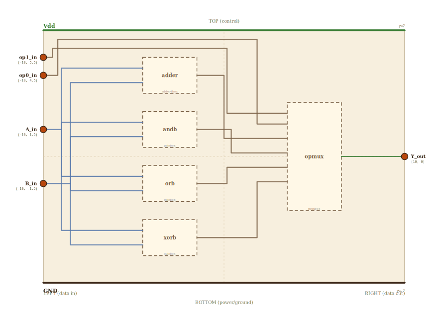

# Layer 13 — ALU (4-bit, 4 operations)

The compute heart of the datapath. Given two operands `A` and `B` and a
2-bit operation select `op`, the ALU produces one result `Y`. It is where
`add x3, x1, x2` actually happens — the register file hands the ALU two
values, the ALU adds them, and the result goes back to the register file.

It is the culmination of the combinational tower: the **4-bit adder** does
`ADD`, three bitwise gate-arrays do `AND` / `OR` / `XOR`, and a **4-to-1
MUX** (the same primitive built one layer down) picks which of the four
results becomes `Y` based on `op`. That is the decoder/MUX payoff in
action — "a CPU is mostly MUXes."

Operation table:

| op1 | op0 | Y       |
|-----|-----|---------|
|  0  |  0  | A + B   |
|  0  |  1  | A AND B |
|  1  |  0  | A OR B  |
|  1  |  1  | A XOR B |

Per the locked spatial invariant (CLAUDE.md): all inputs on the LEFT
(`op`, then the `A` and `B` operand buses), the result `Y` on the RIGHT.
`A`, `B`, the four results and `Y` are drawn on the page as 4-conductor
bundles (one lit line per bit, so the binary value is readable straight
off the wires); the deeper per-bit *logic* lives one drill down (the adder
is the standalone 4-bit adder; the op-MUX is the standalone MUX shown as
one bit-slice).

## Scene bounds
x ∈ [-10, 10], y ∈ [-7, 7]

## External terminals

| key     | role                  | (x, y)       | edge   |
|---------|-----------------------|--------------|--------|
| op1_in  | op select bit 1       | (-10,  5.5)  | LEFT   |
| op0_in  | op select bit 0       | (-10,  4.5)  | LEFT   |
| A_in    | operand A (4-bit bus) | (-10,  1.5)  | LEFT   |
| B_in    | operand B (4-bit bus) | (-10, -1.5)  | LEFT   |
| Y_out   | result (4-bit bus)    | ( 10,  0)    | RIGHT  |
| Vdd     | supply (+V)           | (  0,  7)    | TOP    |
| GND     | supply (0V)           | (  0, -7)    | BOTTOM |

## Internal supply distribution

Vdd rail along the top (y=7), GND along the bottom (y=-7). Each child
block sits between the rails and taps them directly.

## Embedded children

| child id | child layer | center (cx, cy) | box (w × h) |
|----------|-------------|-----------------|-------------|
| adder    | adder4box   | (-3.0,  4.5)    | 3.0 × 2.0   |
| andb     | gatebox     | (-3.0,  1.5)    | 3.0 × 2.0   |
| orb      | gatebox     | (-3.0, -1.5)    | 3.0 × 2.0   |
| xorb     | gatebox     | (-3.0, -4.5)    | 3.0 × 2.0   |
| opmux    | muxbox      | ( 5.0,  0.0)    | 3.0 × 6.0   |

- `adder` (4-bit adder): `A + B` → result bus. Drillable → /adder4.html.
- `andb` / `orb` / `xorb` (bitwise gate-arrays, leaf): `A&B` / `A|B` /
  `A^B`. Not drillable (arrays of the leaf gates already built).
- `opmux` (4-to-1 MUX): `in0..in3 ← add/and/or/xor`, `s1 ← op1`,
  `s0 ← op0`, `out → Y`. Drillable → /mux.html (one bit-slice).

## Absorbed terminals

Adder `adder` (cx=-3, cy=4.5, w=3, h=2 → x∈[-4.5,-1.5], y∈[3.5,5.5]):

- `adder_A_in` (-4.5, 4.9),  `adder_B_in` (-4.5, 4.1),  `adder_Y_out` (-1.5, 4.5)

AND `andb` (cy=1.5 → y∈[0.5,2.5]):

- `andb_A_in` (-4.5, 1.9),  `andb_B_in` (-4.5, 1.1),  `andb_Y_out` (-1.5, 1.5)

OR `orb` (cy=-1.5 → y∈[-2.5,-0.5]):

- `orb_A_in` (-4.5, -1.1),  `orb_B_in` (-4.5, -1.9),  `orb_Y_out` (-1.5, -1.5)

XOR `xorb` (cy=-4.5 → y∈[-5.5,-3.5]):

- `xorb_A_in` (-4.5, -4.1),  `xorb_B_in` (-4.5, -4.9),  `xorb_Y_out` (-1.5, -4.5)

Op-MUX `opmux` (cx=5, cy=0, w=3, h=6 → x∈[3.5,6.5], y∈[-3,3]):

- `opmux_s1_in`  (3.5,  2.4)   ← op1 (y inside the AND block's band)
- `opmux_s0_in`  (3.5,  1.8)   ← op0 (y inside the AND block's band)
- `opmux_in0_in` (3.5,  1.0)   ← adder result (op 00)
- `opmux_in1_in` (3.5,  0.2)   ← AND result (op 01)
- `opmux_in2_in` (3.5, -0.6)   ← OR result (op 10)
- `opmux_in3_in` (3.5, -1.4)   ← XOR result (op 11)
- `opmux_Y_out`  (6.5,  0.0)   → Y

## Bus junctions

- `A_tap` (-9.0,  1.5)  — operand A turns into its vertical fan-out bus
- `B_tap` (-8.5, -1.5)  — operand B turns into its vertical fan-out bus

## Internal nets

| net   | carries                                            |
|-------|----------------------------------------------------|
| op1   | op select 1 → MUX s1                                |
| op0   | op select 0 → MUX s0                                |
| A     | operand A bus → all four compute blocks             |
| B     | operand B bus → all four compute blocks             |
| add   | adder result → MUX in0                              |
| and   | AND result → MUX in1                                |
| or    | OR result → MUX in2                                 |
| xor   | XOR result → MUX in3                                |
| Y     | selected result → output                            |

## Wires

| from        | to            | via                                            | net |
|-------------|---------------|------------------------------------------------|-----|
| A_in        | A_tap         | —                                              | A   |
| A_tap       | adder_A_in    | (-9.0, 4.9)                                    | A   |
| A_tap       | andb_A_in     | (-9.0, 1.9)                                    | A   |
| A_tap       | orb_A_in      | (-9.0, -1.1)                                   | A   |
| A_tap       | xorb_A_in     | (-9.0, -4.1)                                   | A   |
| B_in        | B_tap         | —                                              | B   |
| B_tap       | adder_B_in    | (-8.5, 4.1)                                    | B   |
| B_tap       | andb_B_in     | (-8.5, 1.1)                                    | B   |
| B_tap       | orb_B_in      | (-8.5, -1.9)                                   | B   |
| B_tap       | xorb_B_in     | (-8.5, -4.9)                                   | B   |
| adder_Y_out | opmux_in0_in  | (0.0, 4.5), (0.0, 1.0)                         | add |
| andb_Y_out  | opmux_in1_in  | (0.4, 1.5), (0.4, 0.2)                         | and |
| orb_Y_out   | opmux_in2_in  | (0.8, -1.5), (0.8, -0.6)                       | or  |
| xorb_Y_out  | opmux_in3_in  | (1.2, -4.5), (1.2, -1.4)                       | xor |
| op1_in      | opmux_s1_in   | (-9.5, 5.5), (-9.5, 6.5), (2.8, 6.5), (2.8, 2.4) | op1 |
| op0_in      | opmux_s0_in   | (-9.2, 4.5), (-9.2, 6.8), (3.0, 6.8), (3.0, 1.8) | op0 |
| opmux_Y_out | Y_out         | —                                              | Y   |

The `A` and `B` operand buses each fan out from a single junction
(`A_tap` / `B_tap`) to all four compute blocks; those branches share the
vertical bus (the same-net stub-sharing the geometry checker permits).
The two `op` selects route over the top edge and drop into the MUX, whose
select terminals sit at a y inside the AND block's band so the path can't
be collapsed into a straight wire that grazes a block.

## Alignment claims

- All four inputs (`op1`, `op0`, `A`, `B`) are on the LEFT edge; the
  single `Y` result is on the RIGHT edge, per the locked invariant.
- The four compute blocks stack top-to-bottom in op order
  (add / and / or / xor) so each result drops into the matching MUX input.
- `opmux_s1_in.y` / `opmux_s0_in.y` lie inside the AND block's vertical
  band, keeping the op-select routes as honest top-edge detours.

## Embedding contract

A 32-bit RV32I ALU is this same shape: 32-bit-wide adder and gate-arrays,
a wider op select (more rows → SUB, SLT, shifts), and a 32-bit-wide op
MUX (32 parallel bit-slices). The 4-bit / 4-op version here keeps the
adder a 1:1 drill into /adder4.html and the op MUX a 1:1 drill into
/mux.html.

