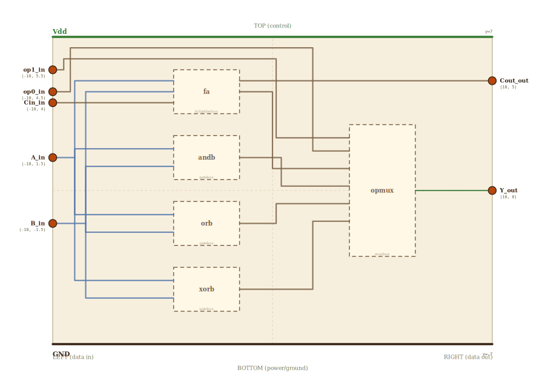

# Layer 14 — 1-bit ALU (single bit-slice, 4 operations)

One bit-slice of the ALU. Given one bit of each operand (`A`, `B`), a
carry-in `Cin`, and a 2-bit operation select `op`, it produces one result
bit `Y` and a carry-out `Cout`. This is the *primitive* the wide ALU is
built from: the layer-13 4-bit ALU is **four of these stacked**, with `op`
broadcast to every slice and `Cout`→`Cin` chaining the slices for the ADD
path. (Exactly the "build the bit-slice, then replicate" move used to go
from the full adder to the 4-bit adder, and from the 1-bit register file
to a wide one.)

Inside one slice: a **full adder** computes `A + B + Cin` (its sum is the
ADD result, its carry-out leaves as `Cout`), three single bitwise gates do
`AND` / `OR` / `XOR`, and a **4-to-1 MUX** picks which of the four results
becomes `Y` based on `op`. The full adder and the op-MUX are drillable
(into /fulladder.html and /mux.html); the bitwise gates are leaves.

Operation table:

| op1 | op0 | Y       |
|-----|-----|---------|
|  0  |  0  | A + B   |
|  0  |  1  | A AND B |
|  1  |  0  | A OR B  |
|  1  |  1  | A XOR B |

Per the locked spatial invariant (CLAUDE.md): all inputs on the LEFT
(`op`, `Cin`, then `A` and `B`), the results `Y` and `Cout` on the RIGHT.
Only the ADD path uses `Cin`/`Cout`; the bitwise ops ignore the carry.

## Scene bounds
x ∈ [-10, 10], y ∈ [-7, 7]

## External terminals

| key      | role                        | (x, y)       | edge   |
|----------|-----------------------------|--------------|--------|
| op1_in   | op select bit 1             | (-10,  5.5)  | LEFT   |
| op0_in   | op select bit 0             | (-10,  4.5)  | LEFT   |
| Cin_in   | carry in (from slice below) | (-10,  4.0)  | LEFT   |
| A_in     | operand A (1 bit)           | (-10,  1.5)  | LEFT   |
| B_in     | operand B (1 bit)           | (-10, -1.5)  | LEFT   |
| Y_out    | result bit                  | ( 10,  0.0)  | RIGHT  |
| Cout_out | carry out (to slice above)  | ( 10,  5.0)  | RIGHT  |
| Vdd      | supply (+V)                 | (  0,  7)    | TOP    |
| GND      | supply (0V)                 | (  0, -7)    | BOTTOM |

## Internal supply distribution

Vdd rail along the top (y=7), GND along the bottom (y=-7). Each child
block sits between the rails and taps them directly.

## Embedded children

| child id | child layer  | center (cx, cy) | box (w × h) |
|----------|--------------|-----------------|-------------|
| fa       | fulladderbox | (-3.0,  4.5)    | 3.0 × 2.0   |
| andb     | gatebox      | (-3.0,  1.5)    | 3.0 × 2.0   |
| orb      | gatebox      | (-3.0, -1.5)    | 3.0 × 2.0   |
| xorb     | gatebox      | (-3.0, -4.5)    | 3.0 × 2.0   |
| opmux    | muxbox       | ( 5.0,  0.0)    | 3.0 × 6.0   |

- `fa` (full adder): `A + B + Cin` → sum (the ADD result) + `Cout`.
  Drillable → /fulladder.html.
- `andb` / `orb` / `xorb` (single bitwise gates, leaf): `A&B` / `A|B` /
  `A^B`. Not drillable.
- `opmux` (4-to-1 MUX): `in0..in3 ← add/and/or/xor`, `s1 ← op1`,
  `s0 ← op0`, `out → Y`. Drillable → /mux.html.

## Absorbed terminals

Full adder `fa` (cx=-3, cy=4.5, w=3, h=2 → x∈[-4.5,-1.5], y∈[3.5,5.5]):

- `fa_A_in` (-4.5, 5.0),  `fa_B_in` (-4.5, 4.5),  `fa_Cin_in` (-4.5, 4.0),  `fa_S_out` (-1.5, 4.5),  `fa_Cout_out` (-1.5, 5.0)

AND `andb` (cy=1.5 → y∈[0.5,2.5]):

- `andb_A_in` (-4.5, 1.9),  `andb_B_in` (-4.5, 1.1),  `andb_Y_out` (-1.5, 1.5)

OR `orb` (cy=-1.5 → y∈[-2.5,-0.5]):

- `orb_A_in` (-4.5, -1.1),  `orb_B_in` (-4.5, -1.9),  `orb_Y_out` (-1.5, -1.5)

XOR `xorb` (cy=-4.5 → y∈[-5.5,-3.5]):

- `xorb_A_in` (-4.5, -4.1),  `xorb_B_in` (-4.5, -4.9),  `xorb_Y_out` (-1.5, -4.5)

Op-MUX `opmux` (cx=5, cy=0, w=3, h=6 → x∈[3.5,6.5], y∈[-3,3]):

- `opmux_s1_in`  (3.5,  2.4)   ← op1
- `opmux_s0_in`  (3.5,  1.8)   ← op0
- `opmux_in0_in` (3.5,  1.0)   ← adder sum (op 00)
- `opmux_in1_in` (3.5,  0.2)   ← AND result (op 01)
- `opmux_in2_in` (3.5, -0.6)   ← OR result (op 10)
- `opmux_in3_in` (3.5, -1.4)   ← XOR result (op 11)
- `opmux_Y_out`  (6.5,  0.0)   → Y

## Bus junctions

- `A_tap` (-9.0,  1.5)  — operand A turns into its vertical fan-out bus
- `B_tap` (-8.5, -1.5)  — operand B turns into its vertical fan-out bus

## Internal nets

| net   | carries                                            |
|-------|----------------------------------------------------|
| op1   | op select 1 → MUX s1                                |
| op0   | op select 0 → MUX s0                                |
| Cin   | carry in → full adder                               |
| A     | operand A → all four compute blocks                 |
| B     | operand B → all four compute blocks                 |
| add   | full-adder sum → MUX in0                             |
| and   | AND result → MUX in1                                |
| or    | OR result → MUX in2                                 |
| xor   | XOR result → MUX in3                                |
| cout  | full-adder carry-out → Cout                          |
| Y     | selected result → output                            |

## Wires

| from        | to            | via                                            | net  |
|-------------|---------------|------------------------------------------------|------|
| A_in        | A_tap         | —                                              | A    |
| A_tap       | fa_A_in       | (-9.0, 5.0)                                    | A    |
| A_tap       | andb_A_in     | (-9.0, 1.9)                                    | A    |
| A_tap       | orb_A_in      | (-9.0, -1.1)                                   | A    |
| A_tap       | xorb_A_in     | (-9.0, -4.1)                                   | A    |
| B_in        | B_tap         | —                                              | B    |
| B_tap       | fa_B_in       | (-8.5, 4.5)                                    | B    |
| B_tap       | andb_B_in     | (-8.5, 1.1)                                    | B    |
| B_tap       | orb_B_in      | (-8.5, -1.9)                                   | B    |
| B_tap       | xorb_B_in     | (-8.5, -4.9)                                   | B    |
| Cin_in      | fa_Cin_in     | —                                              | Cin  |
| fa_S_out    | opmux_in0_in  | (0.0, 4.5), (0.0, 1.0)                         | add  |
| andb_Y_out  | opmux_in1_in  | (0.4, 1.5), (0.4, 0.2)                         | and  |
| orb_Y_out   | opmux_in2_in  | (0.8, -1.5), (0.8, -0.6)                       | or   |
| xorb_Y_out  | opmux_in3_in  | (1.2, -4.5), (1.2, -1.4)                       | xor  |
| fa_Cout_out | Cout_out      | —                                              | cout |
| op1_in      | opmux_s1_in   | (-9.5, 5.5), (-9.5, 6.5), (2.8, 6.5), (2.8, 2.4) | op1 |
| op0_in      | opmux_s0_in   | (-9.2, 4.5), (-9.2, 6.8), (3.0, 6.8), (3.0, 1.8) | op0 |
| opmux_Y_out | Y_out         | —                                              | Y    |

`Cin` enters as a straight horizontal at the full adder's carry-in height
(y=4.0); `Cout` leaves the full adder's top-right as a straight horizontal
at y=5.0 to the right edge — the two carry terminals frame the ADD block,
mirroring how the slices stack (this slice's `Cout` becomes the next
slice's `Cin`). Operand `A`/`B` fan out from a single junction each; the
op selects detour over the top edge into the MUX (their drop-in y sits
inside the AND block's band so the path can't collapse onto a block).

## Alignment claims

- All five inputs (`op1`, `op0`, `Cin`, `A`, `B`) are on the LEFT edge;
  the two outputs (`Y`, `Cout`) are on the RIGHT edge, per the invariant.
- The four compute blocks stack top-to-bottom in op order
  (add / and / or / xor) so each result drops into the matching MUX input.

## Embedding contract

The layer-13 4-bit ALU is four of these slices: `A`/`B`/`Y` widen to 4-bit
buses, `op` is broadcast to all four slices, and `Cout(i) → Cin(i+1)`
chains the ADD path. A 32-bit RV32I ALU is 32 slices, same shape.

