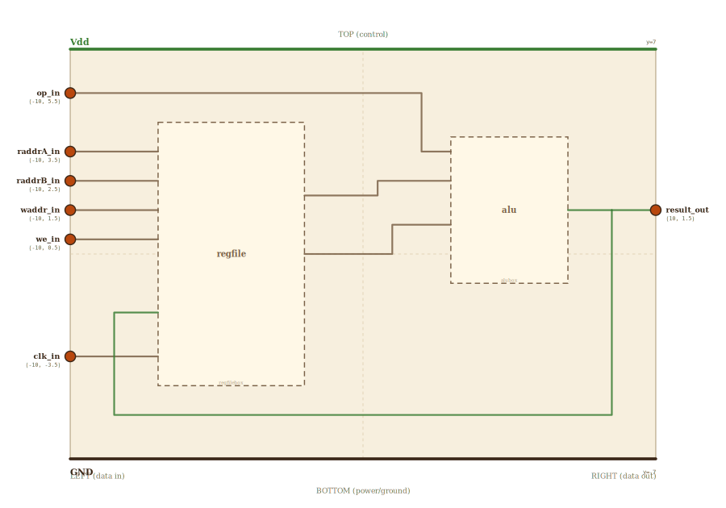

# Layer 15 — datapath (register file + ALU, the `add` loop)

This is the convergence: where stored values finally get *computed on*. A
single RISC-V register-register instruction — `add x3, x1, x2` — is two
reads, one operate, one write. The **register file** supplies two operands
(read ports A and B), the **ALU** combines them, and the result rides back
into the file's write port. Read this page and you have read a CPU's
datapath: everything below (gates, latches, MUXes, the adder) was built so
this loop can run.

Kept 1-bit-wide, like the file and ALU it composes, so every wire is a
single bit and the two read ports → two ALU operands map 1:1. Widen every
block to 32 bits and grow the addresses and this is the literal RV32I
datapath.

## Scene bounds
x ∈ [-10, 10], y ∈ [-7, 7]

## External terminals

| key        | role                          | (x, y)      | edge   |
|------------|-------------------------------|-------------|--------|
| raddrA_in  | read address A (selects x1)   | (-10,  3.5) | LEFT   |
| raddrB_in  | read address B (selects x2)   | (-10,  2.5) | LEFT   |
| waddr_in   | write address (selects x3)    | (-10,  1.5) | LEFT   |
| we_in      | write enable                  | (-10,  0.5) | LEFT   |
| op_in      | ALU operation select          | (-10,  5.5) | LEFT   |
| clk_in     | clock                         | (-10, -3.5) | LEFT   |
| result_out | ALU result (written back)     | ( 10,  1.5) | RIGHT  |
| Vdd        | supply (+V)                   | (  0,  7)   | TOP    |
| GND        | supply (0V)                   | (  0, -7)   | BOTTOM |

## Internal supply distribution

Vdd rail along the top (y=7), GND along the bottom (y=-7). Each child block
sits between the rails and taps them directly.

## Embedded children

| child id | child layer | center (cx, cy) | box (w × h) |
|----------|-------------|-----------------|-------------|
| regfile  | regfilebox  | (-4.5,  0.0)    | 5.0 × 9.0   |
| alu      | alubox      | ( 5.0,  1.5)    | 4.0 × 5.0   |

- `regfile` (4×1-bit, 2 read ports + 1 write port): drillable → /regfile.html.
- `alu` (1-bit ALU slice): `A ← rdataA`, `B ← rdataB`, `op ← op`,
  `Y → result` (and back to `wdata`). Drillable → /alu1.html.

## Absorbed terminals

Register file `regfile` (cx=-4.5, cy=0, w=5, h=9 → x∈[-7,-2], y∈[-4.5,4.5]):

- `regfile_raddrA_in` (-7,  3.5)
- `regfile_raddrB_in` (-7,  2.5)
- `regfile_waddr_in`  (-7,  1.5)
- `regfile_we_in`     (-7,  0.5)
- `regfile_clk_in`    (-7, -3.5)
- `regfile_wdata_in`  (-7, -2.0)
- `regfile_rdataA_out` (-2,  2.0)
- `regfile_rdataB_out` (-2,  0.0)

ALU `alu` (cx=5, cy=1.5, w=4, h=5 → x∈[3,7], y∈[-1,4]):

- `alu_op_in`   (3,  3.5)
- `alu_A_in`    (3,  2.5)
- `alu_B_in`    (3,  1.0)
- `alu_Y_out`   (7,  1.5)

## Bus junctions

- `Y_tap` (8.5, 1.5) — the ALU result splits: out to `result`, and back to `wdata`

## Internal nets

| net    | carries                                              |
|--------|------------------------------------------------------|
| raddrA | read address A → register file                        |
| raddrB | read address B → register file                        |
| waddr  | write address → register file                         |
| we     | write enable → register file                          |
| op     | ALU op select → ALU                                   |
| clk    | clock → register file                                 |
| rdataA | register file read port A → ALU operand A             |
| rdataB | register file read port B → ALU operand B             |
| Y      | ALU result → output + write-back to the register file |

## Wires

| from               | to               | via                                       | net    |
|--------------------|------------------|-------------------------------------------|--------|
| raddrA_in          | regfile_raddrA_in | —                                        | raddrA |
| raddrB_in          | regfile_raddrB_in | —                                        | raddrB |
| waddr_in           | regfile_waddr_in  | —                                        | waddr  |
| we_in              | regfile_we_in     | —                                        | we     |
| clk_in             | regfile_clk_in    | —                                        | clk    |
| op_in              | alu_op_in         | (-8.5, 5.5), (-8.5, 6.5), (2.0, 6.5), (2.0, 3.5) | op |
| regfile_rdataA_out | alu_A_in          | (0.5, 2.0), (0.5, 2.5)                    | rdataA |
| regfile_rdataB_out | alu_B_in          | (1.0, 0.0), (1.0, 1.0)                    | rdataB |
| alu_Y_out          | Y_tap             | —                                         | Y      |
| Y_tap              | result_out        | —                                         | Y      |
| Y_tap              | regfile_wdata_in  | (8.5, -5.5), (-8.5, -5.5), (-8.5, -2.0)   | Y      |

The two read-port outputs cross the central gap into the ALU's operand
inputs (the 1:1 "two reads → two operands" map). The ALU result fans at
`Y_tap`: straight out to `result`, and around the bottom edge back into the
write-data port — the write-back path that lets one instruction's output
become a later instruction's input. The `op` select detours over the top
edge so its drop-in sits clear of both blocks.

## Alignment claims

- All six control/data inputs (`raddrA`, `raddrB`, `waddr`, `we`, `op`,
  `clk`) are on the LEFT edge; the single `result` output is on the RIGHT,
  per the locked invariant.
- `rdataA`/`rdataB` leave the register file's RIGHT edge and enter the ALU's
  LEFT edge — read ports feed operands with no block in between.
- The write-back wire routes around the BOTTOM (below the register file) so
  it never crosses a block, mirroring how the result returns to storage.

## Embedding contract

The RV32I datapath is this exact shape: a 32×32-bit register file with two
read ports and one write port, a 32-bit ALU, `op`/addresses driven by a
decoded instruction, and the same read→operate→write-back loop. Widen the
buses and add instruction decode and this runs real programs.

