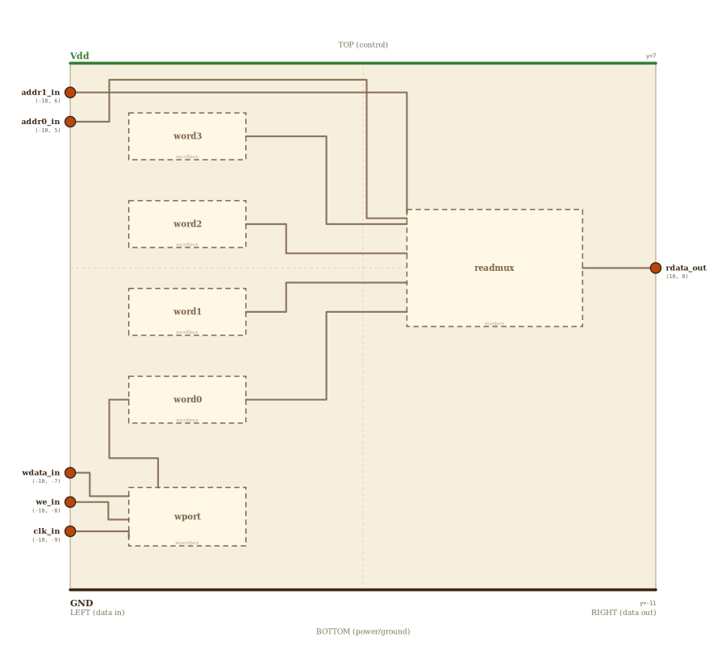

# Layer 16 — data memory (addressable read + write store)

Data memory is `mem` with a second door. The **read path** is identical to the
instruction memory: a 2-bit `addr` selects one of four stored cells and it flows
out as `rdata`, combinationally (no clock). What's new is the **write path**: a
`write port` (an address decoder plus write-enable gating the clock to one cell)
that, on a clock edge with `we=1`, stores `wdata` into the addressed cell.

That read-and-write pair is exactly what a `load` (read a cell) and a `store`
(write a cell) need. Here it's 4 cells × 1 bit; widen the cell and add address
bits for real RAM.

## Scene bounds
x ∈ [-10, 10], y ∈ [-11, 7]

## External terminals

| key       | role                          | (x, y)      | edge   |
|-----------|-------------------------------|-------------|--------|
| addr1_in  | address bit 1                 | (-10,  6.0) | LEFT   |
| addr0_in  | address bit 0                 | (-10,  5.0) | LEFT   |
| wdata_in  | write data in                 | (-10, -7.0) | LEFT   |
| we_in     | write enable                  | (-10, -8.0) | LEFT   |
| clk_in    | clock (commits the write)     | (-10, -9.0) | LEFT   |
| rdata_out | cell read out                 | ( 10,  0.0) | RIGHT  |
| Vdd       | supply (+V)                   | (  0,  7)   | TOP    |
| GND       | supply (0V)                   | (  0, -11)  | BOTTOM |

## Internal supply distribution

Vdd rail at y=7 (TOP), GND at y=-11. Each cell taps the rails directly.

## Embedded children

| child id | child layer | center (cx, cy) | box (w × h) | inputs → absorbed | outputs → absorbed |
|----------|-------------|-----------------|-------------|-------------------|--------------------|
| word3    | wordbox     | (-6.0,  4.5)    | 4.0 × 1.6   | —                 | rdata_out → word3_rdata_out |
| word2    | wordbox     | (-6.0,  1.5)    | 4.0 × 1.6   | —                 | rdata_out → word2_rdata_out |
| word1    | wordbox     | (-6.0, -1.5)    | 4.0 × 1.6   | —                 | rdata_out → word1_rdata_out |
| word0    | wordbox     | (-6.0, -4.5)    | 4.0 × 1.6   | wsel → word0_w_in | rdata_out → word0_rdata_out |
| readmux  | muxbox      | ( 4.5,  0.0)    | 6.0 × 4.0   | addr → readmux_s{1,0}_in; word{3..0} → readmux_in{3..0} | out → readmux_out |
| wport    | wportbox    | (-6.0, -8.5)    | 4.0 × 2.0   | wdata/we/clk → wport_{wdata,we,clk}_in | wsel → wport_out |

The read MUX is sized to `mux`'s aspect (its hover-embed of `/mux.html` isn't
distorted). The `wport` write port sits in a band below the cells; its decoded
write line rides up the left gutter into the addressed cell (shown to word0 and
word3 — the decoder reaches all four).

## Absorbed terminals

Word cells (read out on the right edge x=-4.0; write in on the left edge x=-8.0):

- `word3_rdata_out` (-4.0,  4.5)
- `word2_rdata_out` (-4.0,  1.5)
- `word1_rdata_out` (-4.0, -1.5)
- `word0_rdata_out` (-4.0, -4.5)   `word0_w_in` (-8.0, -4.5)

Read MUX `readmux` (cx=4.5, cy=0, w=6, h=4 → x∈[1.5,7.5], y∈[-2,2]):

- `readmux_in3_in` (1.5,  1.5)
- `readmux_in2_in` (1.5,  0.5)
- `readmux_in1_in` (1.5, -0.5)
- `readmux_in0_in` (1.5, -1.5)
- `readmux_s1_in`  (1.5,  1.9)
- `readmux_s0_in`  (1.5,  1.7)
- `readmux_out`    (7.5,  0.0)

Write port `wport` (cx=-6, cy=-8.5, w=4, h=2 → x∈[-8,-4], y∈[-9.5,-7.5]):

- `wport_wdata_in` (-8.0, -7.8)
- `wport_we_in`    (-8.0, -8.6)
- `wport_clk_in`   (-8.0, -9.2)
- `wport_out`      (-7.0, -7.5)

## Internal nets

| net   | carries                                  |
|-------|------------------------------------------|
| addr1 | address bit 1 → read MUX select          |
| addr0 | address bit 0 → read MUX select          |
| word3 | stored cell 3 → read MUX in3             |
| word2 | stored cell 2 → read MUX in2             |
| word1 | stored cell 1 → read MUX in1             |
| word0 | stored cell 0 → read MUX in0             |
| rdata | selected cell out                        |
| wdata | write data → write port                  |
| we    | write enable → write port                |
| clk   | clock → write port                       |
| wsel  | decoded write line → addressed cell      |

## Wires

| from              | to             | via                                               | net   |
|-------------------|----------------|---------------------------------------------------|-------|
| Vdd_left          | Vdd_right      | —                                                 | Vdd   |
| GND_left          | GND_right      | —                                                 | GND   |
| addr1_in          | readmux_s1_in  | (-9.5, 6.0), (-9.5, 6.5), (0.0, 6.5), (0.0, 1.9)  | addr1 |
| addr0_in          | readmux_s0_in  | (-9.0, 5.0), (-9.0, 6.8), (0.3, 6.8), (0.3, 1.7)  | addr0 |
| word3_rdata_out   | readmux_in3_in | (-1.5, 4.5), (-1.5, 1.5)                           | word3 |
| word2_rdata_out   | readmux_in2_in | (-2.0, 1.5), (-2.0, 0.5)                           | word2 |
| word1_rdata_out   | readmux_in1_in | (-2.0, -1.5), (-2.0, -0.5)                         | word1 |
| word0_rdata_out   | readmux_in0_in | (-1.5, -4.5), (-1.5, -1.5)                         | word0 |
| readmux_out       | rdata_out      | —                                                 | rdata |
| wdata_in          | wport_wdata_in | (-9.5, -7.0), (-9.5, -7.8)                         | wdata |
| we_in             | wport_we_in    | (-8.7, -8.0), (-8.7, -8.6)                         | we    |
| clk_in            | wport_clk_in   | (-8.5, -9.0), (-8.5, -9.2)                         | clk   |
| wport_out         | word0_w_in     | (-7.0, -6.5), (-9.0, -6.5), (-9.0, -4.5)          | wsel  |

The two address bits ride OVER the cells into the read MUX's selects; the four
cells bend into the MUX's data inputs; the MUX forwards the addressed cell as
`rdata`. Below, `wdata`/`we`/`clk` enter the write port; on a clock edge it
raises the addressed cell's `wsel` line up the left gutter and the cell stores
`wdata`.

## Supply helpers

- `Vdd_left` (-10, 7), `Vdd_right` (10, 7)
- `GND_left` (-10, -11), `GND_right` (10, -11)

## Alignment claims

- All inputs (`addr1`, `addr0`, `wdata`, `we`, `clk`) are on the LEFT; the
  single `rdata` output is on the RIGHT, per the locked invariant.
- Each `word{n}_rdata_out` shares its `readmux_in{n}_in` y-value → the four
  read buses are pure horizontals.
- The write lines run in the left gutter (x ≤ -9), clear of every cell box.

## Embedding contract

Same block as instruction memory, plus a write port. On the datapath it sits
beside the register file: a `load` drives its address from the ALU result and
takes `rdata`; a `store` drives `wdata` from a register and pulses `we`.

