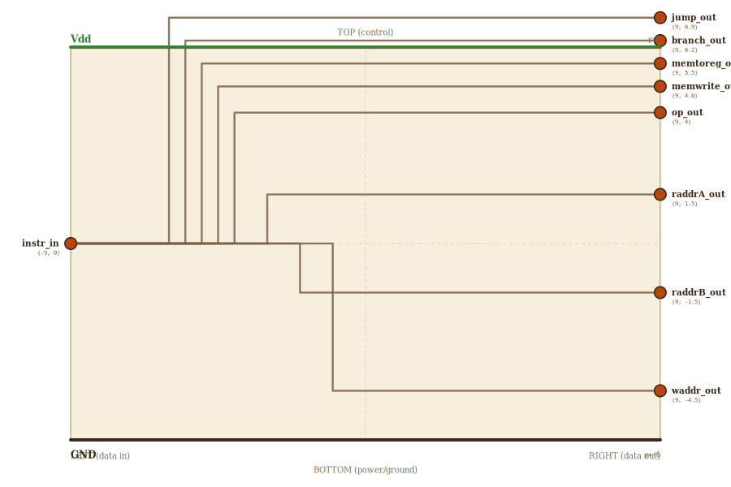

# Layer 16 — instruction decoder (field extraction)

Where the datapath's control inputs finally get a *source*. On the datapath
page you set `op`, `raddrA`, `raddrB`, `waddr` by hand; in a CPU they are
*sliced straight out of the instruction word*. That's the whole job here.

A RISC-V instruction carries the register numbers and the operation as plain
bit-fields — `opcode`, `func`, `rs1`, `rs2`, `rd`. The whole 10-bit word
arrives as one bus (`/10`); the decoder splits it into fields, each leaving as
its own bus (`/2`) — plus ONE piece of real logic, the CONTROL UNIT: the
opcode bundle feeds it and is decoded truth-table style into the control
lines (opcode `10` = LW → `memToReg`; `11` = SW → `memWrite`; `00` = R-type →
neither; `01` reserved for branch). The opcode never leaves as data — it
exists to be decoded. `func` goes separately to the ALU (RISC-V's
opcode/funct split).

| instruction field | bits | datapath output          |
|-------------------|------|--------------------------|
| opcode            | 2    | (control unit input)     |
| func              | 2    | op                       |
| rs1               | 2    | raddrA                   |
| rs2               | 2    | raddrB                   |
| rd                | 2    | waddr                    |
| — control unit    |      | memToReg, memWrite       |

## Scene bounds
x ∈ [-9, 9], y ∈ [-6, 6]

## External terminals

| key          | role                            | (x, y)     | edge   |
|--------------|---------------------------------|------------|--------|
| instr_in     | 10-bit instruction word (/10)   | (-9,  0)   | LEFT   |
| memtoreg_out | control: LW → write-back source | ( 9,  5.5) | RIGHT  |
| memwrite_out | control: SW → memory write-en   | ( 9,  4.8) | RIGHT  |
| op_out       | func field → ALU op (/2)        | ( 9,  4)   | RIGHT  |
| raddrA_out   | rs1 field → read-addr A (/2)    | ( 9,  1.5) | RIGHT  |
| raddrB_out   | rs2 field → read-addr B (/2)    | ( 9, -1.5) | RIGHT  |
| waddr_out    | rd field → write-addr (/2)      | ( 9, -4.5) | RIGHT  |
| Vdd          | supply (+V)                     | ( 0,  6)   | TOP    |
| GND          | supply (0V)                     | ( 0, -6)   | BOTTOM |

The instruction word enters on the LEFT as one bus; the four decoded field
buses leave on the RIGHT, per the locked invariant.

## Internal supply distribution

Vdd rail at y=6 (TOP), GND at y=-6. No internal power taps — the decoder is
pure passthrough field-extraction wiring.

## Wires

| from      | to           | via                            | net      |
|-----------|--------------|--------------------------------|----------|
| Vdd_left  | Vdd_right    | —                              | Vdd      |
| GND_left  | GND_right    | —                              | GND      |
| instr_in  | op_out       | (-4, 0), (-4, 4)               | op       |
| instr_in  | raddrA_out   | (-3, 0), (-3, 1.5)             | raddrA   |
| instr_in  | raddrB_out   | (-2, 0), (-2, -1.5)            | raddrB   |
| instr_in  | waddr_out    | (-1, 0), (-1, -4.5)            | waddr    |
| instr_in  | memtoreg_out | (-5, 0), (-5, 5.5)             | memtoreg |
| instr_in  | memwrite_out | (-4.5, 0), (-4.5, 4.8)         | memwrite |

## Supply helpers

- `Vdd_left` (-9, 6), `Vdd_right` (9, 6)
- `GND_left` (-9, -6), `GND_right` (9, -6)

## Alignment claims

- The instruction word enters on the LEFT (one `/8` bus); all four decoded
  field buses leave on the RIGHT, per the locked invariant.
- The fields fan out in datapath order `op, raddrA, raddrB, waddr` top-to-
  bottom — the order of the datapath's left-edge inputs.

## Embedding contract

A real RV32I instruction decoder is this, wider and with the field positions
fixed by the ISA (rd[11:7], rs1[19:15], rs2[24:20], opcode[6:0]) — plus a bit
of control logic where this page has bare wire (decode opcode → RegWrite /
ALUSrc / MemWrite, sign-extend the immediate). The skeleton is the same:
slice the word, route each field to the block that consumes it.

