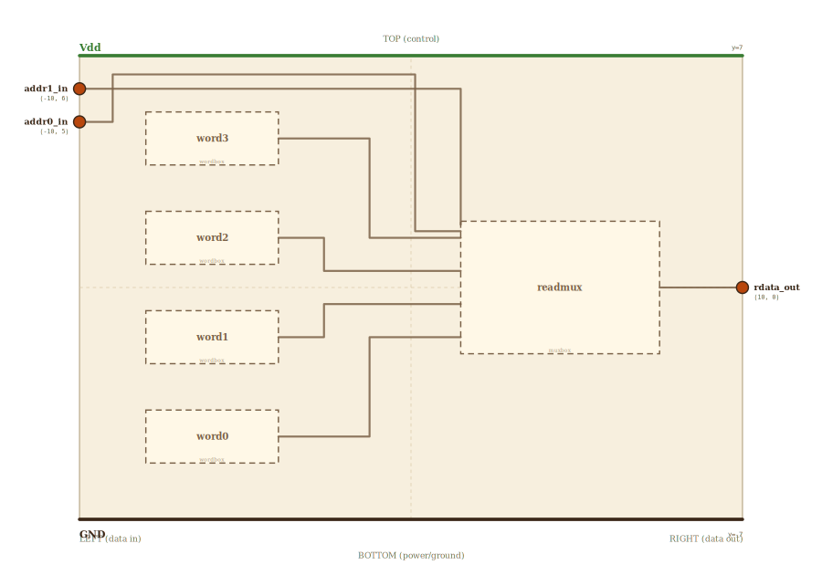

# Layer 16 — memory (addressable word store)

Memory doesn't know whether it holds instructions or data — it just stores
**addressable words**: give it an address, it hands back the word living there.
That's why this block is plain `mem`, reused for both roles (instruction
memory on the fetch path, data memory on the load/store path).

This is the **read path**: a 2-bit `addr` selects one of four stored words
and it flows out as `rdata`. Read is combinational — the word appears the
instant the address settles, no clock (exactly like the register file's read
port). The four words are storage cells (`register`s); a read **MUX** picks
the addressed one. The write port (decoder + write-enable gating the clock to
one cell) joins this block when we reach loads/stores.

Here it's 4 words × 8 bits — one word wide enough to hold an instruction.
Narrow the word for 1-bit data, widen it and add address bits for real memory.

## Scene bounds
x ∈ [-10, 10], y ∈ [-7, 7]

## External terminals

| key       | role                          | (x, y)      | edge   |
|-----------|-------------------------------|-------------|--------|
| addr1_in  | address bit 1                 | (-10,  6.0) | LEFT   |
| addr0_in  | address bit 0                 | (-10,  5.0) | LEFT   |
| rdata_out | word read out (8-bit)         | ( 10,  0.0) | RIGHT  |
| Vdd       | supply (+V)                   | (  0,  7)   | TOP    |
| GND       | supply (0V)                   | (  0, -7)   | BOTTOM |

## Internal supply distribution

Vdd rail at y=7 (TOP), GND at y=-7. Each word cell taps the rails directly.

## Embedded children

| child id | child layer | center (cx, cy) | box (w × h) | inputs → absorbed | outputs → absorbed |
|----------|-------------|-----------------|-------------|-------------------|--------------------|
| word3    | wordbox     | (-6.0,  4.5)    | 4.0 × 1.6   | —                 | rdata_out → word3_rdata_out |
| word2    | wordbox     | (-6.0,  1.5)    | 4.0 × 1.6   | —                 | rdata_out → word2_rdata_out |
| word1    | wordbox     | (-6.0, -1.5)    | 4.0 × 1.6   | —                 | rdata_out → word1_rdata_out |
| word0    | wordbox     | (-6.0, -4.5)    | 4.0 × 1.6   | —                 | rdata_out → word0_rdata_out |
| readmux  | muxbox      | ( 4.5,  0.0)    | 6.0 × 4.0   | addr → readmux_s{1,0}_in; word{3..0} → readmux_in{3..0} | out → readmux_out |

The read MUX is sized to `mux`'s aspect (so its hover-embed of `/mux.html`
isn't distorted). The four word cells span the full height, so each word→MUX
bus bends down/up to reach the MUX's data inputs (just like the register
file's read port — the embed's real projected pins are used at page runtime).

## Absorbed terminals

Word cells (right edge x = -4.0):

- `word3_rdata_out` (-4.0,  4.5)
- `word2_rdata_out` (-4.0,  1.5)
- `word1_rdata_out` (-4.0, -1.5)
- `word0_rdata_out` (-4.0, -4.5)

Read MUX `readmux` (cx=4.5, cy=0, w=6, h=4 → x∈[1.5,7.5], y∈[-2,2]):

- `readmux_in3_in` (1.5,  1.5)
- `readmux_in2_in` (1.5,  0.5)
- `readmux_in1_in` (1.5, -0.5)
- `readmux_in0_in` (1.5, -1.5)
- `readmux_s1_in`  (1.5,  1.9)  ← select MSB (LEFT, top)
- `readmux_s0_in`  (1.5,  1.7)  ← select LSB
- `readmux_out`    (7.5,  0.0)

## Internal nets

| net   | carries                                  |
|-------|------------------------------------------|
| addr1 | address bit 1 → read MUX select          |
| addr0 | address bit 0 → read MUX select          |
| word3 | stored word 3 → read MUX in3             |
| word2 | stored word 2 → read MUX in2             |
| word1 | stored word 1 → read MUX in1             |
| word0 | stored word 0 → read MUX in0             |
| rdata | selected word out                        |

## Wires

| from              | to             | via                                               | net   |
|-------------------|----------------|---------------------------------------------------|-------|
| Vdd_left          | Vdd_right      | —                                                 | Vdd   |
| GND_left          | GND_right      | —                                                 | GND   |
| addr1_in          | readmux_s1_in  | (-9.5, 6.0), (-9.5, 6.5), (0.0, 6.5), (0.0, 1.9)  | addr1 |
| addr0_in          | readmux_s0_in  | (-9.0, 5.0), (-9.0, 6.8), (0.3, 6.8), (0.3, 1.7)  | addr0 |
| word3_rdata_out   | readmux_in3_in | (-1.5, 4.5), (-1.5, 1.5)                           | word3 |
| word2_rdata_out   | readmux_in2_in | (-2.0, 1.5), (-2.0, 0.5)                           | word2 |
| word1_rdata_out   | readmux_in1_in | (-2.0, -1.5), (-2.0, -0.5)                         | word1 |
| word0_rdata_out   | readmux_in0_in | (-1.5, -4.5), (-1.5, -1.5)                         | word0 |
| readmux_out       | rdata_out      | —                                                 | rdata |

The two address bits ride OVER the word cells into the read MUX's select
inputs; the four stored words bend down/up into the MUX's data inputs; the
MUX forwards the addressed word out as `rdata`.

## Supply helpers

- `Vdd_left` (-10, 7), `Vdd_right` (10, 7)
- `GND_left` (-10, -7), `GND_right` (10, -7)

## Alignment claims

- The only inputs (`addr1`, `addr0`) are on the LEFT; the single `rdata`
  output is on the RIGHT, per the locked invariant.
- Each `word{n}_rdata_out` shares its `readmux_in{n}_in` y-value → the four
  word→MUX buses are pure horizontals.

## Embedding contract

A real memory is this, much larger: N words of W bits, the address widened to
log2(N) bits driving a bigger read MUX (and a write port: an address decoder
plus write-enable gating the clock to the selected cell). Instruction memory
and data memory are the same block — only the role of the address differs.

