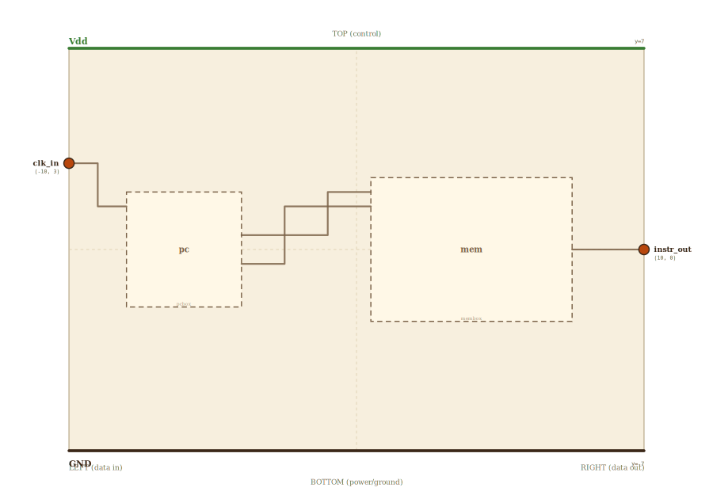

# Layer 17 — fetch (program counter + instruction memory)

The front of the machine: where instructions *come from*. A **program
counter** holds the address of the current instruction; **memory** hands back
the word living there; on each clock the PC advances by one, so the next cycle
fetches the next instruction. That loop — address out, instruction back, PC
advances — runs forever, and it's the whole of instruction fetch.

The PC is a counter (a register that `+1`s itself); here it's shown as a
block displaying the live count with its `+1` self-loop. Its low bits drive
the memory's address; the memory (the `mem` block from the previous level —
drillable) returns the addressed word as the instruction. Combinational read,
clocked PC: the instruction is stable all cycle, the PC only moves on the edge.

## Scene bounds
x ∈ [-10, 10], y ∈ [-7, 7]

## External terminals

| key        | role                         | (x, y)      | edge   |
|------------|------------------------------|-------------|--------|
| clk_in     | clock                        | (-10,  3.0) | LEFT   |
| instr_out  | instruction word (8-bit)     | ( 10,  0.0) | RIGHT  |
| Vdd        | supply (+V)                  | (  0,  7)   | TOP    |
| GND        | supply (0V)                  | (  0, -7)   | BOTTOM |

## Internal supply distribution

Vdd rail at y=7 (TOP), GND at y=-7. Both blocks tap the rails directly.

## Embedded children

| child id | child layer | center (cx, cy) | box (w × h) | inputs → absorbed | outputs → absorbed |
|----------|-------------|-----------------|-------------|-------------------|--------------------|
| pc       | pcbox       | (-6.0,  0.0)    | 4.0 × 4.0   | clk_in → pc_clk_in | addr{1,0} → pc_addr{1,0}_out |
| mem      | membox      | ( 4.0,  0.0)    | 7.0 × 5.0   | addr{1,0} → mem_addr{1,0}_in | rdata → mem_rdata_out |

The PC's `+1` self-loop is internal (drawn on the page); only `clk` in and the
2-bit `addr` out cross its boundary. The `mem` box is sized to `mem`'s aspect
so its hover-embed of `/mem.html` isn't distorted; its addr/rdata pins are
projected at page runtime.

## Absorbed terminals

PC `pc` (cx=-6, cy=0, w=4, h=4 → x∈[-8,-4], y∈[-2,2]):

- `pc_clk_in`     (-8.0,  1.5)  ← LEFT
- `pc_addr1_out`  (-4.0,  0.5)  ← RIGHT
- `pc_addr0_out`  (-4.0, -0.5)  ← RIGHT

Memory `mem` (cx=4, cy=0, w=7, h=5 → x∈[0.5,7.5], y∈[-2.5,2.5]):

- `mem_addr1_in`  (0.5,  2.0)   ← LEFT (matches /mem.html's top-left addr pins)
- `mem_addr0_in`  (0.5,  1.5)   ← LEFT
- `mem_rdata_out` (7.5,  0.0)   ← RIGHT

## Internal nets

| net   | carries                                    |
|-------|--------------------------------------------|
| clk   | clock → PC                                 |
| addr1 | PC count bit 1 → memory address            |
| addr0 | PC count bit 0 → memory address            |
| instr | memory's word out → the fetched instruction |

## Wires

| from          | to             | via                              | net   |
|---------------|----------------|----------------------------------|-------|
| Vdd_left      | Vdd_right      | —                                | Vdd   |
| GND_left      | GND_right      | —                                | GND   |
| clk_in        | pc_clk_in      | (-9.0, 3.0), (-9.0, 1.5)         | clk   |
| pc_addr1_out  | mem_addr1_in   | (-1.75, 0.5), (-1.75, 2.0)       | addr1 |
| pc_addr0_out  | mem_addr0_in   | (-2.0, -0.5), (-2.0, 1.5)        | addr0 |
| mem_rdata_out | instr_out      | —                                | instr |

The PC's two address bits cross the gap and bend up into the memory's
top-left address inputs; the memory's word-out runs straight to `instr_out`.

## Supply helpers

- `Vdd_left` (-10, 7), `Vdd_right` (10, 7)
- `GND_left` (-10, -7), `GND_right` (10, -7)

## Alignment claims

- The only input (`clk`) is on the LEFT; the instruction (`instr`) leaves on
  the RIGHT, per the locked invariant.
- `pc → mem` address wires route entirely in the gap between the two boxes
  (no box crossings); `mem → instr` is a straight horizontal.

## Embedding contract

A real fetch unit is this same shape: a wide PC (`+4` per RV32I instruction)
addressing a large instruction memory, the fetched word feeding decode. Widen
the PC and the memory word and this is the front end of the pipeline.

