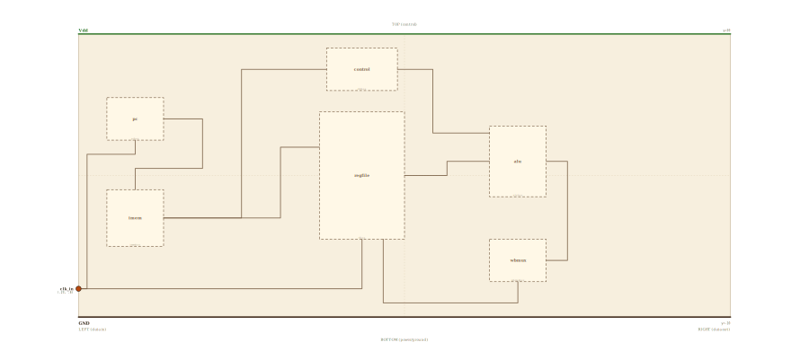

# Layer 18 — CPU (single-cycle datapath)

The top of the tower: every block built so far, wired into a processor you can
open. A program lives in instruction memory; the **program counter** points at
one word; that word is **decoded** into register addresses and an operation; the
**register file** supplies operands; the **ALU** computes; the result rides
through the **write-back** MUX back into the register file. Four jobs — **fetch,
decode, execute, write-back** — wired in one combinational pass per clock.

What's new on this layer isn't a new primitive — it's the *assembly*. Every
block here is a block from an earlier page (PC = a `register`, instruction/data
memory = `mem`, control = a `decoder`, the register file, the 1-bit `alu`, the
write-back `mux`), and on the animation page each one is a live drill into that
exact page, with the datapath's wires landing on the embedded component's real
pins.

Kept 1-bit-wide and toy-ISA (`opcode|rs1|rs2|rd`, op `00 ADD / 01 AND / 10 OR /
11 XOR`), exactly like `datapath`/`mem`/`fetch`. Widen every block to 32 bits,
add a control unit for loads/stores/branches, and insert pipeline registers
between the stages, and this is a real RV32I core.

## Scene bounds
x ∈ [-23, 23], y ∈ [-10, 10]

## External terminals

| key      | role                          | (x, y)      | edge   |
|----------|-------------------------------|-------------|--------|
| clk_in   | clock — drives PC + reg file  | (-23, -8.0) | LEFT   |
| Vdd      | supply (+V)                   | (  0, 10)   | TOP    |
| GND      | supply (0V)                   | (  0, -10)  | BOTTOM |

A CPU is self-contained: the only signal crossing its boundary is the **clock**.
`clk_in` enters on the LEFT (per the locked invariant) and fans into the two
clocked elements — the program counter and the register file's write port.

## Internal supply distribution

Vdd rail along the top (y=10), GND along the bottom (y=-10). Each block sits
between the rails and taps them directly; power distribution is implicit.

## Embedded children

Six abstract boxes (the `*box` layer suffix keeps them un-resolved at this level
— this page shows the architecture; each box is a live drill into its own page).

| child id | child layer | center (cx, cy) | box (w × h) |
|----------|-------------|-----------------|-------------|
| pc       | pcbox       | (-19.0,  4.0)   | 4.0 × 3.0   |
| imem     | imembox     | (-19.0, -3.0)   | 4.0 × 4.0   |
| control  | ctrlbox     | ( -3.0,  7.5)   | 5.0 × 3.0   |
| regfile  | rfbox       | ( -3.0,  0.0)   | 6.0 × 9.0   |
| alu      | alubox      | (  8.0,  1.0)   | 4.0 × 5.0   |
| wbmux    | wbmuxbox    | (  8.0, -6.0)   | 4.0 × 3.0   |

- `pc` program counter + `imem` instruction memory — the **fetch** stage.
- `control` (a decoder of the opcode) + `regfile` (2 read ports, 1 write) — **decode**.
- `alu` 1-bit ALU slice — **execute**.
- `wbmux` write-back select — **write-back**; its output loops back to `regfile`.

## Absorbed terminals

Hardcoded (these boxes don't resolve to a child layer; their connection points
are placed by hand on the box edges).

Program counter `pc` (x∈[-21,-17], y∈[2.5,5.5]):

- `pc_clk_in`   (-19.0,  2.5)  ← BOTTOM
- `pc_addr_out` (-17.0,  4.0)  ← RIGHT

Instruction memory `imem` (x∈[-21,-17], y∈[-5,-1]):

- `imem_addr_in`   (-19.0, -1.0)  ← TOP
- `imem_instr_out` (-17.0, -3.0)  ← RIGHT

Control unit `control` (x∈[-5.5,-0.5], y∈[6,9]):

- `ctrl_op_in`  (-5.5,  7.5)  ← LEFT
- `ctrl_out`    (-0.5,  7.5)  ← RIGHT

Register file `regfile` (x∈[-6,0], y∈[-4.5,4.5]):

- `rf_instr_in`  (-6.0,  2.0)  ← LEFT
- `rf_clk_in`    (-3.0, -4.5)  ← BOTTOM
- `rf_wb_in`     (-1.5, -4.5)  ← BOTTOM
- `rf_rdata_out` ( 0.0,  0.0)  ← RIGHT

ALU `alu` (x∈[6,10], y∈[-1.5,3.5]):

- `alu_a_in`   (6.0,  1.0)  ← LEFT
- `alu_op_in`  (6.0,  3.0)  ← LEFT
- `alu_y_out`  (10.0, 1.0)  ← RIGHT

Write-back MUX `wbmux` (x∈[6,10], y∈[-7.5,-4.5]):

- `wbmux_in`   (10.0, -6.0)  ← RIGHT
- `wbmux_out`  (8.0, -7.5)   ← BOTTOM

## Internal nets

| net    | carries                                              |
|--------|------------------------------------------------------|
| clk    | clock → PC and register file                          |
| addr   | PC value → instruction-memory address                 |
| instr  | fetched instruction → register file + control         |
| op     | control unit's decoded operation → ALU                |
| rdata  | register-file read port → ALU operand                 |
| aluY   | ALU result → write-back MUX                            |
| wb     | write-back result → register-file write port (loop)   |

## Wires

| from           | to            | via                                          | net   |
|----------------|---------------|----------------------------------------------|-------|
| clk_in         | pc_clk_in     | (-22.4, -8.0), (-22.4, 1.5), (-19.0, 1.5)    | clk   |
| clk_in         | rf_clk_in     | (-3.0, -8.0)                                 | clk   |
| pc_addr_out    | imem_addr_in  | (-16.0, 4.0), (-16.0, 0.5), (-19.0, 0.5)     | addr  |
| imem_instr_out | rf_instr_in   | (-8.0, -3.0), (-8.0, 2.0)                    | instr |
| imem_instr_out | ctrl_op_in    | (-12.0, -3.0), (-12.0, 7.5)                  | instr |
| ctrl_out       | alu_op_in     | (2.0, 7.5), (2.0, 3.0)                       | op    |
| rf_rdata_out   | alu_a_in      | (3.0, 0.0), (3.0, 1.0)                       | rdata |
| alu_y_out      | wbmux_in      | (11.5, 1.0), (11.5, -6.0)                    | aluY  |
| wbmux_out      | rf_wb_in      | (8.0, -9.0), (-1.5, -9.0)                    | wb    |

The fetch front sits at the far left: the PC's value drops into the instruction
memory's address, the fetched word leaves on the right and fans to both the
register file (read addresses) and the control unit (opcode, over the top). The
register file's read output crosses the central gap into the ALU; the control
unit's decoded op drops in beside it. The ALU result wraps around the right edge
down into the write-back MUX, whose output loops along the bottom — below every
block — back into the register file's write port.

## Alignment claims

- The only external data terminal, `clk_in`, is on the LEFT edge; `Vdd` on TOP,
  `GND` on BOTTOM — per the locked spatial invariant.
- The clock fans along a low lane to the PC and the register file; the
  write-back result returns along the bottom (y=-9), clear of every box.
- The read-data and op wires meet the ALU in the open gap between the register
  file and the ALU — no wire crosses a foreign box's interior.

## Embedding contract

A real core is this exact shape: a wide PC and instruction memory, a control
unit + 32×32 register file, a 32-bit ALU, data memory on the write-back path,
and the same fetch→decode→execute→write-back loop. Add pipeline registers
between the stages (each a `register`) and forwarding/hazard logic and this runs
real RV32I programs with several instructions in flight at once.

