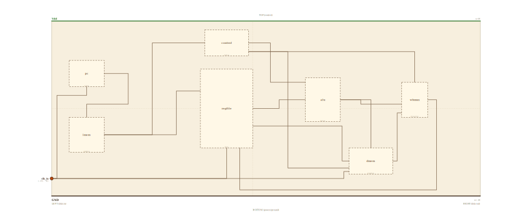

# Layer 19 — CPU (single-cycle datapath with load/store)

The R-type core from `cpu`, opened one notch wider: the same **fetch →
decode → execute → write-back** loop, plus the one stage that lets a program
touch memory. Two blocks do it — a **data memory** beside the register file
and a revived **write-back MUX**. Together they unlock the two instructions
every program leans on: **store** (`Mem[rs1] = rs2`) and **load**
(`rd = Mem[rs1]`).

What changed from `cpu` is the write-back path. There the ALU result was the
only source, so it wired straight into the register file's write port. Here
there are **two** sources — the ALU result and the value read out of data
memory — so a MUX picks between them, steered by the control unit's
**mem-to-reg** select. The ALU result fans out: it feeds the data memory as
the effective **address** for the load/store, and it feeds the MUX's input-0
(the R-type result). The data memory's read-out feeds the MUX's input-1
(loaded data). The MUX output loops back to the register file's write port.

Every block here is still a block from an earlier page (PC = a `register`,
instruction memory = `mem`, control = a `decoder`, the register file, the
1-bit `alu`, data memory = `dmem`, the write-back `mux`), and on the animation
page each is a live drill into that exact page. Kept 1-bit-wide and toy-ISA,
exactly like `cpu`. Widen every block to 32 bits, compute the address as
`base + offset` in the ALU, and add pipeline registers between the stages and
this is a real RV32I core running `lw`/`sw`.

## Scene bounds
x ∈ [-23, 26], y ∈ [-10, 10]

## External terminals

| key      | role                          | (x, y)      | edge   |
|----------|-------------------------------|-------------|--------|
| clk_in   | clock — drives PC + reg file  | (-23, -8.0) | LEFT   |
| Vdd      | supply (+V)                   | (  0, 10)   | TOP    |
| GND      | supply (0V)                   | (  0, -10)  | BOTTOM |

A CPU is self-contained: the only signal crossing its boundary is the
**clock**. `clk_in` enters on the LEFT (per the locked invariant) and fans
into the three clocked elements — the program counter, the register file's
write port, and the data memory's write port.

## Internal supply distribution

Vdd rail along the top (y=10), GND along the bottom (y=-10). Each block sits
between the rails and taps them directly; power distribution is implicit.

## Embedded children

Seven abstract boxes (the `*box` layer suffix keeps them un-resolved at this
level — this page shows the architecture; each box is a live drill into its
own page).

| child id | child layer | center (cx, cy) | box (w × h) |
|----------|-------------|-----------------|-------------|
| pc       | pcbox       | (-19.0,  4.0)   | 4.0 × 3.0   |
| imem     | imembox     | (-19.0, -3.0)   | 4.0 × 4.0   |
| control  | ctrlbox     | ( -3.0,  7.5)   | 5.0 × 3.0   |
| regfile  | rfbox       | ( -3.0,  0.0)   | 6.0 × 9.0   |
| alu      | alubox      | (  8.0,  1.0)   | 4.0 × 5.0   |
| dmem     | dmembox     | ( 13.5, -6.0)   | 5.0 × 3.0   |
| wbmux    | wbmuxbox    | ( 21.5, -6.0)   | 3.0 × 4.0   |

- `pc` program counter + `imem` instruction memory — the **fetch** stage.
- `control` (a decoder of the opcode) + `regfile` (2 read ports, 1 write) — **decode**.
- `alu` 1-bit ALU slice — **execute**.
- `dmem` data memory (read + write port) — the **memory** stage.
- `wbmux` write-back MUX — picks ALU-result vs. loaded-data — **write-back**.

## Absorbed terminals

Hardcoded (these boxes don't resolve to a child layer; their connection points
are placed by hand on the box edges).

Program counter `pc` (x∈[-21,-17], y∈[2.5,5.5]):

- `pc_clk_in`   (-19.0,  2.5)  ← BOTTOM
- `pc_addr_out` (-17.0,  4.0)  ← RIGHT

Instruction memory `imem` (x∈[-21,-17], y∈[-5,-1]):

- `imem_addr_in`   (-19.0, -1.0)  ← TOP
- `imem_instr_out` (-17.0, -3.0)  ← RIGHT

Control unit `control` (x∈[-5.5,-0.5], y∈[6,9]):

- `ctrl_op_in`   (-5.5,  7.5)  ← LEFT
- `ctrl_out`     (-0.5,  7.5)  ← RIGHT
- `ctrl_mem_out` (-0.5,  6.5)  ← RIGHT

Register file `regfile` (x∈[-6,0], y∈[-4.5,4.5]):

- `rf_instr_in`  (-6.0,  2.0)  ← LEFT
- `rf_clk_in`    (-3.0, -4.5)  ← BOTTOM
- `rf_wb_in`     (-1.5, -4.5)  ← BOTTOM
- `rf_rdata_out` ( 0.0,  0.0)  ← RIGHT
- `rf_wdata_out` ( 0.0, -2.0)  ← RIGHT

ALU `alu` (x∈[6,10], y∈[-1.5,3.5]):

- `alu_a_in`   (6.0,  1.0)  ← LEFT
- `alu_op_in`  (6.0,  3.0)  ← LEFT
- `alu_y_out`  (10.0, 1.0)  ← RIGHT

Data memory `dmem` (x∈[11,16], y∈[-7.5,-4.5]):

- `dmem_addr_in`  (13.5, -4.5)  ← TOP
- `dmem_wdata_in` (11.0, -6.0)  ← LEFT
- `dmem_we_in`    (11.0, -6.8)  ← LEFT
- `dmem_clk_in`   (11.0, -7.2)  ← LEFT
- `dmem_rdata_out`(16.0, -6.0)  ← RIGHT

Write-back MUX `wbmux` (x∈[20,23], y∈[-8,-4]):

- `wbmux_in0_in` (20.0, -5.0)  ← LEFT
- `wbmux_in1_in` (20.0, -6.5)  ← LEFT
- `wbmux_sel_in` (21.5, -4.0)  ← TOP
- `wbmux_out`    (23.0, -6.0)  ← RIGHT

## Internal nets

| net      | carries                                                    |
|----------|------------------------------------------------------------|
| clk      | clock → PC, register file, data-memory write port           |
| addr1    | PC value → instruction-memory address                       |
| instr    | fetched instruction → register file + control               |
| op1      | control unit's decoded operation → ALU                      |
| memtoreg | control unit's mem-to-reg select → write-back MUX           |
| rdataA   | register-file read port A → ALU operand                     |
| rdataB   | register-file read port B → data-memory write data          |
| aluY     | ALU result → data-memory address AND write-back MUX in0     |
| memaddr  | ALU result as effective address → data memory               |
| memdata  | data-memory read port → write-back MUX in1 (loaded data)    |
| memwrite | control unit's write-enable → data-memory write port        |
| wb       | write-back MUX output → register-file write port (loop)     |

## Wires

| from           | to            | via                                                  | net      |
|----------------|---------------|------------------------------------------------------|----------|
| clk_in         | pc_clk_in     | (-22.4, -8.0), (-22.4, 1.5), (-19.0, 1.5)            | clk      |
| clk_in         | rf_clk_in     | (-3.0, -8.0)                                         | clk      |
| clk_in         | dmem_clk_in   | (10.4, -8.0), (10.4, -7.2)                           | clk      |
| pc_addr_out    | imem_addr_in  | (-16.0, 4.0), (-16.0, 0.5), (-19.0, 0.5)             | addr1    |
| imem_instr_out | rf_instr_in   | (-8.0, -3.0), (-8.0, 2.0)                            | instr    |
| imem_instr_out | ctrl_op_in    | (-12.0, -3.0), (-12.0, 7.5)                          | instr    |
| ctrl_out       | alu_op_in     | (2.0, 7.5), (2.0, 3.0)                               | op1      |
| ctrl_mem_out   | wbmux_sel_in  | (3.5, 6.5), (3.5, -3.0), (21.5, -3.0)                | memtoreg |
| ctrl_mem_out   | dmem_we_in    | (4.0, 6.5), (4.0, -6.8)                              | memwrite |
| rf_rdata_out   | alu_a_in      | (3.0, 0.0), (3.0, 1.0)                               | rdataA   |
| rf_wdata_out   | dmem_wdata_in | (10.2, -2.0), (10.2, -6.0)                           | rdataB   |
| alu_y_out      | dmem_addr_in  | (11.5, 1.0), (11.5, -3.8), (13.5, -3.8)              | aluY     |
| alu_y_out      | wbmux_in0_in  | (10.8, 1.0), (10.8, -2.5), (19.0, -2.5), (19.0, -5.0)| aluY     |
| dmem_rdata_out | wbmux_in1_in  | (18.0, -6.0), (18.0, -6.5)                           | memdata  |
| wbmux_out      | rf_wb_in      | (24.5, -6.0), (24.5, -9.3), (-1.5, -9.3)             | wb       |

The fetch front sits at the far left: the PC's value drops into the
instruction memory's address, the fetched word leaves on the right and fans to
both the register file (read addresses) and the control unit (opcode, over the
top). The register file's read port A crosses the central gap into the ALU;
read port B drops down into the data memory's write-data port; the control
unit's decoded op drops in beside the ALU operand, and its mem control signals
run along the right and bottom to the data memory's write-enable and the MUX's
select.

The ALU result leaves on the right and **fans**: one branch wraps down to the
data memory's address (top edge), the other drops straight into the write-back
MUX's input-0. The data memory's read port hands its loaded word to the MUX's
input-1. The MUX picks one and wraps along the bottom (y=-9), clear of every
block, back into the register file's write port.

## Alignment claims

- The only external data terminal, `clk_in`, is on the LEFT edge; `Vdd` on
  TOP, `GND` on BOTTOM — per the locked spatial invariant.
- The clock fans along a low lane (y=-8) to the PC, the register file, and the
  data-memory write port; the write-back result returns along the bottom
  (y=-9), clear of every box.
- The ALU result fans in the open gap right of the ALU (x≥11) into two
  vertical drops — one to the data memory's address, one to the MUX's in0 —
  so no wire crosses a foreign box's interior.

## Embedding contract

A real core is this exact shape: a wide PC and instruction memory, a control
unit + 32×32 register file, a 32-bit ALU, data memory on the memory stage, and
a write-back MUX choosing ALU-result vs. loaded-data — wired in the same
fetch→decode→execute→MEM→write-back loop. Add pipeline registers between the
stages (each a `register`) and forwarding/hazard logic and this runs real
RV32I programs with several instructions in flight at once.

