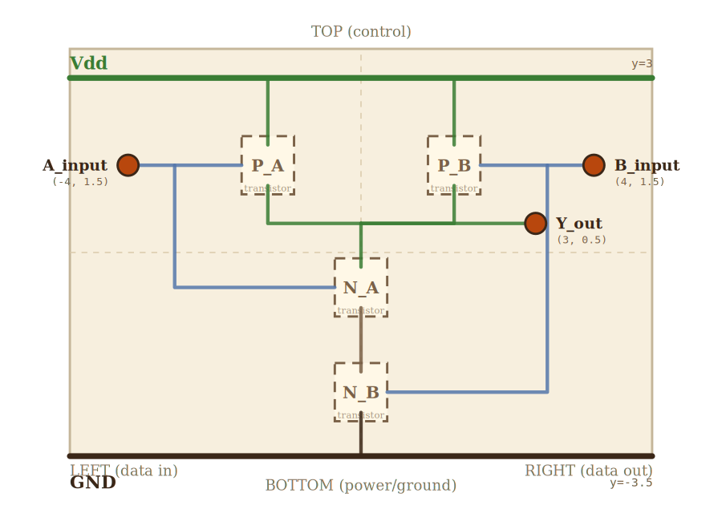

# Layer 1 — NAND gate (CMOS, 4 transistors)

A logic gate built from 2 PMOS pull-ups (in parallel, between Vdd and the
Y node) and 2 NMOS pull-downs (in series, between Y and GND). Output Y is
LOW only when both A and B are HIGH; otherwise HIGH. This is the building
block of the SR latch above (layer 2).

## Scene bounds
x ∈ [-5.0, 5.0], y ∈ [-3.5, 3.5]

(source: `SCENE_BOUNDS` derived in `src/levels/nandWireGraph.ts`.)

## External terminals

The parent connects to these. Data / control terminals are single points
on the LEFT / RIGHT / TOP edges. The two SUPPLY terminals (Vdd, GND) are
single *conceptual* handles — physically each is a horizontal *edge*
spanning the top (Vdd) or bottom (GND) of this scene. The detail of
where on the rail each child taps in lives under "Internal supply
distribution" below.

| key     | role        | (x, y)       | edge   |
|---------|-------------|--------------|--------|
| A_input | data in     | (-4.0,  1.5) | LEFT   |
| B_input | data in     | ( 4.0,  1.5) | RIGHT  |
| Y_out   | data out    | ( 3.0,  0.5) | RIGHT  |
| Vdd     | supply (+V) | ( 0.0,  3.0) | TOP    |
| GND     | supply (0V) | ( 0.0, -3.5) | BOTTOM |

## Internal supply distribution

The Vdd rail runs horizontally at y=+3 from `Vdd_rail_left` (-5, 3) to
`Vdd_rail_right` (3, 3). The parent's Vdd (top edge) connects to this
rail. Vertical drops from the rail feed the two PMOS sources:

- `Vdd_tap_PA` (-1.6, 3.0) drops to P_A.source at (-1.6, 1.85)
- `Vdd_tap_PB` ( 1.6, 3.0) drops to P_B.source at ( 1.6, 1.85)

The GND rail runs at y=-3.5 from `GND_rail_left` (-3, -3.5) to
`GND_rail_right` (5, -3.5). A single vertical riser feeds the bottom of
the NMOS chain:

- `GND_tap_NB` (0, -3.5) rises to N_B.source at (0, -2.75)

Both PMOS transistors sit adjacent to the Vdd rail (no children in
between) so the straight-vertical-drop rule applies cleanly. N_B sits
adjacent to GND for the same reason. The single NMOS chain occupies the
column between the rails, so there's no L-shaped routing in this layer.

## Embedded children

Four transistor minis (layer 0). Each child's local-frame external
terminals (`gate`, `source`, `drain`) map to absorbed terminals in this
layer's scene.

| child id | child layer | center (cx, cy) | box (w × h) | gate→        | source→        | drain→         |
|----------|-------------|-----------------|-------------|--------------|----------------|----------------|
| P_A      | transistor  | (-1.6,  1.5)    | 0.9 × 1.0   | PA_gate      | PA_source      | PA_drain       |
| P_B      | transistor  | ( 1.6,  1.5)    | 0.9 × 1.0   | PB_gate      | PB_source      | PB_drain       |
| N_A      | transistor  | ( 0.0, -0.6)    | 0.9 × 1.0   | NA_gate      | NA_source      | NA_drain       |
| N_B      | transistor  | ( 0.0, -2.4)    | 0.9 × 1.0   | NB_gate      | NB_source      | NB_drain       |

Absorbed-terminal coords (source: `WIRE_NODES` in `nandWireGraph.ts`):

| absorbed key | (x, y)        |
|--------------|---------------|
| PA_gate      | (-2.05, 1.5)  |
| PA_source    | (-1.6,  1.85) |
| PA_drain     | (-1.6,  1.15) |
| PB_gate      | ( 2.05, 1.5)  |
| PB_source    | ( 1.6,  1.85) |
| PB_drain     | ( 1.6,  1.15) |
| NA_gate      | (-0.45,-0.6)  |
| NA_source    | ( 0.0, -0.95) |
| NA_drain     | ( 0.0, -0.25) |
| NB_gate      | ( 0.45,-2.4)  |
| NB_source    | ( 0.0, -2.75) |
| NB_drain     | ( 0.0, -2.05) |

## Wires

Internal wires (source: `WIRES` in `nandWireGraph.ts`).

| from           | to             | via              | net |
|----------------|----------------|------------------|-----|
| Vdd_rail_left  | Vdd_rail_right | —                | Vdd |
| Vdd_tap_PA     | PA_source      | —                | Vdd |
| Vdd_tap_PB     | PB_source      | —                | Vdd |
| PA_drain       | Y_junction     | (-1.6, 0.5)      | Y   |
| PB_drain       | Y_junction     | ( 1.6, 0.5)      | Y   |
| Y_junction     | Y_out          | —                | Y   |
| Y_junction     | NA_drain       | —                | Y   |
| NA_source      | NB_drain       | —                | mid |
| NB_source      | GND_tap_NB     | —                | GND |
| GND_rail_left  | GND_rail_right | —                | GND |
| A_input        | PA_gate        | —                | A   |
| A_tap_to_NMOS  | NA_gate        | (-3.2, -0.6)     | A   |
| B_input        | PB_gate        | —                | B   |
| B_tap_to_NMOS  | NB_gate        | ( 3.2, -2.4)     | B   |

Helper junction nodes (not external, not directly a child terminal):
- `Vdd_tap_PA` (-1.6, 3.0), `Vdd_tap_PB` (1.6, 3.0)
- `Y_junction` (0, 0.5), `Y_out` (3.0, 0.5)
- `GND_tap_NB` (0, -3.5)
- `A_tap_to_NMOS` (-3.2, 1.5), `B_tap_to_NMOS` (3.2, 1.5)

## Alignment claims

- Each child transistor's `gate`/`source`/`drain` external terminal MUST
  land on the absorbed terminal listed in the embedded-children table.
  Source: `TRANSISTOR_CONNECTIONS` in `src/levels/transistorConnections.ts`
  uses the exact same world coords as `WIRE_NODES` in
  `src/levels/nandWireGraph.ts`. Pinned by
  `tests/unit/nandConnections.test.ts`.
- When the gate is embedded as a mini inside the latch (layer 2), the
  latch's wires that target each NAND's external terminals MUST land
  within 1.5 px of the projected world coord. Source: tests in
  `tests/e2e/wire-connection.spec.ts`.

