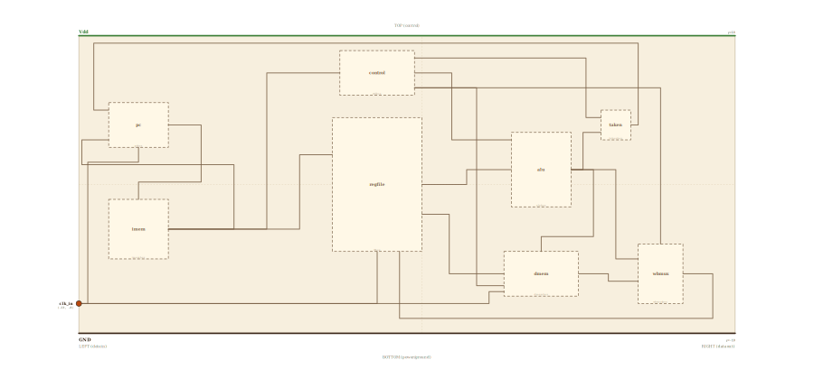

# Layer 20 — CPU (single-cycle datapath with branch)

The load/store core from `cpuldst`, opened one final notch: the same
**fetch → decode → execute → MEM → write-back** loop, plus the one signal that
lets a program *decide where to go next*. Until now the PC had exactly one
future: `pc + 1`. A **branch** gives it a second one — a target address carried
inside the instruction — and a **PC-source MUX** to choose between them.

What changed from `cpuldst` is the fetch front. There the +1 loop lived sealed
inside the PC; here the loop is opened by a MUX: input-0 is the incremented PC
(the sequential future), input-1 is the **branch target** field decoded out of
the instruction, and the select is **PCSrc** — computed beside the ALU as
`branch AND (rs1 == rs2)`. The decoder's control unit raises **branch** for a
`BEQ` opcode; the ALU's XOR compares the two register reads (equal ⇔ result 0);
a small taken-block ANDs them. When taken fires, the PC loads the target and
the instruction that *would* have run next is simply never fetched — the
sequential memory cell is skipped.

Every block is still a block from an earlier page (PC = `register` + MUX,
instruction memory = `mem`, control = a `decoder`, the register file, the 1-bit
`alu`, data memory = `dmem`, the write-back `mux`), and on the animation page
each is a live drill into that exact page. Kept 1-bit-wide and toy-ISA. Widen
to 32 bits, make the target `pc + offset` computed by an adder, and this is a
real RV32I core running `beq`.

## Scene bounds
x ∈ [-23, 21], y ∈ [-10, 10]

## External terminals

| key      | role                          | (x, y)      | edge   |
|----------|-------------------------------|-------------|--------|
| clk_in   | clock — drives PC + reg file  | (-23, -8.0) | LEFT   |
| Vdd      | supply (+V)                   | (  0, 10)   | TOP    |
| GND      | supply (0V)                   | (  0, -10)  | BOTTOM |

A CPU is self-contained: the only signal crossing its boundary is the
**clock**. `clk_in` enters on the LEFT (per the locked invariant) and fans
into the three clocked elements — the program counter, the register file's
write port, and the data memory's write port.

## Internal supply distribution

Vdd rail along the top (y=10), GND along the bottom (y=-10). Each block sits
between the rails and taps them directly; power distribution is implicit.

## Embedded children

Eight abstract boxes (the `*box` layer suffix keeps them un-resolved at this
level — this page shows the architecture; each box is a live drill into its
own page).

| child id | child layer | center (cx, cy) | box (w × h) |
|----------|-------------|-----------------|-------------|
| pc       | pcbox       | (-19.0,  4.0)   | 4.0 × 3.0   |
| imem     | imembox     | (-19.0, -3.0)   | 4.0 × 4.0   |
| control  | ctrlbox     | ( -3.0,  7.5)   | 5.0 × 3.0   |
| regfile  | rfbox       | ( -3.0,  0.0)   | 6.0 × 9.0   |
| alu      | alubox      | (  8.0,  1.0)   | 4.0 × 5.0   |
| pcsrc    | pcsrcbox    | ( 13.0,  4.0)   | 2.0 × 2.0   |
| dmem     | dmembox     | (  8.0, -6.0)   | 5.0 × 3.0   |
| wbmux    | wbmuxbox    | ( 16.0, -6.0)   | 3.0 × 4.0   |

- `pc` program counter (now: +1 adder, **PC-source MUX**, register) + `imem`
  instruction memory — the **fetch** stage.
- `control` (a decoder of the opcode; raises **branch** for BEQ) + `regfile` — **decode**.
- `alu` 1-bit ALU slice — **execute**; its XOR result doubles as the equality test.
- `pcsrc` — PCSrc = Branch AND Zero (the standard P&H name): the decision; steers the PC MUX.
- `dmem` data memory + `wbmux` write-back MUX — **MEM / write-back** (unchanged).

## Absorbed terminals

Hardcoded (these boxes don't resolve to a child layer; their connection points
are placed by hand on the box edges).

Program counter `pc` (x∈[-21,-17], y∈[2.5,5.5]):

- `pc_clk_in`    (-19.0,  2.5)  ← BOTTOM
- `pc_target_in` (-21.0,  3.0)  ← LEFT
- `pc_pcsrc_in`  (-21.0,  5.0)  ← LEFT
- `pc_addr_out`  (-17.0,  4.0)  ← RIGHT

Instruction memory `imem` (x∈[-21,-17], y∈[-5,-1]):

- `imem_addr_in`   (-19.0, -1.0)  ← TOP
- `imem_instr_out` (-17.0, -3.0)  ← RIGHT

Control unit `control` (x∈[-5.5,-0.5], y∈[6,9]):

- `ctrl_op_in`      (-5.5,  7.5)  ← LEFT
- `ctrl_out`        (-0.5,  7.5)  ← RIGHT
- `ctrl_mem_out`    (-0.5,  6.5)  ← RIGHT
- `ctrl_branch_out` (-0.5,  8.5)  ← RIGHT

Register file `regfile` (x∈[-6,0], y∈[-4.5,4.5]):

- `rf_instr_in`  (-6.0,  2.0)  ← LEFT
- `rf_clk_in`    (-3.0, -4.5)  ← BOTTOM
- `rf_wb_in`     (-1.5, -4.5)  ← BOTTOM
- `rf_rdata_out` ( 0.0,  0.0)  ← RIGHT
- `rf_wdata_out` ( 0.0, -2.0)  ← RIGHT

ALU `alu` (x∈[6,10], y∈[-1.5,3.5]):

- `alu_a_in`   (6.0,  1.0)  ← LEFT
- `alu_op_in`  (6.0,  3.0)  ← LEFT
- `alu_y_out`  (10.0, 1.0)  ← RIGHT

PCSrc `pcsrc` (x∈[12,14], y∈[3,5]):

- `pcsrc_y_in`  (12.0, 3.5)  ← LEFT
- `pcsrc_br_in` (12.0, 4.5)  ← LEFT
- `pcsrc_out`   (14.0, 4.0)  ← RIGHT

Data memory `dmem` (x∈[5.5,10.5], y∈[-7.5,-4.5]):

- `dmem_addr_in`  ( 8.0, -4.5)  ← TOP
- `dmem_wdata_in` ( 5.5, -6.0)  ← LEFT
- `dmem_we_in`    ( 5.5, -6.8)  ← LEFT
- `dmem_clk_in`   ( 5.5, -7.2)  ← LEFT
- `dmem_rdata_out`(10.5, -6.0)  ← RIGHT

Write-back MUX `wbmux` (x∈[14.5,17.5], y∈[-8,-4]):

- `wbmux_in0_in` (14.5, -5.0)  ← LEFT
- `wbmux_in1_in` (14.5, -6.5)  ← LEFT
- `wbmux_sel_in` (16.0, -4.0)  ← TOP
- `wbmux_out`    (17.5, -6.0)  ← RIGHT

## Internal nets

| net      | carries                                                    |
|----------|------------------------------------------------------------|
| clk      | clock → PC, register file, data-memory write port           |
| addr1    | PC value → instruction-memory address                       |
| instr    | fetched instruction → register file + control               |
| target   | instruction's target field → PC-source MUX input-1          |
| op1      | control unit's decoded operation → ALU                      |
| branch   | control unit's branch line → PCSrc block                    |
| pcsrc    | PCSrc = Branch AND Zero → PC-source MUX select (P&H name)   |
| memtoreg | control unit's mem-to-reg select → write-back MUX           |
| rdataA   | register-file read port A → ALU operand                     |
| rdataB   | register-file read port B → data-memory write data          |
| aluY     | ALU result (= the equality test for BEQ) → PCSrc block, mem |
| memaddr  | ALU result as effective address → data memory               |
| memdata  | data-memory read port → write-back MUX in1 (loaded data)    |
| memwrite | control unit's write-enable → data-memory write port        |
| wb       | write-back MUX output → register-file write port (loop)     |

## Wires

| from           | to            | via                                                  | net      |
|----------------|---------------|------------------------------------------------------|----------|
| clk_in         | pc_clk_in     | (-22.4, -8.0), (-22.4, 1.5), (-19.0, 1.5)            | clk      |
| clk_in         | rf_clk_in     | (-3.0, -8.0)                                         | clk      |
| clk_in         | dmem_clk_in   | (4.5, -8.0), (4.5, -7.2)                             | clk      |
| pc_addr_out    | imem_addr_in  | (-16.0, 4.0), (-16.0, 0.5), (-19.0, 0.5)             | addr1    |
| imem_instr_out | rf_instr_in   | (-8.0, -3.0), (-8.0, 2.0)                            | instr    |
| imem_instr_out | ctrl_op_in    | (-12.0, -3.0), (-12.0, 7.5)                          | instr    |
| imem_instr_out | pc_target_in  | (-13.0, -3.0), (-13.0, 1.8), (-22.8, 1.8), (-22.8, 3.0) | target |
| ctrl_out       | alu_op_in     | (2.0, 7.5), (2.0, 3.0)                               | op1      |
| ctrl_branch_out| pcsrc_br_in   | (11.0, 8.5), (11.0, 4.5)                             | branch   |
| ctrl_mem_out   | wbmux_sel_in  | (3.5, 6.5), (3.5, -3.0), (16.0, -3.0)                | memtoreg |
| ctrl_mem_out   | dmem_we_in    | (4.0, 6.5), (4.0, -6.8)                              | memwrite |
| rf_rdata_out   | alu_a_in      | (3.0, 0.0), (3.0, 1.0)                               | rdataA   |
| rf_wdata_out   | dmem_wdata_in | (1.5, -2.0), (1.5, -6.0)                             | rdataB   |
| alu_y_out      | pcsrc_y_in    | (10.8, 1.0), (10.8, 3.5)                             | aluY     |
| alu_y_out      | dmem_addr_in  | (11.5, 1.0), (11.5, -3.5), (8.0, -3.5)               | aluY     |
| alu_y_out      | wbmux_in0_in  | (13.0, 1.0), (13.0, -5.0)                            | aluY     |
| pcsrc_out      | pc_pcsrc_in   | (14.5, 4.0), (14.5, 9.5), (-22.0, 9.5), (-22.0, 5.0) | pcsrc    |
| dmem_rdata_out | wbmux_in1_in  | (12.5, -6.0), (12.5, -6.5)                           | memdata  |
| wbmux_out      | rf_wb_in      | (19.5, -6.0), (19.5, -9.0), (-1.5, -9.0)             | wb       |

The fetch front is where the story is. The PC still drops its value into the
instruction memory's address — but the PC box now hides an opened loop: +1
adder → **PC-source MUX** → register. Two new wires arrive at its left edge:
the **target** field peeled off the fetched instruction (it loops back left
under the PC), and **PCSrc**, the decision, arriving over the top from the far
right. When PCSrc is 0 the MUX picks +1 and the machine walks sequentially;
when taken is 1 it loads the target and the next sequential cell is skipped.

The decision itself is built beside the ALU: the control unit's **branch**
line drops into the PCSrc block from the top lane, the ALU's result (for BEQ
the XOR of the two register reads — 0 exactly when they're equal) enters
beside it, and the block's AND fires only for a taken branch. Its output rides
the top lane (y=9.5) all the way back to the PC — the longest wire on the
page, and the point of the lesson: *execute reaches back into fetch.*

## Alignment claims

- The only external data terminal, `clk_in`, is on the LEFT edge; `Vdd` on
  TOP, `GND` on BOTTOM — per the locked spatial invariant.
- The taken decision rides the y=9.5 lane above every block from the taken
  block back to the PC's left edge; the target field rides the y=1.8 lane
  below the PC box. Neither crosses a foreign box interior.
- The ALU result fans right of the ALU (x≥10.8) into three vertical runs —
  the PCSrc block, the data memory's address, and the MUX's in0 — so no wire
  crosses a foreign box's interior.

## Embedding contract

A real core is this exact shape: the branch comparator is the ALU (subtract,
test zero), the target is `pc + imm` from an adder, and the PC-source MUX is
steered by `Branch AND Zero`. Widen everything to 32 bits and this runs real
RV32I `beq` — loops, ifs, and every control structure a compiler emits reduce
to exactly this wire from execute back into fetch.

