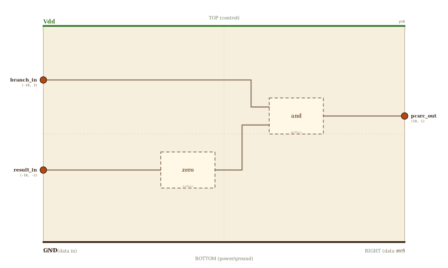

# Layer 21 — PCSrc (the branch decision)

The one corner of the CPU that makes a *decision*. Everything else computes
values; this block chooses a future: should the next instruction come from
`PC + 1` or from the branch target? Standard single-cycle naming (Patterson &
Hennessy): the decoder's control unit raises **Branch** for a branch opcode,
the ALU exports **Zero** (its result was zero ⇔ the compared values were
equal), and **PCSrc = Branch AND Zero** steers the PC-source MUX in fetch.

Two gates build it. The ALU's result enters a **Zero detector** — for 1-bit
data a NOT gate (one-bit subtraction is XOR, so a zero difference means
equal); for 32-bit data the same block is a wide NOR across the result bits.
The Zero flag then meets the Branch control line at an **AND** gate whose
output is PCSrc. Only "this is a branch" AND "they were equal" redirects the
machine; every other combination lets the PC walk sequentially.

## Scene bounds
x ∈ [-10, 10], y ∈ [-6, 6]

## External terminals

| key       | role                                | (x, y)    | edge   |
|-----------|-------------------------------------|-----------|--------|
| branch_in | Branch control (from the decoder)   | (-10,  3) | LEFT   |
| result_in | ALU result (the compare difference) | (-10, -2) | LEFT   |
| pcsrc_out | PCSrc → PC-source MUX select        | ( 10,  1) | RIGHT  |
| Vdd       | supply (+V)                         | (  0,  6) | TOP    |
| GND       | supply (0V)                         | (  0, -6) | BOTTOM |

## Internal supply distribution

Vdd rail along the top (y=6), GND along the bottom (y=-6). Both gates sit
between the rails and tap them directly.

## Embedded children

| child id | child layer | center (cx, cy) | box (w × h) |
|----------|-------------|-----------------|-------------|
| zero     | notbox      | (-2.0, -2.0)    | 3.0 × 2.0   |
| and      | andbox      | ( 4.0,  1.0)    | 3.0 × 2.0   |

- `zero` — the Zero detector: NOT of the 1-bit ALU result (wide NOR at 32 bit).
- `and` — PCSrc = Branch AND Zero, the decision itself.

## Absorbed terminals

Zero detector `zero` (x∈[-3.5,-0.5], y∈[-3,-1]):

- `zero_result_in` (-3.5, -2.0)  ← LEFT
- `zero_out`       (-0.5, -2.0)  ← RIGHT

AND gate `and` (x∈[2.5,5.5], y∈[0,2]):

- `and_a_in` (2.5, 1.5)  ← LEFT
- `and_b_in` (2.5, 0.5)  ← LEFT
- `and_out`  (5.5, 1.0)  ← RIGHT

## Internal nets

| net    | carries                                      |
|--------|----------------------------------------------|
| branch | decoder's Branch control → AND input a       |
| result | ALU result → Zero detector                   |
| zero   | Zero flag (result == 0) → AND input b        |
| pcsrc  | Branch AND Zero → PC-source MUX select       |

## Wires

| from      | to             | via                  | net    |
|-----------|----------------|----------------------|--------|
| branch_in | and_a_in       | (1.5, 3), (1.5, 1.5) | branch |
| result_in | zero_result_in | —                    | result |
| zero_out  | and_b_in       | (1.0, -2), (1.0, 0.5)| zero   |
| and_out   | pcsrc_out      | —                    | pcsrc  |

The Branch control rides the top lane (y=3), clear of both gates, then drops
into the AND's upper input. The ALU result enters at the Zero detector's
height and its flag climbs into the AND's lower input. The decision leaves on
the right, headed for the fetch stage.

## Alignment claims

- Both data inputs (`branch_in`, `result_in`) are on the LEFT edge; the single
  output `pcsrc_out` is on the RIGHT; `Vdd` TOP, `GND` BOTTOM — per the locked
  spatial invariant.
- The branch lane (y=3) passes above the Zero detector and enters the AND from
  outside its box; no wire crosses a gate interior.

## Embedding contract

In a real core this is drawn as a bare AND gate beside the ALU: the ALU's
Zero output pin and the control unit's Branch line meet, and the AND's output
is wired to the PC-source MUX select. The Zero detector is inside the ALU
(a NOR across the 32 result bits); we draw it explicitly because our 1-bit
ALU exports the raw result instead. Same logic, same names, same wire.

