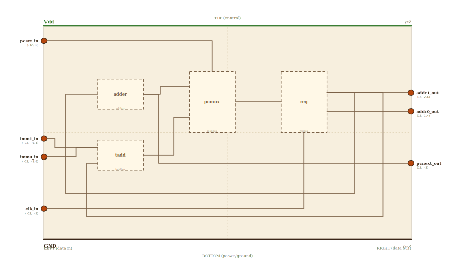

# Layer 22 — branching program counter (+1 adder, PC-source MUX, register)

The program counter from `counter`, opened up for the branch CPU. There the
+1 loop was sealed: adder → register → adder, forever. Here the loop runs
through a **PC-source MUX** before it reaches the register: input-0 is the
incremented PC (the sequential future), input-1 is the **branch target**
arriving from the decoder, and the select is **PCSrc** — the branch decision
computed beside the ALU. When PCSrc is 0 the PC walks; when PCSrc is 1 it
leaps to the target, and the sequential cell is never fetched.

Same discipline as every sequential page: the adder and MUX are purely
combinational (always computing both futures), and only the register's clock
edge decides *when* the chosen future becomes the present. The MUX does not
create or destroy signals — both candidate values are always sitting on its
inputs; the select wire merely decides which one passes through.

## Scene bounds
x ∈ [-12, 12], y ∈ [-7, 7]

## External terminals

| key      | role                                  | (x, y)    | edge   |
|----------|---------------------------------------|-----------|--------|
| pcsrc_in | PCSrc — the branch decision (select)  | (-12,  6) | LEFT   |
| imm1_in  | branch offset (imm), high bit         | (-12,-0.4)| LEFT   |
| imm0_in  | branch offset (imm), low bit          | (-12,-1.6)| LEFT   |
| clk_in   | clock — edge loads the chosen next PC | (-12, -5) | LEFT   |
| addr1_out| PC value, high bit → fetch address    | ( 12, 2.6)| RIGHT  |
| addr0_out| PC value, low bit → fetch address     | ( 12, 1.4)| RIGHT  |
| Vdd      | supply (+V)                           | (  0,  7) | TOP    |
| GND      | supply (0V)                           | (  0, -7) | BOTTOM |

## Internal supply distribution

Vdd rail along the top (y=7), GND along the bottom (y=-7). Every block sits
between the rails and taps them directly.

## Embedded children

| child id | child layer | center (cx, cy) | box (w × h) |
|----------|-------------|-----------------|-------------|
| adder    | addbox      | (-7.0,  2.5)    | 3.0 × 2.0   |
| tadd     | taddbox     | (-7.0, -1.5)    | 3.0 × 2.0   |
| pcmux    | muxbox      | (-1.0,  2.0)    | 3.0 × 4.0   |
| reg      | regbox      | ( 5.0,  2.0)    | 3.0 × 4.0   |

- `adder` — the +1 increment (a 2-bit adder with B tied to 01).
- `tadd` — the branch-target adder: PC + imm (the RISC-V PC-relative move).
- `pcmux` — the PC-source MUX: in0 = PC+1, in1 = PC+imm, select = PCSrc.
- `reg` — the PC register itself; its Q is the fetch address.

## Absorbed terminals

Adder `adder` (x∈[-8.5,-5.5], y∈[1.5,3.5]):

- `add_a_in`  (-8.5, 2.5)  ← LEFT
- `add_s_out` (-5.5, 2.5)  ← RIGHT

Target adder `tadd` (x∈[-8.5,-5.5], y∈[-2.5,-0.5]):

- `tadd_imm_in` (-8.5, -1.0)  ← LEFT
- `tadd_pc_in`  (-8.5, -2.0)  ← LEFT
- `tadd_t_out`  (-5.5, -1.5)  ← RIGHT

PC-source MUX `pcmux` (x∈[-2.5,0.5], y∈[0,4]):

- `mux_in0_in` (-2.5, 3.0)  ← LEFT
- `mux_in1_in` (-2.5, 1.0)  ← LEFT
- `mux_sel_in` (-1.0, 4.0)  ← TOP
- `mux_out`    ( 0.5, 2.0)  ← RIGHT

Register `reg` (x∈[3.5,6.5], y∈[0,4]):

- `reg_d_in`   (3.5, 2.0)  ← LEFT
- `reg_clk_in` (5.0, 0.0)  ← BOTTOM
- `reg_q1_out` (6.5, 2.6)  ← RIGHT
- `reg_q0_out` (6.5, 1.4)  ← RIGHT

## Internal nets

| net    | carries                                            |
|--------|----------------------------------------------------|
| clk    | clock → the PC register's edge                     |
| pcsrc  | the branch decision → MUX select                   |
| imm1   | branch offset high bit → target adder              |
| imm0   | branch offset low bit → target adder               |
| target | PC + imm → MUX input-1 (the branch future)         |
| pcnext | adder's PC+1 → MUX input-0 (the sequential future) |
| pcsel  | MUX output → register D (the chosen next PC)       |
| addr1  | register Q high bit → fetch address / feedback     |
| addr0  | register Q low bit → fetch address                 |

## Wires

| from       | to          | via                                      | net    |
|------------|-------------|------------------------------------------|--------|
| pcsrc_in   | mux_sel_in  | (-1.0, 6.0)                              | pcsrc  |
| imm1_in    | tadd_imm_in | (-10.2, -0.4), (-10.2, -1.0)             | imm1   |
| imm0_in    | tadd_imm_in | (-9.8, -1.6), (-9.8, -1.0)               | imm0   |
| clk_in     | reg_clk_in  | (5.0, -5.0)                              | clk    |
| add_s_out  | mux_in0_in  | (-4.4, 2.5), (-4.4, 3.0)                 | pcnext |
| tadd_t_out | mux_in1_in  | (-4.0, -1.5), (-4.0, 1.0)                | target |
| mux_out    | reg_d_in    | —                                        | pcsel  |
| reg_q1_out | addr1_out   | (10.0, 2.6)                              | addr1  |
| reg_q0_out | addr0_out   | (10.0, 1.4)                              | addr0  |
| reg_q1_out | add_a_in    | (7.5, 2.6), (7.5, -3.5), (-10.0, -3.5), (-10.0, 2.5) | addr1 |
| reg_q1_out | tadd_pc_in  | (7.9, 2.6), (7.9, -3.9), (-9.4, -3.9), (-9.4, -2.0) | addr1 |

The select rides the top lane (y=6) and drops into the MUX from above —
control from the outside world, data flowing left to right beneath it. The
two target bits merge into the MUX's input-1; the adder's +1 result enters
input-0. Whatever the MUX passes lands on the register's D, and the clock
edge (bottom lane, y=-5) makes it the new PC. The register's Q leaves right
as the fetch address and loops back along the bottom into the adder — the
same feedback that made the plain counter count, now with a switch in it.

## Alignment claims

- All inputs (`pcsrc_in`, `imm1_in`, `imm0_in`, `clk_in`) enter on the LEFT
  edge; both outputs leave on the RIGHT; `Vdd` TOP, `GND` BOTTOM — per the
  locked spatial invariant.
- The feedback loops ride the y=-3.5/-3.9 lanes below every block; the select
  rides y=6 above them. No wire crosses a foreign box interior.

## Embedding contract

This is the fetch-front of every real CPU: a 32-bit PC register, a +4 adder,
and a PC-source MUX steered by `PCSrc = Branch AND Zero` (jumps and
exceptions add more MUX inputs — same switch, more futures). The branch CPU
page embeds this exact scene inside its PC block; drilling in lands here.

