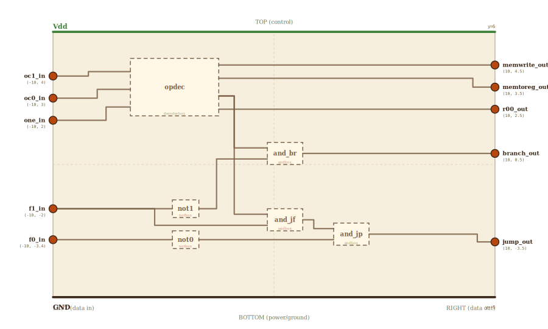

# Layer 23 — Control unit (opcode → named control lines)

Every stage of the datapath obeys control lines — Branch, Jump, memToReg,
memWrite — and until now those lines simply "arrived from the decoder." This
layer opens that box. The control unit is the small circuit inside the
instruction decoder that reads the opcode (and, for the control-flow family,
the funct field) and raises exactly the lines this instruction needs. It is
not magic: one 2-to-4 **decoder** — the exact layer-10 block — matches the
opcode into a one-hot row, and three gates refine the shared control-flow row
into Branch vs. Jump.

Rows 10 (load) and 11 (store) need no refinement at all: each one-hot row
*is* the control line, leaving directly as memToReg / memWrite. Row 00
(R-type) matches nothing — an ADD needs no special treatment, so its row
honestly dead-ends. Row 01 is a *family* (BEQ, BNE, JAL share the opcode,
like RISC-V's funct3 split): Branch = fam · f̄₁, and Jump = fam · f₁ · f̄₀.

## Scene bounds
x ∈ [-10, 10], y ∈ [-6, 6]

## External terminals

| key          | role                                | (x, y)      | edge   |
|--------------|-------------------------------------|-------------|--------|
| oc1_in       | opcode bit 1 (from the field slice) | (-10,  4.0) | LEFT   |
| oc0_in       | opcode bit 0                        | (-10,  3.0) | LEFT   |
| one_in       | enable, tied high (always decoding) | (-10,  2.0) | LEFT   |
| f1_in        | funct bit 1                         | (-10, -2.0) | LEFT   |
| f0_in        | funct bit 0                         | (-10, -3.4) | LEFT   |
| memwrite_out | 11 · store → memWrite               | ( 10,  4.5) | RIGHT  |
| memtoreg_out | 10 · load → memToReg                | ( 10,  3.5) | RIGHT  |
| r00_out      | 00 · R-type row (no control line)   | ( 10,  2.5) | RIGHT  |
| branch_out   | 01,f0x · beq/bne → Branch           | ( 10,  0.5) | RIGHT  |
| jump_out     | 01,f10 · jal → Jump                 | ( 10, -3.5) | RIGHT  |
| Vdd          | supply (+V)                         | (  0,  6)   | TOP    |
| GND          | supply (0V)                         | (  0, -6)   | BOTTOM |

## Internal supply distribution

Vdd rail along the top (y=6), GND along the bottom (y=-6). The decoder and
each gate sit between the rails and tap them directly.

## Embedded children

| child id | child layer | center (cx, cy) | box (w × h) |
|----------|-------------|-----------------|-------------|
| opdec    | decoderbox  | (-4.5,  3.5)    | 4.0 × 2.6   |
| not1     | notbox      | (-4.0, -2.0)    | 1.2 × 0.8   |
| and_br   | andbox      | ( 0.5,  0.5)    | 1.6 × 1.0   |
| and_jf   | andbox      | ( 0.5, -2.5)    | 1.6 × 1.0   |
| not0     | notbox      | (-4.0, -3.4)    | 1.2 × 0.8   |
| and_jp   | andbox      | ( 3.5, -3.15)   | 1.6 × 1.0   |

- `opdec` — the layer-10 2-to-4 decoder, matching the opcode one-hot.
- `not1` + `and_br` — Branch = fam · f̄₁ (a conditional branch has f₁ = 0).
- `and_jf` + `not0` + `and_jp` — Jump = fam · f₁ · f̄₀ (JAL is funct 10).

## Absorbed terminals

Opcode decoder `opdec` (x∈[-6.5,-2.5], y∈[2.2,4.8]):

- `opdec_a1_in`    (-6.5, 4.2)  ← LEFT
- `opdec_a0_in`    (-6.5, 3.4)  ← LEFT
- `opdec_en_in`    (-6.5, 2.6)  ← LEFT
- `opdec_sel3_out` (-2.5, 4.5)  ← RIGHT
- `opdec_sel2_out` (-2.5, 3.9)  ← RIGHT
- `opdec_sel1_out` (-2.5, 3.1)  ← RIGHT
- `opdec_sel0_out` (-2.5, 2.5)  ← RIGHT

Inverter `not1` (x∈[-4.6,-3.4], y∈[-2.4,-1.6]):

- `not1_a_in`  (-4.6, -2.0)  ← LEFT
- `not1_y_out` (-3.4, -2.0)  ← RIGHT

Inverter `not0` (x∈[-4.6,-3.4], y∈[-3.8,-3.0]):

- `not0_a_in`  (-4.6, -3.4)  ← LEFT
- `not0_y_out` (-3.4, -3.4)  ← RIGHT

AND gate `and_br` (x∈[-0.3,1.3], y∈[0,1]):

- `and_br_a_in` (-0.3, 0.75)  ← LEFT
- `and_br_b_in` (-0.3, 0.25)  ← LEFT
- `and_br_y_out` (1.3, 0.5)   ← RIGHT

AND gate `and_jf` (x∈[-0.3,1.3], y∈[-3,-2]):

- `and_jf_a_in` (-0.3, -2.25)  ← LEFT
- `and_jf_b_in` (-0.3, -2.75)  ← LEFT
- `and_jf_y_out` (1.3, -2.5)   ← RIGHT

AND gate `and_jp` (x∈[2.7,4.3], y∈[-3.65,-2.65]):

- `and_jp_a_in` (2.7, -2.9)   ← LEFT
- `and_jp_b_in` (2.7, -3.4)   ← LEFT
- `and_jp_y_out` (4.3, -3.15) ← RIGHT

## Internal nets

| net      | carries                                            |
|----------|----------------------------------------------------|
| oc1      | opcode bit 1 → decoder a1                          |
| oc0      | opcode bit 0 → decoder a0                          |
| one      | constant 1 → decoder enable (always decoding)      |
| memwrite | row 11 (store) → memWrite output                   |
| memtoreg | row 10 (load) → memToReg output                    |
| r00      | row 00 (R-type) — matches no control line          |
| fam      | row 01, the control-flow family → both refinement ANDs |
| f1       | funct bit 1 → NOT + the jump AND                   |
| f0       | funct bit 0 → NOT                                  |
| f1bar    | ¬f₁ → the branch AND                               |
| f0bar    | ¬f₀ → the jump AND                                 |
| jmp1     | fam · f₁ → the jump AND                            |
| branch   | fam · f̄₁ → Branch output                           |
| jump     | fam · f₁ · f̄₀ → Jump output                        |

## Wires

| from            | to             | via                        | net      |
|-----------------|----------------|----------------------------|----------|
| oc1_in          | opdec_a1_in    | (-8.4, 4.0), (-8.4, 4.2)   | oc1      |
| oc0_in          | opdec_a0_in    | (-8.0, 3.0), (-8.0, 3.4)   | oc0      |
| one_in          | opdec_en_in    | (-7.6, 2.0), (-7.6, 2.6)   | one      |
| opdec_sel3_out  | memwrite_out   | (9.0, 4.5), (9.0, 4.5)     | memwrite |
| opdec_sel2_out  | memtoreg_out   | (9.0, 3.9), (9.0, 3.5)     | memtoreg |
| opdec_sel0_out  | r00_out        | —                          | r00      |
| opdec_sel1_out  | and_br_a_in    | (-1.8, 3.1), (-1.8, 0.75)  | fam      |
| opdec_sel1_out  | and_jf_a_in    | (-1.8, 3.1), (-1.8, -2.25) | fam      |
| f1_in           | not1_a_in      | —                          | f1       |
| f1_in           | and_jf_b_in    | (-5.4, -2.0), (-5.4, -2.75)| f1       |
| not1_y_out      | and_br_b_in    | (-2.6, -2.0), (-2.6, 0.25) | f1bar    |
| and_br_y_out    | branch_out     | —                          | branch   |
| f0_in           | not0_a_in      | —                          | f0       |
| not0_y_out      | and_jp_b_in    | —                          | f0bar    |
| and_jf_y_out    | and_jp_a_in    | (1.8, -2.5), (1.8, -2.9)   | jmp1     |
| and_jp_y_out    | jump_out       | (9.2, -3.15), (9.2, -3.5)  | jump     |

The opcode bits climb into the decoder at the top-left; its one-hot rows
leave rightward. The two direct rows (store, load) run straight across the
top to their outputs; the R-type row runs across unused; the family row
drops down the -1.8 lane into the two refinement ANDs. The funct bits enter
low on the left, are inverted beside their lanes, and the three-gate cascade
resolves Branch (upper AND) or Jump (lower cascade) before leaving right.

## Alignment claims

- All data inputs (`oc1_in`, `oc0_in`, `one_in`, `f1_in`, `f0_in`) are on the
  LEFT edge; all outputs (`memwrite_out`, `memtoreg_out`, `r00_out`,
  `branch_out`, `jump_out`) on the RIGHT; `Vdd` TOP, `GND` BOTTOM — per the
  locked spatial invariant.
- The family lane (x=-1.8) drops from the decoder's sel1 row past the branch
  AND into the jump AND without crossing any box interior; the funct fan
  (x=-5.4) and the inverted lanes (-2.6, 2.0) likewise route between boxes.

## Embedding contract

This block lives INSIDE the layer-16 instruction decoder: the field slicer
hands it the opcode and funct bundles, and its four outputs are the decoder's
control rows (Branch / Jump / memToReg / memWrite) that the datapath pages
consume. In a real core this is the block diagrams label "Control": a wider
decoder (RV32I: 7-bit opcode) plus per-family cleanup gates — same shape,
more rows.

