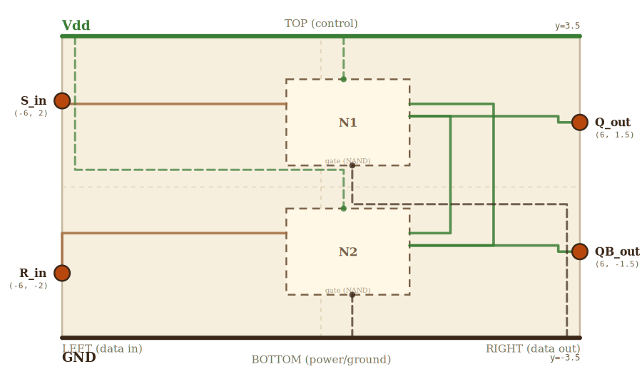

# Layer 2 — SR latch (NAND-based, active-LOW)

Two cross-coupled NAND gates. The output of each is wired back to one
input of the other. That feedback loop is what creates MEMORY: the
circuit has two stable states (Q=0,Q̄=1 and Q=1,Q̄=0). S̄ pulses to 0 set
Q=1; R̄ pulses to 0 reset Q=0; both at 1 = HOLD.

## Scene bounds
x ∈ [-6.0, 6.0], y ∈ [-3.5, 3.5]

(source: `SCENE_BOUNDS` derived in `src/levels/latchWireGraph.ts`.)

## External terminals

| key       | role         | (x, y)        | edge   |
|-----------|--------------|---------------|--------|
| S_in      | data in (S̄) | (-6.0,  2.0)  | LEFT   |
| R_in      | data in (R̄) | (-6.0, -2.0)  | LEFT   |
| Q_out     | data out (Q) | ( 6.0,  1.5)  | RIGHT  |
| QB_out    | data out (Q̄)| ( 6.0, -1.5)  | RIGHT  |
| Vdd_left  | supply (Vdd) | (-6.0,  3.5)  | TOP    |
| Vdd_right | supply (Vdd) | ( 6.0,  3.5)  | TOP    |
| GND_left  | supply (GND) | (-6.0, -3.5)  | BOTTOM |
| GND_right | supply (GND) | ( 6.0, -3.5)  | BOTTOM |

## Embedded children

Two NAND minis (layer 1). Each child's external terminals
(`A_input`, `B_input`, `Y_out`, `Vdd_rail_*`, `GND_rail_*`) map to the
absorbed terminals in this layer.

| child id | child layer | center (cx, cy) | box (w × h) | A_input →    | B_input →    | Y_out →   |
|----------|-------------|-----------------|-------------|--------------|--------------|-----------|
| N1       | gate (NAND) | ( 0.625,  1.5)  | 3.75 × 1.0  | N1_top_in    | N1_bot_in    | N1_out    |
| N2       | gate (NAND) | ( 0.625, -1.5)  | 3.75 × 1.0  | N2_bot_in    | N2_top_in    | N2_out    |

Absorbed-terminal coords (source: `WIRE_NODES` in `latchWireGraph.ts`):

| absorbed key | (x, y)         | description                       |
|--------------|----------------|-----------------------------------|
| N1_top_in    | (-1.25,  2.0)  | NAND1 top input  (S̄ direct)      |
| N1_bot_in    | (-1.25,  1.0)  | NAND1 bottom input (Q̄ feedback)  |
| N1_out       | ( 2.5,   1.5)  | NAND1 output → Q                  |
| N2_top_in    | (-1.25, -1.0)  | NAND2 top input  (Q feedback)     |
| N2_bot_in    | (-1.25, -2.0)  | NAND2 bottom input (R̄ direct)    |
| N2_out       | ( 2.5,  -1.5)  | NAND2 output → Q̄                 |

The two NANDs each have only TWO inputs in this layer (not the gate's
A_input from LEFT and B_input from RIGHT). The latch wraps the
cross-coupled feedback OUT, around the right edge, and BACK IN. So for
NAND1 (the SET gate): A_input (the gate's LEFT input) = S̄, and B_input
(the gate's RIGHT input) = Q̄ feedback. For NAND2 (the RESET gate):
A_input = R̄ (LEFT-arriving direct input), B_input = Q feedback
(RIGHT-arriving cross-coupled).

## Wires

Internal wires (source: `WIRES` in `latchWireGraph.ts`).

| from        | to          | via                       | net   |
|-------------|-------------|---------------------------|-------|
| Vdd_left    | Vdd_right   | —                         | Vdd   |
| GND_left    | GND_right   | —                         | GND   |
| S_in        | N1_top_in   | —                         | S_bar |
| R_in        | N2_bot_in   | —                         | R_bar |
| N1_out      | Q_out       | (3.5, 1.5)                | Q     |
| N2_out      | QB_out      | (4.5, -1.5)               | Q_bar |
| Q_branch    | N2_top_in   | (3.5, -1.0)               | Q     |
| QB_branch   | N1_bot_in   | (4.5,  1.0)               | Q_bar |

Junction nodes (cross-coupled wraparound corners):
- `Q_branch`  ( 3.5,  1.5), `Q_wrap`  ( 3.5, -1.0)
- `QB_branch` ( 4.5, -1.5), `QB_wrap` ( 4.5,  1.0)

## Alignment claims

- Each child NAND's `A_input`, `B_input`, `Y_out` external terminal MUST
  project to the matching absorbed terminal in the embedded-children
  table. This is enforced when the NAND mini is rendered inside the latch
  scene via `GATE_MODULE.projectAllTerminals` — the same projection math
  the latch wire-graph world coords were chosen to match. Pinned by
  `tests/e2e/wire-connection.spec.ts`.
- When the latch is embedded as a mini inside the D latch (layer 3) or
  the DFF (layer 4), its 8 external terminals MUST project within 1.5 px
  of where the parent's wires land. Source:
  `tests/e2e/wire-connection-dff.spec.ts`.

