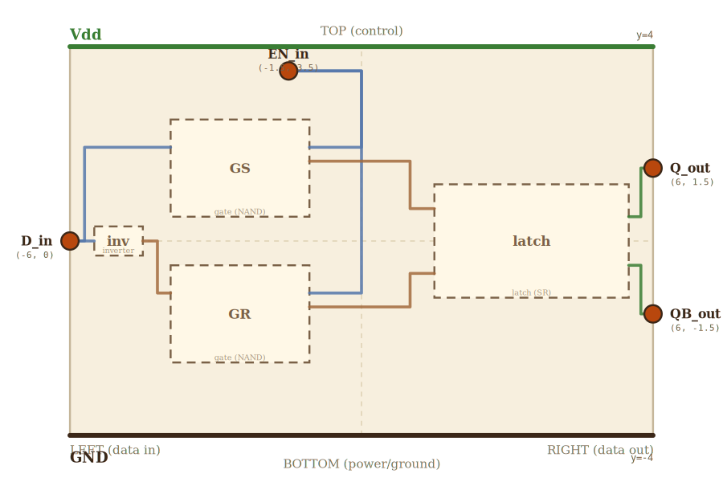

# Layer 3 — D latch (gated)

One SR latch + two gating NANDs (NAND_S and NAND_R) + one inverter.
When EN=1 the latch is transparent: S̄ = !D, R̄ = D, so Q follows D. When
EN=0 the latch HOLDS: S̄ = R̄ = 1 means the SR latch retains its last
state.

## Scene bounds
x ∈ [-6.0, 6.0], y ∈ [-4.0, 4.0]

## External terminals

| key    | role         | (x, y)        | edge   |
|--------|--------------|---------------|--------|
| D_in   | data in      | (-6.0,  0.0)  | LEFT   |
| EN_in  | control in   | (-1.5,  3.5)  | TOP    |
| Q_out  | data out (Q) | ( 6.0,  1.5)  | RIGHT  |
| QB_out | data out (Q̄)| ( 6.0, -1.5)  | RIGHT  |
| Vdd    | supply (+V)  | ( 0.0,  4.0)  | TOP    |
| GND    | supply (0V)  | ( 0.0, -4.0)  | BOTTOM |

## Embedded children

Two gating NANDs (GS, GR), one inverter, and one full SR latch.

EVERY gate input uses the canonical terminals from `layer1_gate.md`:
**A on the LEFT edge, B on the RIGHT edge, Y on the RIGHT edge**. No
fictional TOP-edge inputs — programmatic `check.mjs` rule 7a refuses to
let a parent invent a terminal the child doesn't really have.

| child id | child layer | center (cx, cy) | box (w × h)   | input(s) → absorbed                                          | output → absorbed                                          |
|----------|-------------|-----------------|---------------|--------------------------------------------------------------|------------------------------------------------------------|
| inv      | inverter    | (-5.0,  0.0)    | 1.0 × 0.6     | in → inv_in (LEFT)                                           | out → inv_out (RIGHT)                                      |
| GS       | gate (NAND) | (-2.5,  1.5)    | 2.857 × 2.0   | A → GS_A_in, B → GS_B_in                                     | Y → GS_Y_out (RIGHT)                                       |
| GR       | gate (NAND) | (-2.5, -1.5)    | 2.857 × 2.0   | A → GR_A_in, B → GR_B_in                                     | Y → GR_Y_out (RIGHT)                                       |
| latch    | latch (SR)  | ( 3.5,  0.0)    | 4.0 × 2.333   | S_in → latch_S_in, R_in → latch_R_in                         | Q_out → latch_Q_out (RIGHT), QB_out → latch_QB_out (RIGHT) |

Auto-derived absorbed positions (rule 7b asserts these match
`projectChildTerminal` on every check run):

    GS box (cx=-2.5, cy=1.5, w=2.857, h=2.0)
      GS_A_in  = (-3.929,  1.929)   LEFT  edge, gate.A_input frac 2/7
      GS_B_in  = (-1.071,  1.929)   RIGHT edge, gate.B_input frac 2/7
      GS_Y_out = (-1.071,  1.643)   RIGHT edge, gate.Y_out   frac 3/7
    GR box (cx=-2.5, cy=-1.5, w=2.857, h=2.0) — mirror of GS:
      GR_A_in  = (-3.929, -1.071)
      GR_B_in  = (-1.071, -1.071)
      GR_Y_out = (-1.071, -1.357)
    latch box (cx=3.5, cy=0, w=4.0, h=2.333)
      latch_S_in   = (1.5,  0.667)   LEFT  edge, latch.S_in   frac 1.5/7
      latch_R_in   = (1.5, -0.667)   LEFT  edge, latch.R_in   frac 5.5/7
      latch_Q_out  = (5.5,  0.500)   RIGHT edge, latch.Q_out  frac 2/7
      latch_QB_out = (5.5, -0.500)   RIGHT edge, latch.QB_out frac 5/7

Hardcoded absorbed terminals (only the inverter — no layer file to
derive from):

| absorbed key | (x, y)         | description                              |
|--------------|----------------|------------------------------------------|
| inv_in       | (-5.5,  0.0)   | inverter input — LEFT edge mid           |
| inv_out      | (-4.5,  0.0)   | inverter output (!D) — RIGHT edge mid    |

## Wires

EN reaches each gating NAND's B input (RIGHT edge) by wrapping from
EN_in around the right side of the GS/GR column — the wires enter on
the canonical edge, not on a fictional top input.

| from         | to             | via                                                            | net    |
|--------------|----------------|----------------------------------------------------------------|--------|
| D_in         | inv_in         | —                                                              | D      |
| D_in         | GS_A_in        | (-5.7, 0.0), (-5.7, 1.929)                                     | D      |
| inv_out      | GR_A_in        | (-4.2, 0.0), (-4.2, -1.071)                                    | D_bar  |
| EN_in        | GS_B_in        | (-1.5, 3.0), (0.0, 3.0), (0.0, 1.929)                          | EN     |
| EN_in        | GR_B_in        | (-1.5, 3.0), (0.0, 3.0), (0.0, -1.071)                         | EN     |
| GS_Y_out     | latch_S_in     | (1.0, 1.643), (1.0, 0.667)                                     | S_bar  |
| GR_Y_out     | latch_R_in     | (1.0, -1.357), (1.0, -0.667)                                   | R_bar  |
| latch_Q_out  | Q_out          | (5.75, 0.5), (5.75, 1.5)                                       | Q      |
| latch_QB_out | QB_out         | (5.75, -0.5), (5.75, -1.5)                                     | Q_bar  |

## Alignment claims

- Every absorbed terminal name in the embedded-children mapping uses a
  canonical key of the child layer (enforced by rule 7a).
- Every absorbed terminal's position equals its canonical projection
  (enforced by rule 7b — "overlay assertion": when the child layer is
  drilled into, the parent's wire endpoints land on the same pixels
  the child's own external terminals occupy).
- Every exposed terminal is touched by at least one wire (rule 7).

