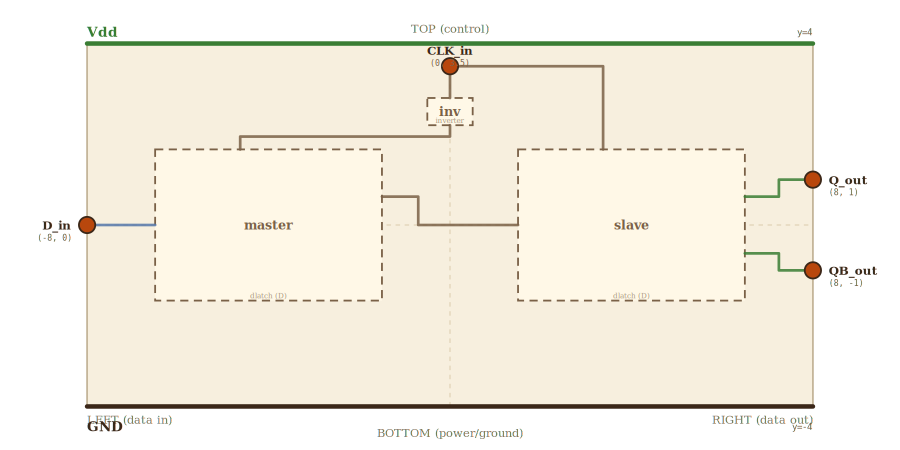

# Layer 4 — DFF (edge-triggered D flip-flop)

Two D-latches in master–slave configuration plus one inverter on CLK.
When CLK=0 the MASTER latch is transparent (master.EN=!CLK=1) and the
SLAVE is holding; when CLK rises, master latches (master.EN=0) and the
slave becomes transparent — so the value captured by the master at the
rising edge propagates to Q. This is the canonical edge-triggered
register cell.

Drilling into the master or slave zooms into the layer-3 D-latch sketch.

## Scene bounds
x ∈ [-8.0, 8.0], y ∈ [-4.0, 4.0]

## External terminals

| key    | role              | (x, y)        | edge   |
|--------|-------------------|---------------|--------|
| D_in   | data in           | (-8.0,  0.0)  | LEFT   |
| CLK_in | clock in          | ( 0.0,  3.5)  | TOP    |
| Q_out  | data out (Q)      | ( 8.0,  1.0)  | RIGHT  |
| QB_out | data out (Q̄)     | ( 8.0, -1.0)  | RIGHT  |
| Vdd    | supply (+V)       | ( 0.0,  4.0)  | TOP    |
| GND    | supply (0V)       | ( 0.0, -4.0)  | BOTTOM |

## Embedded children

Two D-latches plus an inverter producing !CLK for the master.

The inverter sits DIRECTLY under CLK_in with its IN on the TOP edge
and OUT on the BOTTOM — so CLK drops straight down into inv_in and !CLK
drops out the bottom toward master.EN_in. This keeps every wire
approaching its target perpendicular to the edge (no edge-grazing) and
no segment crosses any child interior.

| child id | child layer | center (cx, cy) | box (w × h)   | input(s) → absorbed                                                 | output → absorbed                                              |
|----------|-------------|-----------------|---------------|---------------------------------------------------------------------|----------------------------------------------------------------|
| inv      | inverter    | ( 0.0,  2.5)    | 1.0 × 0.6     | in → inv_in (TOP)                                                   | out → inv_out (BOTTOM)                                         |
| master   | dlatch (D)  | (-4.0,  0.0)    | 5.0 × 3.333   | D_in → master_D_in, EN_in → master_EN_in                            | Q_out → master_Q_out (RIGHT)                                   |
| slave    | dlatch (D)  | ( 4.0,  0.0)    | 5.0 × 3.333   | D_in → slave_D_in, EN_in → slave_EN_in                              | Q_out → slave_Q_out (RIGHT), QB_out → slave_QB_out (RIGHT)     |

Each D-latch box uses the dlatch canvas aspect (12/8 = 1.5) — enforced
by `check.mjs` rule 6a. The inverter is a sub-gate without its own
layer file, so its dimensions are picked locally.

Absorbed-terminal coords for the inverter are hardcoded here (no layer
file to derive from). Every other absorbed terminal is auto-derived
from `CHILD_LAYER_TERMINAL_OFFSETS.dlatch`:

| absorbed key | (x, y)         | description                                       |
|--------------|----------------|---------------------------------------------------|
| inv_in       | ( 0.0,  2.8)   | inverter input — TOP edge mid (CLK drops in)      |
| inv_out      | ( 0.0,  2.2)   | inverter output (!CLK) — BOTTOM edge mid          |

Auto-derived dlatch terminals on the master box (cx=-4, cy=0, w=5, h=3.333):

    master_D_in    = (-6.5,  0.000)   ← LEFT edge,  frac 0.5
    master_EN_in   = (-4.625, 1.667)  ← TOP edge,   frac 0.375
    master_Q_out   = (-1.5,  0.625)   ← RIGHT edge, frac 0.3125
    master_QB_out  = (-1.5, -0.625)   ← RIGHT edge, frac 0.6875

Slave mirrors these around x=0.

## Wires

The Vdd / GND rails span the full top / bottom edges of the scene and
are rendered from the External-terminals table — no explicit rail
wires here.

| from         | to            | via                                                      | net     |
|--------------|---------------|----------------------------------------------------------|---------|
| D_in         | master_D_in   | —                                                        | D       |
| master_Q_out | slave_D_in    | (-0.7, 0.625), (-0.7, 0.0)                               | M       |
| slave_Q_out  | Q_out         | (7.25, 0.625), (7.25, 1.0)                               | Q       |
| slave_QB_out | QB_out        | (7.25, -0.625), (7.25, -1.0)                             | Q_bar   |
| CLK_in       | inv_in        | —                                                        | CLK     |
| inv_out      | master_EN_in  | (0.0, 1.95), (-4.625, 1.95)                              | NOT_CLK |
| CLK_in       | slave_EN_in   | (3.375, 3.5)                                             | CLK     |

## Alignment claims

- Every canonical absorbed terminal MUST equal `projectChildTerminal(child, key)`
  for the corresponding child layer's external terminal.
- When the DFF is embedded inside a higher-layer parent (e.g. a
  register file), its 6 external terminals (D, CLK, Q, Q̄, Vdd, GND)
  MUST project to where the parent's wires terminate.

