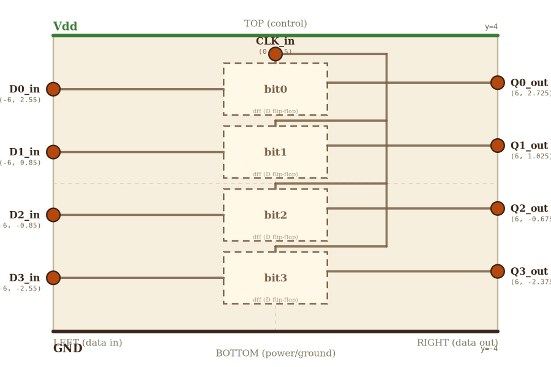

# Layer 5 — 4-bit register

Four DFFs stacked vertically, all sharing one CLK. On every rising
edge of CLK, each DFF latches its D input bit into its output Q. The
register as a whole is the smallest unit of "named storage" inside a
processor — give it a name (e.g. `x1`) and you have a CPU register.

Drilling into any one bit zooms into the layer-4 DFF sketch.

## Scene bounds
x ∈ [-6.0, 6.0], y ∈ [-4.0, 4.0]

## External terminals

| key    | role            | (x, y)         | edge   |
|--------|-----------------|----------------|--------|
| D0_in  | data in  (bit 0)| (-6.0,  2.55)  | LEFT   |
| D1_in  | data in  (bit 1)| (-6.0,  0.85)  | LEFT   |
| D2_in  | data in  (bit 2)| (-6.0, -0.85)  | LEFT   |
| D3_in  | data in  (bit 3)| (-6.0, -2.55)  | LEFT   |
| Q0_out | data out (bit 0)| ( 6.0,  2.725) | RIGHT  |
| Q1_out | data out (bit 1)| ( 6.0,  1.025) | RIGHT  |
| Q2_out | data out (bit 2)| ( 6.0, -0.675) | RIGHT  |
| Q3_out | data out (bit 3)| ( 6.0, -2.375) | RIGHT  |
| CLK_in | clock in        | ( 0.0,  3.5)   | TOP    |
| Vdd    | supply (+V)     | ( 0.0,  4.0)   | TOP    |
| GND    | supply (0V)     | ( 0.0, -4.0)   | BOTTOM |

The D / Q y-coords are NOT arbitrary — they are pinned to the
auto-derived absorbed positions of each child DFF's `D_in` (LEFT edge
frac 0.5) and `Q_out` (RIGHT edge frac 0.375), so every per-bit data
wire on this layer is a straight horizontal segment with no via.

## Embedded children

Four DFF minis stacked. Each one's `D_in` is on the LEFT, `Q_out` on
the RIGHT, `CLK_in` on the TOP — exactly the layer-4 external
contract.

| child id | child layer       | center (cx, cy) | box (w × h) | input(s) → absorbed                          | output → absorbed                    |
|----------|-------------------|-----------------|-------------|----------------------------------------------|--------------------------------------|
| bit0     | dff (D flip-flop) | ( 0.0,  2.55)   | 2.8 × 1.4   | D_in → bit0_D_in, CLK_in → bit0_CLK_in       | Q_out → bit0_Q_out (RIGHT)           |
| bit1     | dff (D flip-flop) | ( 0.0,  0.85)   | 2.8 × 1.4   | D_in → bit1_D_in, CLK_in → bit1_CLK_in       | Q_out → bit1_Q_out (RIGHT)           |
| bit2     | dff (D flip-flop) | ( 0.0, -0.85)   | 2.8 × 1.4   | D_in → bit2_D_in, CLK_in → bit2_CLK_in       | Q_out → bit2_Q_out (RIGHT)           |
| bit3     | dff (D flip-flop) | ( 0.0, -2.55)   | 2.8 × 1.4   | D_in → bit3_D_in, CLK_in → bit3_CLK_in       | Q_out → bit3_Q_out (RIGHT)           |

Each DFF box's aspect = 2.8 / 1.4 = 2.0, matching the DFF canvas
aspect (16 / 8 = 2.0) — enforced by `check.mjs` rule 6a.

Auto-derived absorbed terminals (rule 7b asserts these equal
`projectChildTerminal(child, key)` on every check run):

    bit0 box (cx=0, cy=2.55, w=2.8, h=1.4)
      bit0_D_in   = (-1.4,  2.550)   ← LEFT edge,  frac 0.5
      bit0_CLK_in = ( 0.0,  3.250)   ← TOP edge,   frac 0.5
      bit0_Q_out  = ( 1.4,  2.725)   ← RIGHT edge, frac 0.375
    bit1 box (cx=0, cy=0.85) — shifted by Δy=-1.7
      bit1_D_in   = (-1.4,  0.850)
      bit1_CLK_in = ( 0.0,  1.550)
      bit1_Q_out  = ( 1.4,  1.025)
    bit2 box (cx=0, cy=-0.85) — shifted by Δy=-3.4
      bit2_D_in   = (-1.4, -0.850)
      bit2_CLK_in = ( 0.0, -0.150)
      bit2_Q_out  = ( 1.4, -0.675)
    bit3 box (cx=0, cy=-2.55) — shifted by Δy=-5.1
      bit3_D_in   = (-1.4, -2.550)
      bit3_CLK_in = ( 0.0, -1.850)
      bit3_Q_out  = ( 1.4, -2.375)

Inter-DFF vertical gap = 1.7 − 1.4 = 0.300 wu, more than 3× the
layer's `componentBuffer` (≈ 0.096), so the CLK distribution wire
that runs through each gap clears both adjacent DFFs by ≥ 0.15 wu.

## CLK distribution

CLK_in (TOP, slightly recessed at y=3.5) fans out to all four DFFs:

- **bit0** is the topmost DFF; nothing sits between CLK_in (y=3.5)
  and bit0_CLK_in (y=3.25), so the wire is a direct vertical drop.
- **bit1 / bit2 / bit3** sit below other DFFs. A vertical CLK bus on
  the RIGHT side of the DFF column (x=+3) carries CLK down past each
  intervening DFF; at each gap between two adjacent DFFs the bus
  taps horizontally inward to x=0 at the gap y, then turns into a
  perpendicular vertical stub that enters the next DFF's TOP edge.

This is a tree of named junction nodes, not three overlapping wires
sharing vias — so `check.mjs` rule 4 (wire-wire-overlap) cannot fire
on the shared bus segment.

Helper junction nodes (backticked so `buildNodeMap` registers them
and the PASS D simplifier preserves the via points verbatim):

- `Vdd_left` (-6, 4), `Vdd_right` (6, 4)
- `GND_left` (-6, -4), `GND_right` (6, -4)
- `CLK_corner_top` (3, 3.5) — CLK trunk turns DOWN here, just outside
  the DFF column's right edge (x=1.4) so the vertical bus avoids every
  DFF body.
- `CLK_branch_1` (3, 1.7), `CLK_branch_2` (3, 0.0), `CLK_branch_3` (3, -1.7)
  — bus-tap corners at the gap-y between consecutive DFFs.
- `CLK_drop_1` (0, 1.7), `CLK_drop_2` (0, 0.0), `CLK_drop_3` (0, -1.7)
  — horizontal-to-vertical turn just above each DFF's TOP edge, so
  the wire enters the DFF perpendicular to its top.

## Wires

| from            | to              | via | net |
|-----------------|-----------------|-----|-----|
| Vdd_left        | Vdd_right       | —   | Vdd |
| GND_left        | GND_right       | —   | GND |
| D0_in           | bit0_D_in       | —   | D0  |
| D1_in           | bit1_D_in       | —   | D1  |
| D2_in           | bit2_D_in       | —   | D2  |
| D3_in           | bit3_D_in       | —   | D3  |
| bit0_Q_out      | Q0_out          | —   | Q0  |
| bit1_Q_out      | Q1_out          | —   | Q1  |
| bit2_Q_out      | Q2_out          | —   | Q2  |
| bit3_Q_out      | Q3_out          | —   | Q3  |
| CLK_in          | bit0_CLK_in     | —   | CLK |
| CLK_in          | CLK_corner_top  | —   | CLK |
| CLK_corner_top  | CLK_branch_1    | —   | CLK |
| CLK_branch_1    | CLK_branch_2    | —   | CLK |
| CLK_branch_2    | CLK_branch_3    | —   | CLK |
| CLK_branch_1    | CLK_drop_1      | —   | CLK |
| CLK_drop_1      | bit1_CLK_in     | —   | CLK |
| CLK_branch_2    | CLK_drop_2      | —   | CLK |
| CLK_drop_2      | bit2_CLK_in     | —   | CLK |
| CLK_branch_3    | CLK_drop_3      | —   | CLK |
| CLK_drop_3      | bit3_CLK_in     | —   | CLK |

## Alignment claims

- Every absorbed terminal name in the embedded-children table uses a
  canonical key of the DFF layer (`D_in`, `CLK_in`, `Q_out`) — enforced
  by `check.mjs` rule 7a.
- Every absorbed terminal's position equals `projectChildTerminal(bitN, key)`
  — enforced by rule 7b.
- Every external terminal of THIS layer is touched by at least one wire
  (rule 7).
- The 4 D wires and 4 Q wires are exact horizontals — pixels in the
  parent's view of bitN land on the same y as bitN's projected D / Q.
  When the user clicks `bitN` and zooms into the DFF, the LEFT-edge
  entry point of the DFF lands where the register's D-wire ended; same
  for the RIGHT-edge Q exit.

