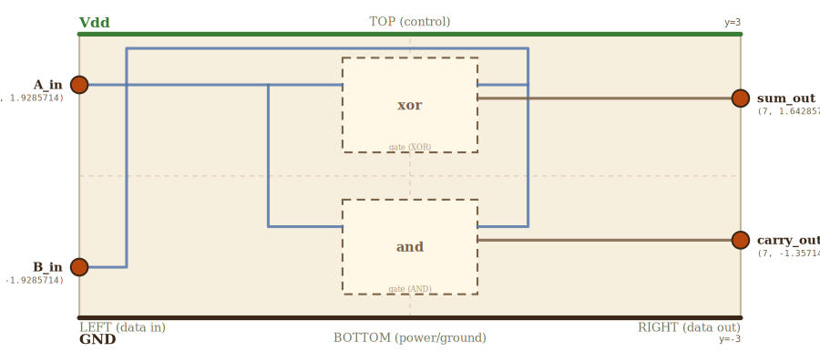

# Layer 6 — half adder

Two single-bit operands `A` and `B` go in; `sum = A XOR B` and
`carry = A AND B` come out. The smallest possible adder.

Both children re-use the layer-1 gate body (aspect 1.4285714, `A_input` on
the LEFT, `B_input` on the RIGHT, `Y_out` on the RIGHT). At this layer
they are labeled XOR and AND — both behaviorally distinct from NAND but
geometrically interchangeable with it. Drilling into either box keeps
the same scene as layer 1 (the user re-reads it through the lens of the
appropriate truth table).

## Scene bounds
x ∈ [-7, 7], y ∈ [-3, 3]

## External terminals

| key       | role            | (x, y)             | edge   |
|-----------|-----------------|--------------------|--------|
| A_in      | data in (A)     | (-7,  1.9285714)      | LEFT   |
| B_in      | data in (B)     | (-7, -1.9285714)      | LEFT   |
| sum_out   | data out (sum)  | ( 7,  1.6428571)      | RIGHT  |
| carry_out | data out (carry)| ( 7, -1.3571429)      | RIGHT  |
| Vdd       | supply (+V)     | ( 0,  3)           | TOP    |
| GND       | supply (0V)     | ( 0, -3)           | BOTTOM |

`A_in.y` equals the y where the xor child's `A_input` lands (LEFT frac
2/7 of a 2-unit-tall box centered at cy=1.5 → 1.9285714). `sum_out.y` and
`carry_out.y` equal the corresponding `Y_out` projected y's. `B_in.y`
mirrors A_in.y about the x-axis — it's just a clean number; B's wire
routes around the gates regardless of its entry y.

## Internal supply distribution

Vdd at y=3 (TOP rail), GND at y=-3 (BOTTOM rail). Each child gets supply
via direct top-drop / bottom-rise — neither gate is sandwiched behind
the other.

## Embedded children

Two gate minis stacked vertically; xor on top, and on bottom. Each box
is 2.857 × 2.0 — aspect 1.4285714, matching the layer-1 gate canvas.

| child id | child layer | center (cx, cy) | box (w × h)   | A_input →  | B_input →  | Y_out →   |
|----------|-------------|-----------------|---------------|------------|------------|-----------|
| xor      | gate (XOR)  | ( 0,  1.5)      | 2.857 × 2.0   | xor_A_in   | xor_B_in   | xor_Y_out |
| and      | gate (AND)  | ( 0, -1.5)      | 2.857 × 2.0   | and_A_in   | and_B_in   | and_Y_out |

Auto-derived absorbed terminals (rule 7b asserts these equal
`projectChildTerminal(child, key)` on every check run):

    xor (cx=0, cy=1.5, w=2.857, h=2)
      xor_A_in  = (-1.4285714,  1.9285714)   ← LEFT  2/7
      xor_B_in  = ( 1.4285714,  1.9285714)   ← RIGHT 2/7
      xor_Y_out = ( 1.4285714,  1.6428571)   ← RIGHT 3/7
    and (cx=0, cy=-1.5)
      and_A_in  = (-1.4285714, -1.0714286)
      and_B_in  = ( 1.4285714, -1.0714286)
      and_Y_out = ( 1.4285714, -1.3571429)

Inter-gate vertical gap = (xor bottom y=0.5) − (and top y=-0.5) = 1.0 wu,
plenty for an A-net drop to thread through (and for the B trunk to skirt
the gates on the far right).

## A net — branches with a junction

A_in (LEFT) enters at the xor's A_input y so the first wire is a clean
horizontal straight to `xor_A_in`. A second wire starts from a junction
`A_tap` on that wire and drops L-shaped down to `and_A_in`.

- `A_tap` (-3, 1.9285714)  — on the A_in → xor_A_in trunk at x=-3

## B net — routed around the gates' top edge

B_in (LEFT) enters and immediately turns UP to clear xor's top, then
crosses RIGHT past xor's right edge, then drops DOWN on a B-trunk
column at x=2.5 (just outside the gates' right edges at x=1.4285714).
Taps INTO each gate's RIGHT-side B_input:

- `B_enter_up` (-6, -1.9285714)  — B_in turns UP here, x just inside scene left
- `B_top_left` (-6, 2.7)      — top corner of the B loop
- `B_top_right` ( 2.5, 2.7)   — B trunk turns DOWN here
- `B_at_xor` ( 2.5, 1.9285714)   — B trunk taps INTO xor_B_in
- `B_at_and` ( 2.5, -1.0714286)  — B trunk bottom — taps INTO and_B_in

The B trunk's vertical leg (x=2.5, y ∈ [-1.0714286, 2.7]) is outside both
gate bodies (gates end at x=1.4285714). The trunk passes through the y's
of xor_Y_out (1.6428571) — sum_out's wire crosses it at the point
(2.5, 1.6428571). Point-crossings of axis-aligned wires are allowed; this
is not a wire-wire overlap.

## Supply helpers

- `Vdd_left` (-7, 3), `Vdd_right` (7, 3)
- `GND_left` (-7, -3), `GND_right` (7, -3)

## Wires

| from         | to            | via                                                                 | net   |
|--------------|---------------|---------------------------------------------------------------------|-------|
| Vdd_left     | Vdd_right     | —                                                                   | Vdd   |
| GND_left     | GND_right     | —                                                                   | GND   |
| A_in         | xor_A_in      | —                                                                   | A     |
| A_tap        | and_A_in      | (-3, -1.0714286)                                                       | A     |
| B_in         | xor_B_in      | (-6, -1.9285714), (-6, 2.7), (2.5, 2.7), (2.5, 1.9285714)                 | B     |
| B_at_xor     | and_B_in      | (2.5, -1.0714286)                                                      | B     |
| xor_Y_out    | sum_out       | —                                                                   | sum   |
| and_Y_out    | carry_out     | —                                                                   | carry |

`A_in → xor_A_in` and `A_tap → and_A_in` together cover the A net.
`B_in → xor_B_in` and `B_at_xor → and_B_in` together cover the B net.

## Alignment claims

- `A_in.y == xor_A_in.y == 1.9285714` → A_in → xor_A_in is a single straight
  horizontal segment.
- `A_tap.y == xor_A_in.y` → A_tap is colocated on the A_in → xor_A_in
  wire; the A net visually branches at A_tap.
- `A_tap.x == and_A_in.x` is NOT required — the A_tap → and_A_in wire
  uses an L-shape (drop down at x=-3, then right at y=-1.0714286).
- `sum_out.y == xor_Y_out.y == 1.6428571`.
- `carry_out.y == and_Y_out.y == -1.3571429`.
- xor and and box aspects are 2.857 / 2.0 = 1.4285714 — equal to the gate
  layer's canvas aspect within numerical precision.

