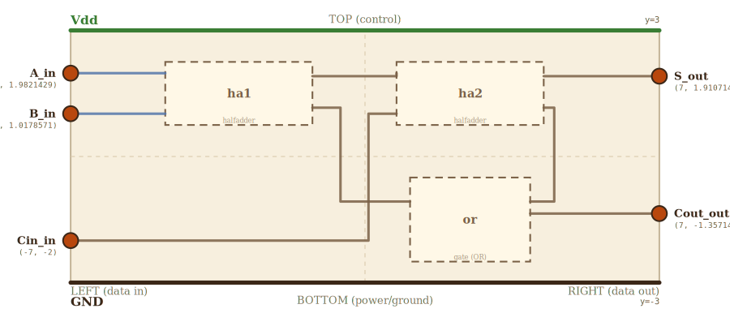

# Layer 7 — full adder

Three single-bit operands `A`, `B`, `Cin` go in; `(S, Cout)` comes out.
`S = A XOR B XOR Cin` and `Cout = (A·B) + (Cin·(A XOR B))`. The first
adder that can handle a carry, which makes it the slice unit for the
4-bit adder above. Internally: two half-adders chained, with an OR
combining the two intermediate carries.

Layout: HA1 on the top-left, HA2 on the top-right (HA1 hands its sum to
HA2's A input via a short jog at x=0). OR sits beneath HA2 so HA2.carry
drops to OR.B in three segments via a right-side lane at x=4.5; HA1.carry
travels further (out of HA1, down past OR's top, around to OR.A on the
LEFT side of OR). Cin loops up over both HAs to reach HA2's B input from
above.

Drilling into HA1 or HA2 zooms into layer 6 (half adder); drilling into
the OR zooms into layer 1 (gate, re-labeled OR).

## Scene bounds
x ∈ [-7, 7], y ∈ [-3, 3]

## External terminals

| key       | role            | (x, y)             | edge   |
|-----------|-----------------|--------------------|--------|
| A_in      | data in  (A)    | (-7,  1.9821429)   | LEFT   |
| B_in      | data in  (B)    | (-7,  1.0178571)   | LEFT   |
| Cin_in    | data in  (Cin)  | (-7, -2)           | LEFT   |
| S_out     | data out (S)    | ( 7,  1.9107143)   | RIGHT  |
| Cout_out  | data out (Cout) | ( 7, -1.3571429)   | RIGHT  |
| Vdd       | supply (+V)     | ( 0,  3)           | TOP    |
| GND       | supply (0V)     | ( 0, -3)           | BOTTOM |

`A_in.y` and `B_in.y` equal the projected y's of HA1's `A_in` and `B_in`
(LEFT frac 0.1785714 and 0.8214286 of a 1.5-tall HA box centered at
cy=1.5). `Cin_in.y` is just below HA1 — Cin loops over the top to reach
HA2.B from above. `S_out.y` equals HA2's projected `sum_out.y`;
`Cout_out.y` equals OR's projected `Y_out.y`.

## Internal supply distribution

Vdd at y=3, GND at y=-3. Each child gets supply via direct top-drop /
bottom-rise from the rails — no child is sandwiched behind another in
the vertical direction.

## Embedded children

| child id | child layer | center (cx, cy) | box (w × h)   | input(s) → absorbed                                          | output(s) → absorbed                                |
|----------|-------------|-----------------|---------------|--------------------------------------------------------------|-----------------------------------------------------|
| ha1      | halfadder   | (-3.0,  1.5)    | 3.5 × 1.5     | A_in → ha1_A_in, B_in → ha1_B_in                             | sum_out → ha1_sum_out, carry_out → ha1_carry_out    |
| ha2      | halfadder   | ( 2.5,  1.5)    | 3.5 × 1.5     | A_in → ha2_A_in, B_in → ha2_B_in                             | sum_out → ha2_sum_out, carry_out → ha2_carry_out    |
| or       | gate (OR)   | ( 2.5, -1.5)    | 2.857 × 2.0   | A_input → or_A_input, B_input → or_B_input                   | Y_out → or_Y_out                                    |

HA box aspect = 3.5 / 1.5 = 2.3333 — exactly matches layer 6's canvas
aspect (14 / 6). OR box aspect = 2.857 / 2 = 1.4286 — matches layer 1's
canvas aspect.

Auto-derived absorbed terminals (rule 7b asserts these equal
`projectChildTerminal(child, key)` on every check run):

    ha1 (cx=-3, cy=1.5, w=3.5, h=1.5)
      ha1_A_in     = (-4.75,  1.9821429)   ← LEFT  0.1785714
      ha1_B_in     = (-4.75,  1.0178571)   ← LEFT  0.8214286
      ha1_sum_out  = (-1.25,  1.9107143)   ← RIGHT 0.2261905
      ha1_carry_out= (-1.25,  1.1607143)   ← RIGHT 0.7261905
    ha2 (cx=2.5, cy=1.5)
      ha2_A_in     = ( 0.75,  1.9821429)
      ha2_B_in     = ( 0.75,  1.0178571)
      ha2_sum_out  = ( 4.25,  1.9107143)
      ha2_carry_out= ( 4.25,  1.1607143)
    or (cx=2.5, cy=-1.5, w=2.857, h=2)
      or_A_input   = ( 1.0714286, -1.0714286)   ← LEFT  2/7
      or_B_input   = ( 3.9285714, -1.0714286)   ← RIGHT 2/7
      or_Y_out     = ( 3.9285714, -1.3571429)   ← RIGHT 3/7

## Sum1 routing (HA1.sum_out → HA2.A_in)

HA1.sum exits at y=1.9107143; HA2.A enters at y=1.9821429 — a 0.0714
mismatch. A two-corner jog at x=0 (in the gap between the two HAs):

    HA1.sum_out (-1.25, 1.9107143)
      → (0,    1.9107143)
      → (0,    1.9821429)
      → HA2.A_in (0.75, 1.9821429)

## Cin routing (Cin_in → HA2.B_in)

Cin enters LEFT at y=-2, must reach HA2.B_in at (0.75, 1.0178571). To
avoid crossing HA1, the wire loops up and over the top of the HAs:

    Cin_in (-7, -2)
      → (-5, -2)            [right past HA1's left edge x=-4.75]
      → (-5,  2.7)          [up to above HA1's top y=2.25]
      → (-0.5, 2.7)         [across the top to the gap between HAs]
      → (-0.5, 1.0178571)   [down to HA2.B_in's y]
      → HA2.B_in (0.75, 1.0178571)

## Carry1 routing (HA1.carry_out → OR.A_input)

HA1.carry exits at (-1.25, 1.1607143); OR.A enters at the LEFT edge of
OR at (1.0714286, -1.0714286). Wire dodges HA1 (going RIGHT first) and
clears OR's top (staying above y=-0.5 until past OR's left edge):

    HA1.carry_out (-1.25, 1.1607143)
      → (-1.0, 1.1607143)    [right past HA1's right edge]
      → (-1.0, -0.3)         [down, staying above OR's top edge y=-0.5]
      → ( 1.0, -0.3)         [right across the gap above OR]
      → ( 1.0, -1.0714286)   [down to OR.A's y, just left of OR.A]
      → OR.A_input (1.0714286, -1.0714286)

## Carry2 routing (HA2.carry_out → OR.B_input)

HA2.carry exits at (4.25, 1.1607143); OR.B enters at the RIGHT edge of
OR at (3.9285714, -1.0714286). Drops on a right-side lane at x=4.5
(just outside HA2's right edge x=4.25 and OR's right edge x=3.9285714):

    HA2.carry_out (4.25, 1.1607143)
      → (4.5,  1.1607143)
      → (4.5, -1.0714286)
      → OR.B_input (3.9285714, -1.0714286)

## Supply helpers

- `Vdd_left` (-7, 3), `Vdd_right` (7, 3)
- `GND_left` (-7, -3), `GND_right` (7, -3)

## Wires

| from           | to             | via                                                                         | net    |
|----------------|----------------|-----------------------------------------------------------------------------|--------|
| Vdd_left       | Vdd_right      | —                                                                           | Vdd    |
| GND_left       | GND_right      | —                                                                           | GND    |
| A_in           | ha1_A_in       | —                                                                           | A      |
| B_in           | ha1_B_in       | —                                                                           | B      |
| Cin_in         | ha2_B_in       | (-5, -2), (-5, 2.7), (-0.5, 2.7), (-0.5, 1.0178571)                         | Cin    |
| ha1_sum_out    | ha2_A_in       | (0, 1.9107143), (0, 1.9821429)                                              | sum1   |
| ha1_carry_out  | or_A_input     | (-1.0, 1.1607143), (-1.0, -0.3), (1.0, -0.3), (1.0, -1.0714286)             | carry1 |
| ha2_carry_out  | or_B_input     | (4.5, 1.1607143), (4.5, -1.0714286)                                         | carry2 |
| ha2_sum_out    | S_out          | —                                                                           | S      |
| or_Y_out       | Cout_out       | —                                                                           | Cout   |

## Alignment claims

- `A_in.y == ha1_A_in.y == 1.9821429` → A_in → ha1_A_in is a single
  axis-aligned horizontal.
- `B_in.y == ha1_B_in.y == 1.0178571` → same for B.
- `S_out.y == ha2_sum_out.y == 1.9107143`.
- `Cout_out.y == or_Y_out.y == -1.3571429`.
- HA1 and HA2 boxes share the same aspect (2.3333) as the layer-6 HA
  canvas (within 5%).
- OR box aspect (1.4286) matches the layer-1 gate canvas.
- Carry1's right-side dodge (out to x=-1.0) avoids touching HA1's right
  edge directly (i.e., no wire-along-edge violation).
- All inter-segment turns lie strictly outside every child box.

