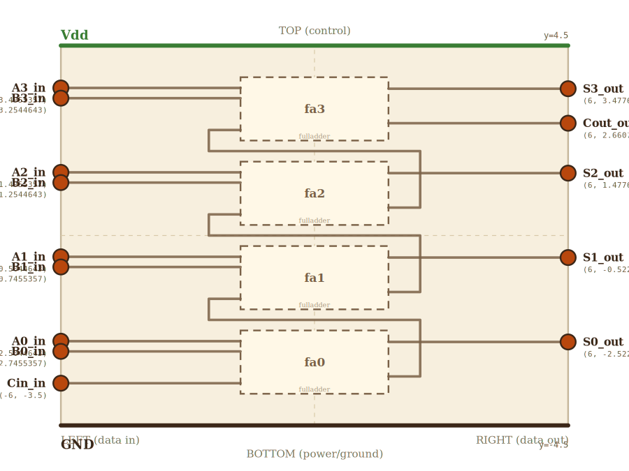

# Layer 8 — 4-bit ripple-carry adder (vertical layout)

Four full adders stacked vertically with carries rippling LSB → MSB
(bottom → top). Two 4-bit operands `A[3..0]` and `B[3..0]` go in along
the LEFT edge; the 4-bit sum `S[3..0]` and an overflow `Cout` come out
on the RIGHT.

LSB-at-bottom convention: bit 0 sits at the smallest y, bit 3 at the
largest. Each FA's `Cout_out` (on its RIGHT) hands its carry to the FA
above via a dual-rail loop — RIGHT rail at x=2.5 climbs up out of one
FA into the gap above; the carry then crosses LEFT at the gap centerline
to the LEFT rail at x=-2.5, which drops it into the next FA's `Cin_in`
(LEFT side).

Drilling into any FA box zooms into layer 7 (full adder).

## Scene bounds
x ∈ [-6, 6], y ∈ [-4.5, 4.5]

## External terminals

| key       | role               | (x, y)            | edge   |
|-----------|--------------------|-------------------|--------|
| A0_in     | data in  (bit 0)   | (-6, -2.5044643)  | LEFT   |
| A1_in     | data in  (bit 1)   | (-6, -0.5044643)  | LEFT   |
| A2_in     | data in  (bit 2)   | (-6,  1.4955357)  | LEFT   |
| A3_in     | data in  (bit 3)   | (-6,  3.4955357)  | LEFT   |
| B0_in     | data in  (bit 0)   | (-6, -2.7455357)  | LEFT   |
| B1_in     | data in  (bit 1)   | (-6, -0.7455357)  | LEFT   |
| B2_in     | data in  (bit 2)   | (-6,  1.2544643)  | LEFT   |
| B3_in     | data in  (bit 3)   | (-6,  3.2544643)  | LEFT   |
| Cin_in    | carry in           | (-6, -3.5)        | LEFT   |
| S0_out    | data out (bit 0)   | ( 6, -2.5223214)  | RIGHT  |
| S1_out    | data out (bit 1)   | ( 6, -0.5223214)  | RIGHT  |
| S2_out    | data out (bit 2)   | ( 6,  1.4776786)  | RIGHT  |
| S3_out    | data out (bit 3)   | ( 6,  3.4776786)  | RIGHT  |
| Cout_out  | carry out (overflow)| ( 6,  2.6607143) | RIGHT  |
| Vdd       | supply (+V)        | ( 0,  4.5)        | TOP    |
| GND       | supply (0V)        | ( 0, -4.5)        | BOTTOM |

Every external A_n / B_n / S_n y equals the corresponding FA_n's
projected A / B / S y. Same for Cin (FA0.Cin) and Cout (FA3.Cout).

## Internal supply distribution

Vdd at y=4.5, GND at y=-4.5. Each FA gets supply via L-shaped side-bus
routing: a Vdd vertical bus on the LEFT (x=-5.7, outside the FA stack)
with horizontal taps into each FA's top edge, mirrored by a GND bus on
the RIGHT (x=5.7). This is the L-shaped pattern from README.md.

## Embedded children

| child id | child layer | center (cx, cy) | box (w × h)   | input(s) → absorbed                                                                          | output(s) → absorbed                                              |
|----------|-------------|-----------------|---------------|----------------------------------------------------------------------------------------------|-------------------------------------------------------------------|
| fa3      | fulladder   | ( 0,  3.0)      | 3.5 × 1.5     | A_in → fa3_A_in, B_in → fa3_B_in, Cin_in → fa3_Cin_in                                        | S_out → fa3_S_out, Cout_out → fa3_Cout_out                        |
| fa2      | fulladder   | ( 0,  1.0)      | 3.5 × 1.5     | A_in → fa2_A_in, B_in → fa2_B_in, Cin_in → fa2_Cin_in                                        | S_out → fa2_S_out, Cout_out → fa2_Cout_out                        |
| fa1      | fulladder   | ( 0, -1.0)      | 3.5 × 1.5     | A_in → fa1_A_in, B_in → fa1_B_in, Cin_in → fa1_Cin_in                                        | S_out → fa1_S_out, Cout_out → fa1_Cout_out                        |
| fa0      | fulladder   | ( 0, -3.0)      | 3.5 × 1.5     | A_in → fa0_A_in, B_in → fa0_B_in, Cin_in → fa0_Cin_in                                        | S_out → fa0_S_out, Cout_out → fa0_Cout_out                        |

FA box aspect = 3.5 / 1.5 = 2.3333 — matches layer 7's canvas aspect
(14 / 6) within numerical precision. Row pitch = 2 wu (box 1.5 + gap
0.5). FA0 box bottom = -3.75 → just above the GND rail (y=-4.5). FA3
box top = 3.75 → just below the Vdd rail (y=4.5).

Auto-derived absorbed terminals (box w=3.5, h=1.5):

    fa3 (cy=3.0):
      fa3_A_in    = (-1.75,  3.4955357)
      fa3_B_in    = (-1.75,  3.2544643)
      fa3_Cin_in  = (-1.75,  2.5)
      fa3_S_out   = ( 1.75,  3.4776786)
      fa3_Cout_out= ( 1.75,  2.6607143)
    fa2 (cy=1.0):
      fa2_A_in    = (-1.75,  1.4955357)
      fa2_B_in    = (-1.75,  1.2544643)
      fa2_Cin_in  = (-1.75,  0.5)
      fa2_S_out   = ( 1.75,  1.4776786)
      fa2_Cout_out= ( 1.75,  0.6607143)
    fa1 (cy=-1.0):
      fa1_A_in    = (-1.75, -0.5044643)
      fa1_B_in    = (-1.75, -0.7455357)
      fa1_Cin_in  = (-1.75, -1.5)
      fa1_S_out   = ( 1.75, -0.5223214)
      fa1_Cout_out= ( 1.75, -1.3392857)
    fa0 (cy=-3.0):
      fa0_A_in    = (-1.75, -2.5044643)
      fa0_B_in    = (-1.75, -2.7455357)
      fa0_Cin_in  = (-1.75, -3.5)
      fa0_S_out   = ( 1.75, -2.5223214)
      fa0_Cout_out= ( 1.75, -3.3392857)

## Carry chain routing

Each segment from `fa_n_Cout_out` to `fa_(n+1)_Cin_in` is a 5-segment
polyline:

    fa_n_Cout_out
      → (2.5, fa_n_Cout.y)        [right stub to RIGHT rail at x=2.5]
      → (2.5, gap_y)               [up to gap centerline between fa_n and fa_(n+1)]
      → (-2.5, gap_y)              [cross LEFT across the inter-FA gap]
      → (-2.5, fa_(n+1)_Cin.y)     [drop down to LEFT rail at x=-2.5, at Cin level]
      → fa_(n+1)_Cin_in            [right stub into LEFT side of next FA]

Gap centerlines (between adjacent FA boxes whose bottom/top edges sit
0.5 wu apart):

| from / to gap          | y centerline |
|------------------------|--------------|
| fa0 (top -2.25) ↔ fa1 (bot -1.75) | y=-2  |
| fa1 (top -0.25) ↔ fa2 (bot  0.25) | y= 0  |
| fa2 (top  1.75) ↔ fa3 (bot  2.25) | y= 2  |

Each carry's right-rail vertical leg (x=2.5) and left-rail vertical leg
(x=-2.5) sit OUTSIDE every FA box (FA x range [-1.75, 1.75]) — no
wire-through-box. The horizontal LEFT cross at each gap_y sits strictly
inside the corresponding gap, clearing both adjacent FA bodies.

`Cout_out` (external) is a direct horizontal from `fa3_Cout_out` to
the RIGHT scene boundary — it doesn't use the carry rails.

## Supply helpers

- `Vdd_left` (-6, 4.5), `Vdd_right` (6, 4.5)
- `GND_left` (-6, -4.5), `GND_right` (6, -4.5)

## Wires

| from           | to            | via                                                                       | net  |
|----------------|---------------|---------------------------------------------------------------------------|------|
| Vdd_left       | Vdd_right     | —                                                                         | Vdd  |
| GND_left       | GND_right     | —                                                                         | GND  |
| A0_in          | fa0_A_in      | —                                                                         | A0   |
| A1_in          | fa1_A_in      | —                                                                         | A1   |
| A2_in          | fa2_A_in      | —                                                                         | A2   |
| A3_in          | fa3_A_in      | —                                                                         | A3   |
| B0_in          | fa0_B_in      | —                                                                         | B0   |
| B1_in          | fa1_B_in      | —                                                                         | B1   |
| B2_in          | fa2_B_in      | —                                                                         | B2   |
| B3_in          | fa3_B_in      | —                                                                         | B3   |
| Cin_in         | fa0_Cin_in    | —                                                                         | Cin  |
| fa0_S_out      | S0_out        | —                                                                         | S0   |
| fa1_S_out      | S1_out        | —                                                                         | S1   |
| fa2_S_out      | S2_out        | —                                                                         | S2   |
| fa3_S_out      | S3_out        | —                                                                         | S3   |
| fa0_Cout_out   | fa1_Cin_in    | (2.5, -3.3392857), (2.5, -2), (-2.5, -2), (-2.5, -1.5)                    | C01  |
| fa1_Cout_out   | fa2_Cin_in    | (2.5, -1.3392857), (2.5,  0), (-2.5,  0), (-2.5,  0.5)                    | C12  |
| fa2_Cout_out   | fa3_Cin_in    | (2.5,  0.6607143), (2.5,  2), (-2.5,  2), (-2.5,  2.5)                    | C23  |
| fa3_Cout_out   | Cout_out      | —                                                                         | Cout |

## Alignment claims

- Every A_n_in / B_n_in / S_n_out / Cin_in / Cout_out external terminal
  shares its y with the corresponding FA's absorbed terminal — every
  external wire is a single straight horizontal.
- Carry-chain right-rail (x=2.5) verticals sit outside the FA stack
  (FA right edge x=1.75) by 0.75 wu.
- Carry-chain left-rail (x=-2.5) verticals sit outside the FA stack
  (FA left edge x=-1.75) by 0.75 wu.
- Each gap-crossing horizontal (y ∈ {-2, 0, 2}) lies strictly inside
  the 0.5-wu inter-FA gap (no wire crosses an FA body).
- Cout's horizontal at y=2.6607143 does NOT collide with the C23
  right-rail vertical (which spans y ∈ [0.6607143, 2]).

