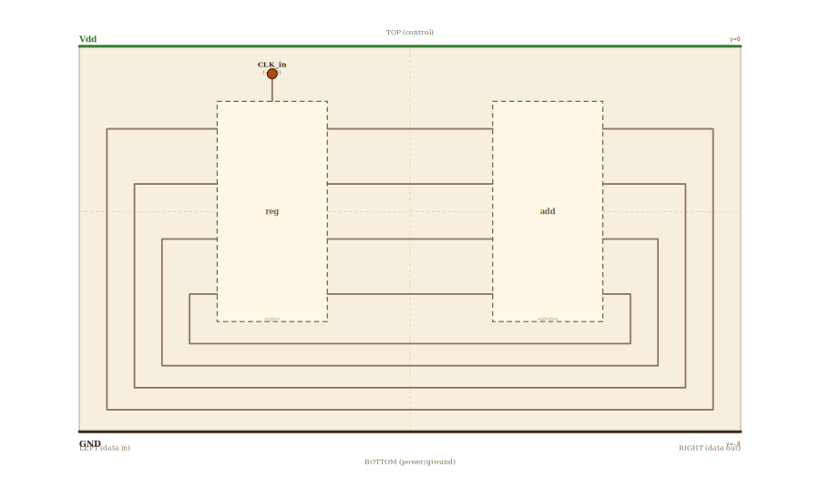

# Layer 9 — program counter

A 4-bit register feeding its own outputs back through a "+1" adder. On
every rising edge of CLK, the register snapshots `PC + 1` → the value
it held a moment ago, plus one. The smallest circuit that "knows where
it is" — every CPU's instruction-fetch loop is this same shape, scaled
to 32 bits with the adder set to `+4`.

Closed system: no external data inputs or outputs at this level — just
CLK going in (TOP) and Vdd / GND rails.

The reg and add children at THIS layer expose a 4-bit interface with
bits at evenly-spaced fractional positions (0.125 / 0.375 / 0.625 /
0.875 from the top), LSB at the BOTTOM. This is the **embedding
contract** for any PC implementation: the standalone layer-5 register
and layer-8 adder pages can use any internal layout they like at
their own zoom levels, but when embedded here they must expose this
contract on their box boundaries so the Q-to-A bus and S-to-D feedback
bus are clean axis-aligned wires.

Drilling into the `reg` box zooms into layer 5; into the `add` box
zooms into layer 8.

## Scene bounds
x ∈ [-12, 12], y ∈ [-8, 6]

## External terminals

| key       | role          | (x, y)        | edge   |
|-----------|---------------|---------------|--------|
| CLK_in    | clock in      | (-5, 5)       | TOP    |
| Vdd       | supply (+V)   | ( 0, 6)       | TOP    |
| GND       | supply (0V)   | ( 0, -8)      | BOTTOM |

The PC has NO external D / Q / S external terminals — its data path is
a closed feedback loop. The actual stored value is read by a sidebar
implementation (UI), not via a wire.

## Internal supply distribution

Vdd at y=6 (TOP rail), GND at y=-8 (BOTTOM rail). Each child gets
supply via direct top-drop / bottom-rise; the boxes sit at cy=0 with
no other child between them and either rail.

## Embedded children

| child id | child layer | center (cx, cy) | box (w × h) | input(s) → absorbed | output(s) → absorbed |
|----------|-------------|-----------------|-------------|---------------------|----------------------|
| reg      | regbox      | (-5, 0)         | 4 × 8       | CLK_in → reg_CLK_in; D3..D0_in declared as junctions | Q3..Q0_out declared as junctions |
| add      | adderbox    | ( 5, 0)         | 4 × 8       | A3..A0_in declared as junctions; Cin and B handled internally (constant `+1`) | S3..S0_out declared as junctions; Cout unused |

Both `regbox` and `adderbox` use **non-resolving** layer descriptors —
the auto-projection from a real child-layer's terminal contract is
explicitly bypassed here, because the layer 5 register's standalone
layout is LSB-at-TOP while this layer (and layer 8 adder) is
LSB-at-BOTTOM. When the implementation re-renders these as embedded
children at the PC level, it must produce per-bit terminals at the
declared (x, y) positions below — that IS the embedding contract.

## Absorbed terminals (declared as inline junctions)

`reg` (box at x ∈ [-7, -3], y ∈ [-4, 4], LSB at BOTTOM):

- `reg_CLK_in` (-5, 4)
- `reg_D3_in` (-7, 3)
- `reg_D2_in` (-7, 1)
- `reg_D1_in` (-7, -1)
- `reg_D0_in` (-7, -3)
- `reg_Q3_out` (-3, 3)
- `reg_Q2_out` (-3, 1)
- `reg_Q1_out` (-3, -1)
- `reg_Q0_out` (-3, -3)

`add` (box at x ∈ [3, 7], y ∈ [-4, 4], LSB at BOTTOM):

- `add_A3_in` (3, 3)
- `add_A2_in` (3, 1)
- `add_A1_in` (3, -1)
- `add_A0_in` (3, -3)
- `add_S3_out` (7, 3)
- `add_S2_out` (7, 1)
- `add_S1_out` (7, -1)
- `add_S0_out` (7, -3)

Each terminal y is at a uniform 2-wu pitch; in box-fraction terms,
that's fractions (0.125, 0.375, 0.625, 0.875) of the 8-wu-tall box.

## Q-to-A forward bus

Four clean straight horizontals at y ∈ {3, 1, -1, -3}, length 6 wu:

| from        | to        | y     |
|-------------|-----------|-------|
| reg_Q3_out  | add_A3_in | 3     |
| reg_Q2_out  | add_A2_in | 1     |
| reg_Q1_out  | add_A1_in | -1    |
| reg_Q0_out  | add_A0_in | -3    |

Each is a straight horizontal in the gap between the reg's right edge
(x=-3) and the add's left edge (x=3) — no jogs, no crossings.

## Feedback bus (S → D, looped UNDER the boxes)

Each S_n_out → D_n_in wire is a 5-segment polyline looping along the
bottom of the scene. Bits use nested lanes — bit 3 outermost (longest
travel), bit 0 innermost (shortest):

| bit | y_n  | rail_R_n | bottom_y_n | rail_L_n |
|-----|------|----------|------------|----------|
| 3   |  3   |  11      |  -7        |  -11     |
| 2   |  1   |  10.5    |  -6.7      |  -10.5   |
| 1   | -1   |  10      |  -6.4      |  -10     |
| 0   | -3   |   9.5    |  -6.1      |   -9.5   |

Per-wire path:

    S_n_out (7, y_n)
      → (rail_R_n, y_n)
      → (rail_R_n, bottom_y_n)
      → (rail_L_n, bottom_y_n)
      → (rail_L_n, y_n)
      → D_n_in (-7, y_n)

All horizontals at `bottom_y_n` lie below both children's bottom edge
(y=-4 ≥ all bottom_y_n). All verticals at `rail_R_n` are outside the
add box (rail_R_n ≥ 9.5 > 7 = add right). All verticals at `rail_L_n`
are outside the reg box (rail_L_n ≤ -9.5 < -7 = reg left).

## Supply helpers

- `Vdd_left` (-12, 6), `Vdd_right` (12, 6)
- `GND_left` (-12, -8), `GND_right` (12, -8)

## Wires

| from           | to              | via                                            | net |
|----------------|-----------------|------------------------------------------------|-----|
| Vdd_left       | Vdd_right       | —                                              | Vdd |
| GND_left       | GND_right       | —                                              | GND |
| CLK_in         | reg_CLK_in      | —                                              | CLK |
| reg_Q3_out     | add_A3_in       | —                                              | Q3  |
| reg_Q2_out     | add_A2_in       | —                                              | Q2  |
| reg_Q1_out     | add_A1_in       | —                                              | Q1  |
| reg_Q0_out     | add_A0_in       | —                                              | Q0  |
| add_S3_out     | reg_D3_in       | (11, 3), (11, -7), (-11, -7), (-11, 3)         | S3  |
| add_S2_out     | reg_D2_in       | (10.5, 1), (10.5, -6.7), (-10.5, -6.7), (-10.5, 1) | S2 |
| add_S1_out     | reg_D1_in       | (10, -1), (10, -6.4), (-10, -6.4), (-10, -1)   | S1  |
| add_S0_out     | reg_D0_in       | (9.5, -3), (9.5, -6.1), (-9.5, -6.1), (-9.5, -3) | S0 |

## Alignment claims

- Every Q-to-A wire is a single straight horizontal (Q_n.y == A_n.y for
  all n).
- Every S-to-D feedback wire is an axis-aligned 5-segment polyline,
  with nested lanes that don't overlap.
- All children's bit terminals lie at evenly-spaced fractions (0.125,
  0.375, 0.625, 0.875) of their box height — both reg and add comply.
- Bits are LSB-at-BOTTOM in both children, so the Q-to-A bus and
  S-to-D feedback are direct (no twist).
- The CLK wire is a direct vertical drop from CLK_in (-5, 5) to
  reg_CLK_in (-5, 4).

## Note on convention divergence

The layer-5 register's standalone wireframe uses **LSB at TOP** (D0 at
the top of the box). This layer-9 wireframe uses **LSB at BOTTOM**.
The two are inconsistent — but layer 9's convention is the one to
follow going forward (matches layer 8 adder4 and standard CPU-textbook
datapath conventions). Re-rendering the layer 5 register to LSB-at-
BOTTOM is a separate task.

