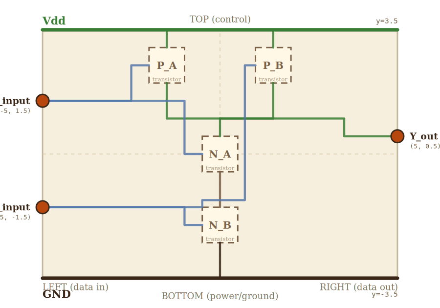

# PROPOSAL — NAND gate v2 (both inputs LEFT, output RIGHT)

Experimental redesign of layer 1's NAND. The external terminals match
the textbook NAND symbol convention: `A_input` and `B_input` both on
the LEFT edge, `Y_out` on the RIGHT. The transistor-level layout
inside the box is rearranged to support that interface.

## Scene bounds
x ∈ [-5.0, 5.0], y ∈ [-3.5, 3.5]

## External terminals

| key     | role        | (x, y)       | edge   |
|---------|-------------|--------------|--------|
| A_input | data in     | (-5.0,  1.5) | LEFT   |
| B_input | data in     | (-5.0, -1.5) | LEFT   |
| Y_out   | data out    | ( 5.0,  0.5) | RIGHT  |
| Vdd     | supply (+V) | ( 0.0,  3.5) | TOP    |
| GND     | supply (0V) | ( 0.0, -3.5) | BOTTOM |

## Embedded children

Four transistor minis arranged so each one's gate is reachable from
the LEFT input rail at its corresponding y.

| child id | child layer | center (cx, cy) | box (w × h) | gate→     | source→     | drain→     |
|----------|-------------|-----------------|-------------|-----------|-------------|------------|
| P_A      | transistor  | (-1.5,  2.5)    | 1.0 × 1.0   | PA_gate   | PA_source   | PA_drain   |
| P_B      | transistor  | ( 1.5,  2.5)    | 1.0 × 1.0   | PB_gate   | PB_source   | PB_drain   |
| N_A      | transistor  | ( 0.0,  0.0)    | 1.0 × 1.0   | NA_gate   | NA_source   | NA_drain   |
| N_B      | transistor  | ( 0.0, -2.0)    | 1.0 × 1.0   | NB_gate   | NB_source   | NB_drain   |

Absorbed-terminal coords (transistors are physical leaves — terminals
sit inside the body where the actual transistor stub lives):

| absorbed key | (x, y)        |
|--------------|---------------|
| PA_gate      | (-2.0,  2.5)  |
| PA_source    | (-1.5,  3.0)  |
| PA_drain     | (-1.5,  2.0)  |
| PB_gate      | ( 1.0,  2.5)  |
| PB_source    | ( 1.5,  3.0)  |
| PB_drain     | ( 1.5,  2.0)  |
| NA_gate      | (-0.5,  0.0)  |
| NA_drain     | ( 0.0,  0.5)  |
| NA_source    | ( 0.0, -0.5)  |
| NB_gate      | (-0.5, -2.0)  |
| NB_drain     | ( 0.0, -1.5)  |
| NB_source    | ( 0.0, -2.5)  |

Helper junction nodes (named so the PASS D simplifier won't collapse
the path through them — any via whose coord matches a named node is
preserved verbatim):
- `Y_junction` (0, 1) — PMOS drains tied together, feeds NA.drain + Y_out
- `Y_corner_top` (3.5, 1) — Y wire turns DOWN here, well inside the scene
- `Y_corner_bot` (3.5, 0.5) — Y wire turns RIGHT to enter Y_out perpendicular
- `B_to_PB_bend` (0.7, 2.5) — B wire turns RIGHT to enter PB.gate perpendicular (no edge grazing)

## Wires

| from           | to              | via                                       | net |
|----------------|-----------------|-------------------------------------------|-----|
| Vdd_rail_left  | Vdd_rail_right  | —                                         | Vdd |
| GND_rail_left  | GND_rail_right  | —                                         | GND |
| Vdd_tap_PA     | PA_source       | —                                         | Vdd |
| Vdd_tap_PB     | PB_source       | —                                         | Vdd |
| PA_drain       | Y_junction      | (-1.5, 1.0)                               | Y   |
| PB_drain       | Y_junction      | ( 1.5, 1.0)                               | Y   |
| Y_junction     | NA_drain        | —                                         | Y   |
| Y_junction     | Y_out           | (3.5, 1.0), (3.5, 0.5)                    | Y   |
| NA_source      | NB_drain        | —                                         | mid |
| NB_source      | GND_tap_NB      | —                                         | GND |
| A_input        | PA_gate         | (-2.5, 1.5), (-2.5, 2.5)                  | A   |
| A_input        | NA_gate         | (-1.0, 1.5), (-1.0, 0.0)                  | A   |
| B_input        | NB_gate         | (-1.0, -1.5), (-1.0, -2.0)                | B   |
| B_input        | PB_gate         | (-0.5, -1.5), (-0.5, -1.3), (0.7, -1.3), (0.7, 2.5)     | B   |

Helper junction nodes for supply taps (backticks make `buildNodeMap`
register these as named nodes the wires can reference):
- `Vdd_rail_left` (-5, 3.5), `Vdd_rail_right` (5, 3.5)
- `Vdd_tap_PA` (-1.5, 3.5), `Vdd_tap_PB` (1.5, 3.5)
- `GND_rail_left` (-5, -3.5), `GND_rail_right` (5, -3.5)
- `GND_tap_NB` (0, -3.5)

